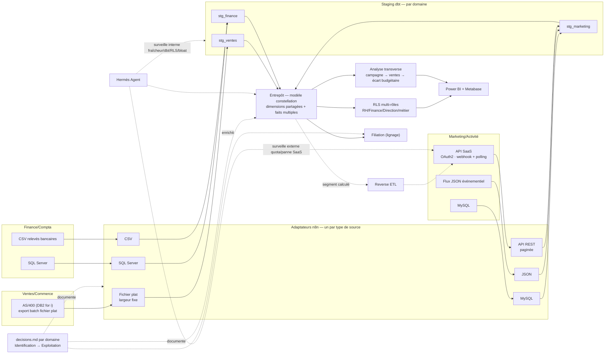

# Projet 19 — Plateforme data d'entreprise multi-domaines

> **🚧 Cadrage figé (validé le 2026-09-04), implémentation pas commencée.** Cadrage complet dans
> l'issue [valentinratigniet-byte/valentinratigniet-byte#2](https://github.com/valentinratigniet-byte/valentinratigniet-byte/issues/2)
> (architecture, intérêt par poste cible, doctrine, phasage) — source de
> vérité, à lire en premier. Ce README sera réécrit au fil de
> l'implémentation pour ne documenter que ce qui est **réellement construit
> et vérifié**, jamais le plan seul (même discipline que le
> [Projet 18](https://github.com/valentinratigniet-byte/projet-18-monitoring-energie-rte)).

## 🎯 Problème métier

Trois bases "de production" simulées mais délibérément hétérogènes et mal
fichues (Ventes/Commerce, Finance/Compta, Marketing/Activité) — chacune
vivante via un simulateur d'usage sur plusieurs mois simulés, pour que le
volume et les vrais problèmes (bloat, index inutilisés, doublons)
émergent de l'usage plutôt que d'être injectés à la main. L'objectif :
les rendre exploitables — nettoyage, ETL/ELT, entrepôt en modèle
**constellation** (dimensions partagées, plusieurs faits), RLS
multi-rôles réelle, documentation vivante, connectique de visualisation
multiple, et un volet **housekeeping** (index/bloat) intégré nativement,
pas en périphérie.

**Ambition assumée** : le plus gros projet solo du portfolio à ce jour,
comparable en ampleur au projet binôme
[projet-baptiste-valentin](https://github.com/valentinratigniet-byte/projet-baptiste-valentin)
mais fait seul — voir l'issue de cadrage pour le détail.

## 🗂️ Architecture cible (cf. issue #2)



Infra réutilisée, pas recréée : VPS + Coolify + n8n déjà en place depuis le
[Projet 18](https://github.com/valentinratigniet-byte/projet-18-monitoring-energie-rte).

## 🚀 Phasage (par domaine, pas par couche technique)

1. Infra partagée (VPS/Coolify existant + Hermès Agent)
2. Domaine 1 — Ventes/Commerce, bout en bout (source sale → nettoyage → staging → fait → RLS → doc)
3. Domaine 2 — Finance/Compta
4. Domaine 3 — Marketing/Activité (volume + housekeeping à grande échelle)
5. Consolidation constellation + dictionnaire global + connectique multi-domaines + **analyse transverse** (`docs/analyse-transverse.md`, livrable obligatoire)
6. Housekeeping transverse (index/bloat sur les 3 sources + l'entrepôt)
7. Filiation branché

**Analyse transverse (Phase 5)** — le fil narratif qui a motivé le choix
des 3 domaines dès le départ, rendu explicite plutôt qu'implicite : suit
campagne marketing → impact ventes → écart budgétaire finance, en
réutilisant ouvertement les méthodes déjà prouvées du portfolio —
décomposition Prix/Volume/Mix ([Projet 15](https://github.com/valentinratigniet-byte/projet-15-reporting-ecarts-cg))
et allocation ABC costing ([Projet 17](https://github.com/valentinratigniet-byte/projet-17-rentabilite-produit-client))
appliquées sur les données réellement entreposées ici. Boucle
explicitement DE → BA → CG au lieu de s'arrêter à l'entrepôt.

**Doctrine "tentaculaire mais chirurgical"** (reprise et étendue du Projet 18) :
un seul domaine construit et validé de bout en bout avant de lancer le
suivant — jamais plusieurs chantiers à moitié faits en parallèle.

## 🗃️ Structure du repo

Un seul repo, un gros dossier par domaine (pas 3 repos séparés) — garde un
point d'entrée unique et une chaîne dbt unique pour partager facilement les
dimensions de la constellation entre domaines. Chaque domaine aura sa doc
"avant/après mission" (état brut chiffré → nettoyage → recommandations pour
l'équipe métier concernée), dans l'esprit du
[Projet 02](https://github.com/valentinratigniet-byte/projet-02-pipeline-nettoyage-qualite)
élargi avec une vraie section recommandations.

```
projet-19-plateforme-entreprise/
├── README.md
├── LICENSE
├── domaines/
│   ├── ventes-commerce/      <- README.md, source/, avant.md, decisions.md, apres.md
│   ├── finance-compta/       <- idem
│   └── marketing-activite/   <- idem
├── dbt/                       <- projet unique, staging/{ventes,finance,marketing} -> marts constellation
├── entrepot/                  <- dictionnaire de données généré, schéma constellation
├── hermes-agent/               <- config/déploiement Hermès Agent
└── docs/                       <- documentation transverse, housekeeping
```

**`decisions.md` par domaine — journal des prises de décision, pas qu'un
rapport qualité.** Identifier, compartimenter/sectoriser et **expliquer**
chaque décision prise sur la donnée à chaque étape, format **donnée
concernée → décision → pourquoi → alternative écartée** :

1. **Identification** — inventaire de ce qui existe dans la source avant
   d'extraire (tables/champs, volumétrie, propriétaire métier).
2. **Compartimentation/sectorisation** — rattachement à un domaine,
   classification de sensibilité (nourrit la RLS multi-rôles).
3. **Extraction** — quel adaptateur choisi et pourquoi, limites acceptées.
4. **Traitement** — transformations métier appliquées et leur raison.
5. **Nettoyage** — chaque règle du staging dbt, justifiée et chiffrée.
6. **Entreposage** — choix de modélisation (grain, clés, dimensions
   partagées, historisation).
7. **Exploitation** — quel dashboard/KPI/décision métier la donnée rend
   possible au final.

Pas qu'un markdown enterré : chaque étape est liée aux objets réels
qu'elle concerne, et le journal alimente [Filiation](https://github.com/valentinratigniet-byte/projet-14-filiation)
(branché en dernière phase) — Filiation montre le *chemin* de la donnée,
`decisions.md` montre le *raisonnement* derrière chaque étape de ce chemin.

**Extraction — un adaptateur par type de source, pas par domaine**,
orchestrés par n8n, réutilisables tels quels pour un futur 4e domaine.
Chaque domaine s'appuie sur une **vraie techno d'entreprise**, pas un mock
Postgres déguisé (pas 3× la même base) :

| Domaine | Techno principale | Pourquoi | Sources secondaires |
|---|---|---|---|
| Ventes/Commerce | **AS/400 (DB2 for i)** — simulé en export batch fichier plat, conventions AS/400 authentiques | Très répandu en ERP/gestion commerciale industrie/distribution françaises | — |
| Finance/Compta | **SQL Server** (Docker `mcr.microsoft.com/mssql/server`) | Techno standard des ERP compta (Sage, Cegid, SAP Business One) | Export CSV relevés bancaires |
| Marketing/Activité | **MySQL** (Docker `mysql:8`) | Techno standard des stacks web/CRM | **API SaaS** (type Mailchimp/Brevo — pagination, clé API, rate-limit, sync incrémentale) + flux JSON d'événements (tracking) |

Pas de vraie connexion DB2/400 live (licence IBM i) — et ce n'est de toute
façon pas comme ça qu'un atelier AS/400 réel partage sa donnée en pratique :
un job batch nocturne dépose un export à largeur fixe, pas une connexion
SQL directe. C'est ce qu'on simule honnêtement, documenté comme hypothèse
assumée (même discipline "mesuré pas inventé" que le reste du portfolio).

**Source SaaS Marketing — poussée au-delà du simple polling API** :

1. **Push ET pull** — webhook temps réel (n8n, trigger natif) pour les
   événements (ouverture, clic, désabonnement) + API de polling pour le
   rattrapage/backfill et la donnée de référence, avec réconciliation des
   trous laissés par un webhook manqué.
2. **OAuth2 avec refresh de token** — plus réaliste qu'une clé API
   statique (comme les vraies SaaS type HubSpot/Salesforce), cycle
   d'expiration + refresh automatique géré par l'adaptateur, échec de
   refresh alerté plutôt qu'un crash muet.
3. **Reverse ETL** — l'entrepôt repousse un segment calculé (ex. issu de
   l'analyse transverse, Phase 5) vers l'outil SaaS pour une action
   concrète (campagne de relance ciblée) — boucle DE → BA → **action
   métier**, pas seulement DE → reporting.
4. **Hermès Agent surveille la dépendance externe** — pas que la fraîcheur
   interne : quota API consommé, panne/latence du SaaS, échec de refresh
   OAuth2 — un vrai sujet de risque fournisseur, notifié comme le reste.

Structure vide à ce stade — se remplira domaine par domaine au fil des
phases. Voir [l'issue #2](https://github.com/valentinratigniet-byte/valentinratigniet-byte/issues/2)
pour le détail complet de chaque brique.

---

*Projet 19 du [Portfolio Data](https://github.com/valentinratigniet-byte). Réutilise l'infra du
[Projet 18](https://github.com/valentinratigniet-byte/projet-18-monitoring-energie-rte). Cadrage :
[issue #2](https://github.com/valentinratigniet-byte/valentinratigniet-byte/issues/2).*
