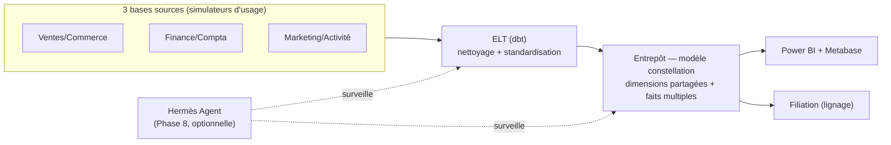
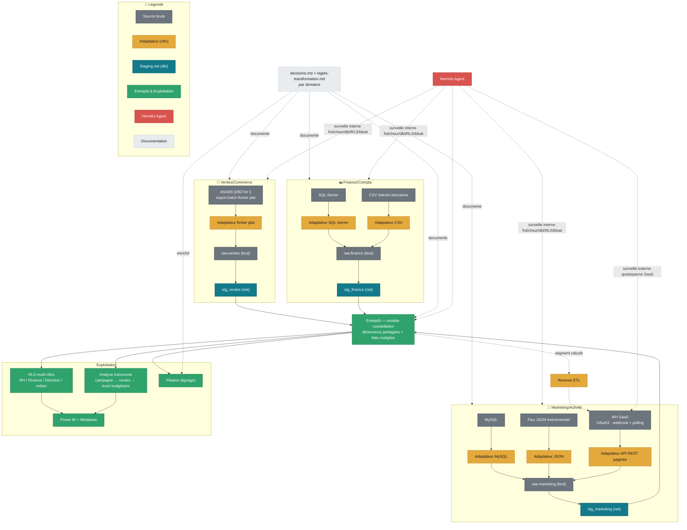

# Projet 19 — Plateforme data d'entreprise multi-domaines

> **🚧 En construction — Phases 1 à 3 terminées (infra, Ventes/Commerce, Finance/Compta), Phase 4 (Marketing/Activité) à venir.** Cadrage complet dans
> l'issue [valentinratigniet-byte/valentinratigniet-byte#2](https://github.com/valentinratigniet-byte/valentinratigniet-byte/issues/2)
> (architecture, intérêt par poste cible, doctrine, phasage) — source de
> vérité, à lire en premier. Ce README sera réécrit au fil de
> l'implémentation pour ne documenter que ce qui est **réellement construit
> et vérifié**, jamais le plan seul (même discipline que le
> [Projet 18](https://github.com/valentinratigniet-byte/projet-18-monitoring-energie-rte)).

## 🎯 Problème métier

Trois bases "de production" simulées mais délibérément hétérogènes et mal
fichues (Ventes/Commerce, Finance/Compta, Marketing/Activité) — chacune
vivante via un simulateur d'usage sur plusieurs mois simulés, pour que le
volume et les vrais problèmes (bloat, index inutilisés, doublons)
émergent de l'usage plutôt que d'être injectés à la main. L'objectif :
les rendre exploitables — nettoyage, ETL/ELT, entrepôt en modèle
**constellation** (dimensions partagées, plusieurs faits), RLS
multi-rôles réelle, documentation vivante, connectique de visualisation
multiple, et un volet **housekeeping** (index/bloat) intégré nativement,
pas en périphérie.

**Ambition assumée** : le plus gros projet solo du portfolio à ce jour,
comparable en ampleur au projet binôme
[projet-baptiste-valentin](https://github.com/valentinratigniet-byte/projet-baptiste-valentin)
mais fait seul — voir l'issue de cadrage pour le détail.

## 🗂️ Architecture cible (cf. issue #2)



Infra réutilisée, pas recréée : VPS + Coolify + n8n déjà en place depuis le
[Projet 18](https://github.com/valentinratigniet-byte/projet-18-monitoring-energie-rte).

**n8n + Apache Airflow — répartition, pas redondance** :
- **n8n** (existant) → orchestration de l'**ingestion** : les 8
  adaptateurs, le mode webhook temps réel du SaaS Marketing. Low-code,
  event-driven. **3 workflows indispensables, certains dès maintenant** —
  1 par domaine, sur la source principale : ingestion AS/400
  (Ventes/Commerce), ingestion SQL Server (Finance/Compta), ingestion
  MySQL (Marketing/Activité). Le reste (sources secondaires, webhook/
  polling SaaS, reverse ETL) attend le besoin réel constaté domaine par
  domaine, pas figé à l'avance.
- **Airflow (nouveau)** → orchestration du **pipeline de transformation** :
  DAG dbt complet (raw → snapshots → staging → marts → tests → slim CI),
  par domaine puis consolidation. Apporte retries fins, sensors, et le
  **backfill** natif que n8n gère mal. Combo dbt+Airflow = le pairing
  d'orchestration le plus reconnu du marché DE. Charge VPS vérifiée
  (2026-09-04) : **2 vCPU, 7.8 Gi RAM (~5 Gi disponibles), 86 Go disque
  libres**, charge actuelle légère (Coolify + n8n + Metabase ≈ 2 Gi
  utilisés) — de la marge pour Airflow, mais les 2 vCPU restent le point
  de vigilance réel une fois plusieurs domaines actifs en parallèle.

<details>
<summary><strong>🔍 Voir le schéma détaillé</strong> — sources précises, adaptateurs, staging par domaine, RLS, reverse ETL</summary>

Un couloir par domaine (source → adaptateur → brut → net), qui converge
vers l'entrepôt, puis un seul bloc d'exploitation en aval — plutôt qu'un
maillage de flèches, pour rester lisible malgré le nombre de briques.
Couleurs = même famille que la charte du portfolio (Petrol & Ambre).
**Hermès Agent (en rouge) fait partie de l'architecture cible mais est en
standby, Phase 8 optionnelle** — les nœuds `HERMES` ci-dessous représentent
ce qui sera branché *si* cette phase se fait, pas ce qui existe dès la
Phase 1.



</details>

## 🚀 Phasage (par domaine, pas par couche technique)

1. ✅ Infra partagée (VPS/Coolify existant + Airflow)
2. ✅ Domaine 1 — Ventes/Commerce, bout en bout (source sale → nettoyage → staging → fait → RLS → doc) — **terminé le 2026-09-05**, cf. [`domaines/ventes-commerce/`](domaines/ventes-commerce/)
3. ✅ Domaine 2 — Finance/Compta — **terminé le 2026-09-05**, cf. [`domaines/finance-compta/`](domaines/finance-compta/)
4. Domaine 3 — Marketing/Activité (volume + housekeeping à grande échelle)
5. Consolidation constellation + dictionnaire global + connectique multi-domaines + **analyse transverse** (`docs/analyse-transverse.md`, livrable obligatoire)
6. Housekeeping transverse (index/bloat sur les 3 sources + l'entrepôt)
7. Filiation branché
8. **(Optionnelle) Hermès Agent** — en standby, ajoutée seulement si le
   reste du projet est solide et que ça vaut le temps investi. Surveiller
   un pipeline qui n'existe pas encore n'a pas de sens — même schéma que
   le Projet 18, où l'alerting est arrivé après le build initial.
   Architecture déjà tranchée si cette phase se fait : surveillance
   périodique (fraîcheur/RLS/bloat/dépendance SaaS/changements
   structurels) sur un **modèle local** (Ollama — la latence ne compte pas
   pour du monitoring en tâche de fond, VPS limité à 2 vCPU vérifié) +
   réponse aux questions posées en direct sur **API Claude** (coût à
   l'usage réel, quasi nul car ponctuel). Coût de base : 0€.

**Analyse transverse (Phase 5)** — le fil narratif qui a motivé le choix
des 3 domaines dès le départ, rendu explicite plutôt qu'implicite : suit
campagne marketing → impact ventes → écart budgétaire finance, en
réutilisant ouvertement les méthodes déjà prouvées du portfolio —
décomposition Prix/Volume/Mix ([Projet 15](https://github.com/valentinratigniet-byte/projet-15-reporting-ecarts-cg))
et allocation ABC costing ([Projet 17](https://github.com/valentinratigniet-byte/projet-17-rentabilite-produit-client))
appliquées sur les données réellement entreposées ici. Boucle
explicitement DE → BA → CG au lieu de s'arrêter à l'entrepôt.

**Doctrine "tentaculaire mais chirurgical"** (reprise et étendue du Projet 18) :
un seul domaine construit et validé de bout en bout avant de lancer le
suivant — jamais plusieurs chantiers à moitié faits en parallèle.

## 🗃️ Structure du repo

Un seul repo, un gros dossier par domaine (pas 3 repos séparés) — garde un
point d'entrée unique et une chaîne dbt unique pour partager facilement les
dimensions de la constellation entre domaines. Chaque domaine aura sa doc
"avant/après mission" (état brut chiffré → nettoyage → recommandations pour
l'équipe métier concernée), dans l'esprit du
[Projet 02](https://github.com/valentinratigniet-byte/projet-02-pipeline-nettoyage-qualite)
élargi avec une vraie section recommandations.

```
projet-19-plateforme-entreprise/
├── README.md
├── LICENSE
├── domaines/
│   ├── ventes-commerce/      <- README.md, source/, avant.md, decisions.md, regles-transformation.md, apres.md
│   ├── finance-compta/       <- idem
│   └── marketing-activite/   <- idem
├── dbt/                       <- projet unique, raw -> snapshots (SCD 2) -> staging/{ventes,finance,marketing} -> marts constellation
│                                  + dbt docs (doc technique auto-générée)
├── airflow/                    <- DAG dbt (raw -> snapshots -> staging -> marts -> tests -> slim CI)
├── entrepot/                  <- dictionnaire de données généré, schéma `raw` (brut) + constellation (net)
├── hermes-agent/               <- config/déploiement Hermès Agent (Phase 8, optionnelle)
└── docs/                       <- guide-realisation.md, pieges-*.md, housekeeping
```

**Coût — 0€ garanti sur les phases 1 à 7**, 4 décisions explicites pour
que ce soit vérifié, pas supposé :
1. **SQL Server (Docker)** — édition `Developer` forcée (`MSSQL_PID=Developer`),
   pas l'édition Evaluation par défaut qui expire à 180 jours.
2. **API SaaS Marketing** — simulée par un mock maison (0€ garanti) ou
   tier gratuit réel, jamais un plan payant.
3. **Entrepôt Postgres** — auto-hébergé sur le VPS existant via Coolify,
   pas un nouveau projet Supabase séparé.
4. **Comparatif pganalyze** (housekeeping, Phase 6) — sur documentation
   publique, pas un abonnement réel ; pgHero et le script maison, eux,
   sont réellement déployés.

Le VPS lui-même est un coût déjà engagé pour le Projet 18, pas une
dépense nouvelle.

**`docs/guide-realisation.md` et `docs/pieges-*.md`** — écrits **au fil de
l'implémentation réelle**, pas rédigés à l'avance : un guide de
reproduction complet du projet étape par étape (infra → domaines →
consolidation → Filiation), et des fichiers pièges (un par grande zone),
même format déjà éprouvé au
[Projet 18](https://github.com/valentinratigniet-byte/projet-18-monitoring-energie-rte)
(`pieges-api-rte.md`, `pieges-infra.md`) : problème réel rencontré → cause
→ solution → ce qu'il faut retenir. Rien d'inventé à l'avance — c'est ce
qui rend le projet transmissible, pas seulement montré.

**Deux couches dans l'entrepôt (bronze/silver-gold)** — une vraie copie
des bases de production, en deux versions :
- **Brute** — schéma `raw` : copie 1:1 de ce que chaque adaptateur
  extrait, sans transformation. C'est sur cette couche que les dbt
  snapshots s'appliquent (capture l'historique brut avant nettoyage —
  pattern dbt standard). Conservée pour l'audit et la rejouabilité.
- **Nette** — staging (nettoyage par domaine) → marts constellation,
  déjà cadrée.

`regles-transformation.md` (nouveau, par domaine) — table de
correspondance **colonne brute → colonne nette → règle appliquée → renvoi
vers `decisions.md`**. Rend visible ce que fait l'ETL entre brut et net
sans avoir à lire le SQL — `decisions.md` explique le *pourquoi*, ce
fichier montre le *quoi exactement a changé*.

**`decisions.md` par domaine — journal des prises de décision, pas qu'un
rapport qualité.** Identifier, compartimenter/sectoriser et **expliquer**
chaque décision prise sur la donnée à chaque étape, format **donnée
concernée → décision → pourquoi → alternative écartée** :

1. **Identification** — inventaire de ce qui existe dans la source avant
   d'extraire (tables/champs, volumétrie, propriétaire métier).
2. **Compartimentation/sectorisation** — rattachement à un domaine,
   classification de sensibilité (nourrit la RLS multi-rôles).
3. **Extraction** — quel adaptateur choisi et pourquoi, limites acceptées.
4. **Traitement** — transformations métier appliquées et leur raison.
5. **Nettoyage** — chaque règle du staging dbt, justifiée et chiffrée.
6. **Entreposage** — choix de modélisation (grain, clés, dimensions
   partagées, historisation).
7. **Exploitation** — quel dashboard/KPI/décision métier la donnée rend
   possible au final.

Pas qu'un markdown enterré : chaque étape est liée aux objets réels
qu'elle concerne, et le journal alimente [Filiation](https://github.com/valentinratigniet-byte/projet-14-filiation)
(branché en dernière phase) — Filiation montre le *chemin* de la donnée,
`decisions.md` montre le *raisonnement* derrière chaque étape de ce chemin.

**Versionning — code et données.** Le code (dbt, adaptateurs, doc) est
versionné dans le repo Git unique, comme le reste. Les données historisées
via **dbt snapshots** (SCD type 2 natif) là où c'est pertinent par domaine
(client qui change de segment, statut de commande qui évolue, budget
révisé...) plutôt qu'un `dbt run` qui écrase l'état précédent — choix
documenté dans `decisions.md`, étape Entreposage.

**Trois couches de documentation, chacune son rôle** :
- **dbt docs** (natif, auto-généré) — le *quoi* technique : modèles,
  colonnes, tests, DAG de lineage dbt. Alimente `entrepot/`.
- **`decisions.md`** — le *pourquoi* métier derrière chaque choix.
- **Filiation** — le *chemin* complet inter-systèmes (au-delà de dbt
  seul), alimenté par les deux précédents, pas un doublon.

**Séquençage et impact d'un changement** : le DAG dbt (déduit
automatiquement des `ref()`/`source()` entre modèles) garantit l'ordre
d'exécution et l'absence de cycle. En CI, `dbt build --select
state:modified+` compare à un état de référence et limite
exécution/tests aux modèles **modifiés + tout ce qui en dépend en aval** —
voir l'impact d'un changement sur l'entrepôt avant de le merger, sans
relancer tout le projet. Hermès Agent étend son rôle à la détection de
**changements structurels** (DAG modifié, modèle cassé, contrat de schéma
rompu) — distinct de la surveillance de fraîcheur qu'il fait déjà.

**Extraction — un adaptateur par type de source, pas par domaine**,
orchestrés par n8n, réutilisables tels quels pour un futur 4e domaine.
Chaque domaine s'appuie sur une **vraie techno d'entreprise**, pas un mock
Postgres déguisé (pas 3× la même base) :

| Domaine | Techno principale | Pourquoi | Sources secondaires |
|---|---|---|---|
| Ventes/Commerce | **AS/400 (DB2 for i)** — simulé en export batch fichier plat, conventions AS/400 authentiques | Très répandu en ERP/gestion commerciale industrie/distribution françaises | **Excel/Sheets manuel** — grille tarifaire/remises tenue à la main par l'équipe commerciale (cellules fusionnées, formules figées, versions parallèles) |
| Finance/Compta | **SQL Server** (Docker `mcr.microsoft.com/mssql/server`) | Techno standard des ERP compta (Sage, Cegid, SAP Business One) | Export CSV relevés bancaires + **Factur-X** — factures fournisseurs, norme française de facturation électronique (EN 16931/UBL/CII, réforme B2B PDP/PPF), avec coexistence transitoire ancien format/Factur-X |
| Marketing/Activité | **MySQL** (Docker `mysql:8`) | Techno standard des stacks web/CRM | **API SaaS** (type Mailchimp/Brevo — pagination, clé API, rate-limit, sync incrémentale) + flux JSON d'événements (tracking) |

Pas de vraie connexion DB2/400 live (licence IBM i) — et ce n'est de toute
façon pas comme ça qu'un atelier AS/400 réel partage sa donnée en pratique :
un job batch nocturne dépose un export à largeur fixe, pas une connexion
SQL directe. C'est ce qu'on simule honnêtement, documenté comme hypothèse
assumée (même discipline "mesuré pas inventé" que le reste du portfolio).

**Source SaaS Marketing — poussée au-delà du simple polling API** :

1. **Push ET pull** — webhook temps réel (n8n, trigger natif) pour les
   événements (ouverture, clic, désabonnement) + API de polling pour le
   rattrapage/backfill et la donnée de référence, avec réconciliation des
   trous laissés par un webhook manqué.
2. **OAuth2 avec refresh de token** — plus réaliste qu'une clé API
   statique (comme les vraies SaaS type HubSpot/Salesforce), cycle
   d'expiration + refresh automatique géré par l'adaptateur, échec de
   refresh alerté plutôt qu'un crash muet.
3. **Reverse ETL** — l'entrepôt repousse un segment calculé (ex. issu de
   l'analyse transverse, Phase 5) vers l'outil SaaS pour une action
   concrète (campagne de relance ciblée) — boucle DE → BA → **action
   métier**, pas seulement DE → reporting.
4. **Hermès Agent surveille la dépendance externe** — pas que la fraîcheur
   interne : quota API consommé, panne/latence du SaaS, échec de refresh
   OAuth2 — un vrai sujet de risque fournisseur, notifié comme le reste.

## ✅ Ce qui est réellement construit et vérifié

**Phase 1 (infra) — Airflow.** Stack `LocalExecutor` minimale, déployée
sur le VPS existant, webserver + scheduler healthy, DAG de vérification
exécuté avec succès (`state: success`), exposée en HTTPS (certificat
Let's Encrypt valide) sur [airflow-projet19.76.13.43.130.sslip.io](https://airflow-projet19.76.13.43.130.sslip.io).
Entrepôt Postgres auto-hébergé, schéma `raw` + rôles à privilège minimal.

**Phase 2 (Domaine Ventes/Commerce) — terminée.** Pipeline complet
vérifié : ingestion conteneurisée et idempotente (AS/400 + Excel) → dbt
(snapshot SCD2, staging avec règles de nettoyage réelles, marts
`dim_client`/`fait_ventes`, **14/14 tests**) → RLS multi-rôles
(**8/8 cas vérifiés par `SET ROLE`**, survit aux reruns dbt) → workflow
n8n (export prêt). Doc complète du domaine dans
[`domaines/ventes-commerce/`](domaines/ventes-commerce/)
(`avant.md`/`decisions.md`/`regles-transformation.md`/`apres.md`).

**Phase 3 (Domaine Finance/Compta) — terminée.** SQL Server (édition
Developer) + CSV bancaire + Factur-X (2 canaux), rapprochement
facture/écriture par SIREN+montant (pas par numéro, non partagé entre
sources) → **91 % de rapprochement automatique côté Factur-X structuré,
contre 44 % pour le canal non structuré** — argument chiffré pour la
migration e-facturation. dbt **26/26 tests**, RLS + **sécurité colonne**
sur l'IBAN (nouveauté) **8/8 cas vérifiés**. Doc complète dans
[`domaines/finance-compta/`](domaines/finance-compta/).

Détail complet de la construction, y compris les bugs rencontrés et
corrigés (idempotence, RLS qui disparaît à chaque `dbt run`, casse des
identifiants, événements non corrélés entre simulateurs, `GRANT` table
qui neutralise un `REVOKE` colonne...), dans
[`docs/guide-realisation.md`](docs/guide-realisation.md).
Domaine Marketing/Activité : squelette posé, contenu réel à venir. Voir
[l'issue #2](https://github.com/valentinratigniet-byte/valentinratigniet-byte/issues/2)
pour le détail complet de chaque brique.

---

*Projet 19 du [Portfolio Data](https://github.com/valentinratigniet-byte). Réutilise l'infra du
[Projet 18](https://github.com/valentinratigniet-byte/projet-18-monitoring-energie-rte). Cadrage :
[issue #2](https://github.com/valentinratigniet-byte/valentinratigniet-byte/issues/2).*
