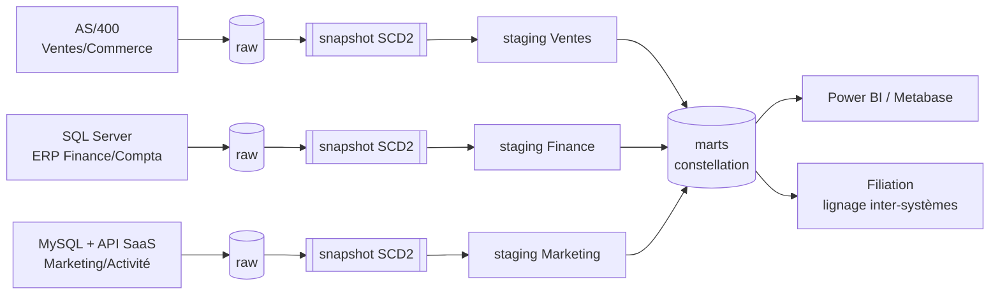
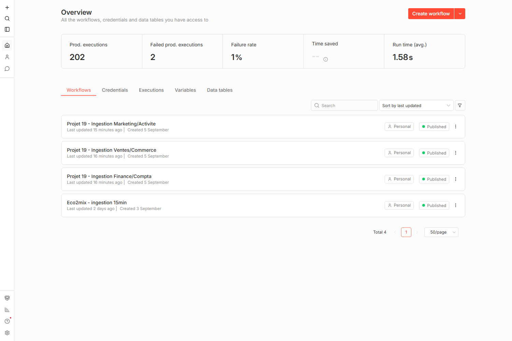
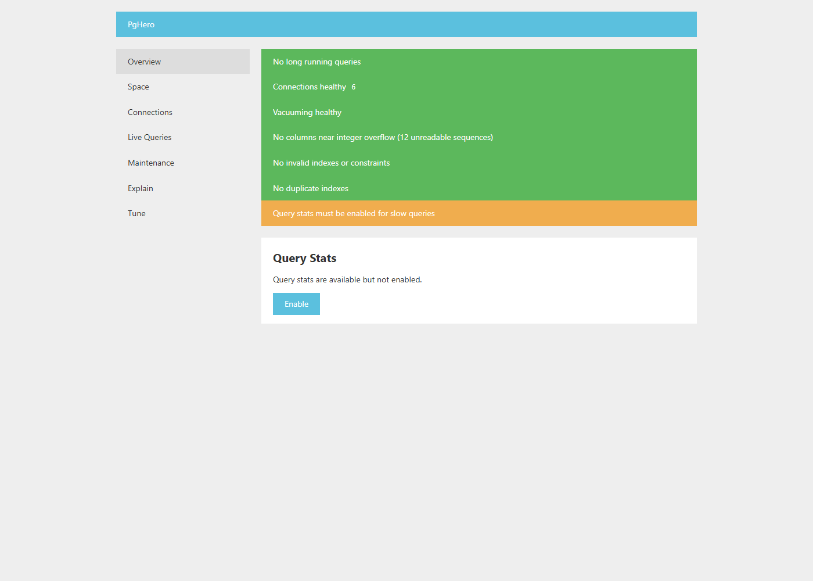
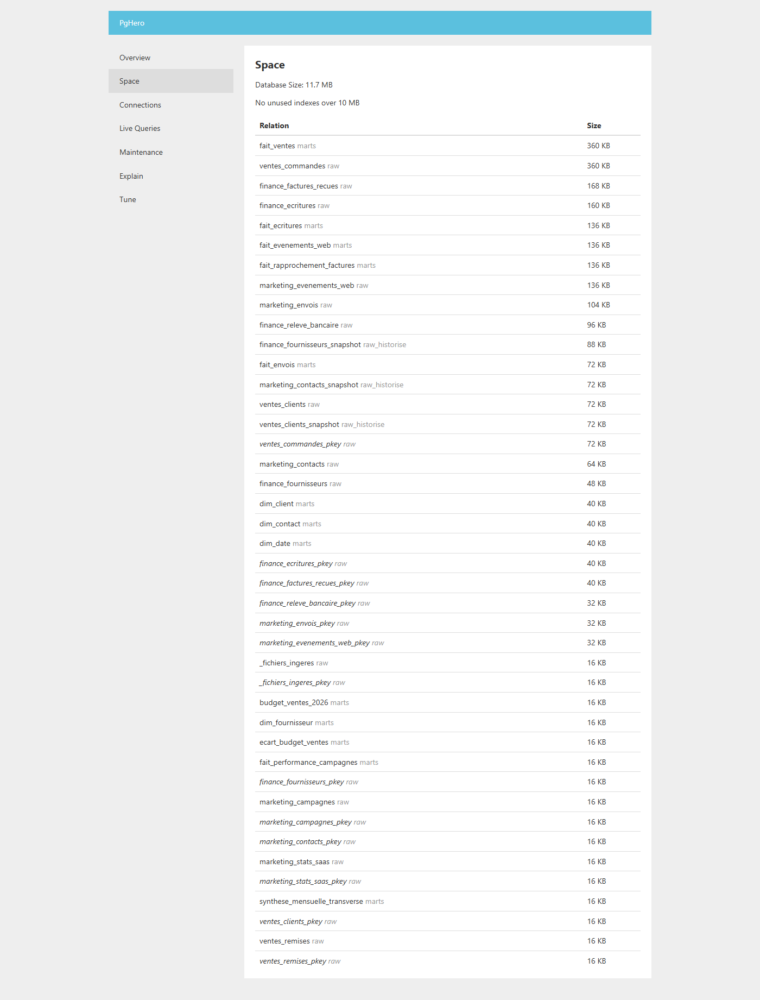

# Anatomie du pipeline — de l'ERP au mart

Partie théorique, complémentaire aux docs existantes : plutôt que de
détailler phase par phase (`guide-realisation.md`) ou par thème transversal
(`construction-etl-erp-dbt.md`), ce document reprend **chaque outil
réellement utilisé** dans le projet et l'explique de zéro — le concept,
un schéma, puis un cas réel **avant → action → après** : vrai schéma de
table, vraie requête dbt, vrais chiffres mesurés, vraies captures d'écran
(`docs/screenshots/`). Rien ci-dessous n'est une maquette : le code est
cité tel quel depuis `dbt/models/` et `airflow/dags/`, les captures sont
celles déjà prises pour `construction-etl-erp-dbt.md`.

Domaine choisi comme fil conducteur : **Finance/Compta**, l'ERP le plus
riche du projet (SQL Server + CDC natif + relevé bancaire + factures
Factur-X).

## Sommaire

1. [Vue d'ensemble](#1-vue-densemble)
2. [ELT & medallion](#2-elt--medallion-transformer-après-avoir-chargé)
3. [Snapshot SCD2](#3-snapshot-scd2-historiser-avant-de-nettoyer)
4. [Tests & contrats dbt](#4-tests-contrats-de-schéma-catalogue)
5. [Sécurité RLS ligne + colonne](#5-row-level-security-ligne-et-colonne)
6. [Orchestration](#6-orchestration-airflow-pour-dbt-n8n-pour-lingestion)
7. [Monitoring](#7-monitoring--pghero)
8. [Lignage](#8-lignage-inter-systèmes--filiation)
9. [Ce qui manque, honnêtement](#9-ce-qui-nest-délibérément-pas-montré-ici)

## 1. Vue d'ensemble

Chaque domaine traverse le même pipeline en 5 étapes : source réelle
hétérogène → `raw` → snapshot historisé → `staging` nettoyé → `marts`. Les
faits convergent vers un modèle en constellation partagé par `dim_date`.



## 2. ELT & medallion — transformer après avoir chargé

Deux idées : la donnée brute est chargée dans l'entrepôt **avant**
transformation (elle reste rejouable) ; la transformation est du **SQL
versionné** dans git (dbt), pas des requêtes ad hoc. dbt ne se connecte
jamais à un progiciel — un adaptateur Python fait toujours le pont, en
lecture seule.

```
raw (brut, TEXT)  →  raw_historise (SCD2)  →  staging (typé, nettoyé)  →  marts (RLS, contrats)
   dbt snapshot            dbt run (staging)          dbt run (marts)
```

### Cas réel — table `dbo.EcrituresComptables`, 8 colonnes

L'ERP comptable (SQL Server, édition Developer) alimente directement
cette table — ce n'est pas un export à ingérer, un adaptateur Python en
lecture seule la lit telle quelle (`ingestion/adaptateurs/sqlserver.py`).

**Avant — schéma brut (`raw`)**

| # | colonne | type |
|---|---|---|
| 1 | EcritureID | INT IDENTITY |
| 2 | FournisseurID | INT NULL |
| 3 | NumeroFacture | VARCHAR(30) |
| 4 | DateEcriture | DATE |
| 5 | MontantHT | VARCHAR(20) |
| 6 | TauxTVA | VARCHAR(10) |
| 7 | MontantTTC | VARCHAR(20) |
| 8 | CompteComptable | VARCHAR(10) |

Montants stockés en `VARCHAR` — deux formats coexistent (`1234.56` US,
`1 234,56` FR, import legacy incohérent). 866 lignes, dont 11 doublons de
saisie exacts.

**Action — dbt, staging** (`stg_finance_ecritures.sql`, réel) :

```sql
select
  "EcritureID"::int                                                as ecriture_id,
  replace(replace(trim("MontantHT"), ' ', ''), ',', '.')::numeric  as montant_ht_eur,
  replace(replace(trim("MontantTTC"), ' ', ''), ',', '.')::numeric as montant_ttc_eur
  -- ...
from source

-- doublons EXACTS supprimés (double-clic comptable réel, pas un
-- enregistrement distinct -- contrairement aux commandes Ventes)
select distinct on (fournisseur_id, numero_facture, montant_ttc_eur, date_ecriture)
  *
from nettoye
order by fournisseur_id, numero_facture, montant_ttc_eur, date_ecriture, ecriture_id
```

**Après — `marts.fait_ecritures`**

| Indicateur | Avant | Après |
|---|---|---|
| Écritures comptables | 866 (11 doublons) | **855** |
| Montant HT total | non calculable | **6 033 449,03 €** |
| Montant TTC total | — | **7 240 138,82 €** |

Matérialisé en `incremental` (curseur `ecriture_id`, jamais
`_ingested_at` — une écriture postée n'est jamais modifiée
rétroactivement, décision documentée dans le modèle lui-même).

### Deuxième cas réel — factures Factur-X, export XML (7 champs)

Canal structuré des factures fournisseurs. Vraies lignes extraites de
`domaines/finance-compta/source/exports/factures_facturx_202601.xml` — la
3ᵉ ligne montre le défaut exact que la normalisation corrige : un SIREN
saisi avec des espaces.

| InvoiceNumber | IssueDate | Seller | SIREN | TaxableAmount | TaxAmount | GrandTotal |
|---|---|---|---|---|---|---|
| FA-2026-01-007 | 2026-01-23 | Besnard | 887558036 | 8979.49 | 1795.90 | 10775.39 |
| FA-2026-01-012 | 2026-01-03 | Guillaume S.A.R.L. | 572769975 | 10446.45 | 2089.29 | 12535.74 |
| FA-2026-01-017 | 2026-01-07 | Diaz Cordier S.A. | **845 533 873** ⚠️ | 9251.70 | 1850.34 | 11102.04 |

→ règle réelle appliquée en staging (`stg_finance_fournisseurs.sql`) :

```sql
nullif(regexp_replace("SIREN", '\s', '', 'g'), '')  as siren_normalise,
siren_normalise ~ '^\d{9}$'                          as siren_valide
```

> **Constat honnête, transverse aux 3 domaines** : une donnée douteuse
> (doublon, SIREN invalide, mojibake) est **flaguée**, jamais fusionnée ou
> corrigée en silence — la décision de correction reste humaine. Le taux
> de correction affiché n'est donc jamais 100 % par construction.

## 3. Snapshot SCD2 — historiser avant de nettoyer

Un **snapshot dbt** compare l'état courant de `raw` à l'état déjà
enregistré et, si une ligne a changé, clôt l'ancienne version
(`dbt_valid_to`) et en insère une nouvelle — un vrai historique **Slowly
Changing Dimension type 2**, sans jamais écrire par-dessus une valeur
passée. Il tourne sur la donnée la plus brute possible, avant tout
nettoyage staging.

**Avant** — un `UPDATE` direct sur `Fournisseurs` (IBAN, raison sociale —
fusion/rachat) écrase la valeur précédente : impossible de répondre à
« quel IBAN était actif le 15 mars ? ».

**Action — CDC réel, 3 exécutions vérifiées contre un vrai SQL Server :**

| Exécution | Changement source | Résultat dans `raw` |
|---|---|---|
| 1 (amorçage) | 80 fournisseurs | 80 lignes insérées |
| 2 | 4 IBAN/raisons modifiés | **4 mises à jour en place** |
| 3 | aucun changement | **0 ligne lue** |

**Après** — 3 snapshots SCD2 actifs sur le projet. `dbt snapshot` rejoué
sans changement produit `INSERT 0 0`, vérifié plutôt que supposé.

## 4. Tests, contrats de schéma, catalogue

dbt génère un catalogue navigable (`manifest.json` + `catalog.json`) :
lignage colonne-à-colonne, tests attachés à chaque modèle, contrats de
schéma, freshness des sources.

**30 modèles** (15 staging + 15 marts, extension Support Client/Inventaire-
Stock incluse) · **69 data tests + 3 tests unitaires** · 15/15 sources avec
freshness · 3 modèles sous contrat · 3 modèles incrémentaux — remesuré le
2026-09-16 en relançant l'entrepôt complet, corrige le chiffre "24 modèles"
resté affiché depuis l'extension à 5 domaines.

Captures ci-dessous prises à l'époque des 24 modèles (3 domaines) — pas
republiées depuis l'extension, pour ne pas laisser croire à une capture
plus récente qu'elle ne l'est. Le lignage/catalogue réel sur 30 modèles
n'a pas encore été recapturé.


*Page d'accueil du catalogue — doc block expliquant comment lire le projet.*


*Lignage des 24 modèles (état à 3 domaines) — l'ordre de build que dbt déduit tout seul du graphe de `ref()`.*


*`fait_ecritures` — badge **incremental** + **CONTRACT: Enforced**, 9 colonnes typées.*


*Un seul consommateur aval déclaré honnêtement : Filiation, réellement branché.*

> C'est en vérifiant la page `fait_ventes` qu'un vrai `dbt run` a détecté
> `_ingested_at` déclaré `TIMESTAMP` au lieu de `TIMESTAMPTZ` — corrigé
> avant la capture, pas après.

**Nouveau piège trouvé le 2026-09-16, en revérifiant le chiffre de tests
sur un entrepôt rechargé de zéro** : 2 des 3 tests unitaires
(`ut_stg_finance_fournisseurs_siren_normalisation`,
`ut_stg_ventes_commandes_date_as400_fallback`) échouent avec
`ghcr.io/dbt-labs/dbt-postgres:1.8.latest` (dbt-core 1.8.3) — erreur
`column "FournisseurID" does not exist`. La table fixture que dbt
matérialise pour un test unitaire à partir des lignes `given:` du YAML ne
préserve pas la casse des identifiants entre guillemets doubles
(`"FournisseurID"`, `"CLICOD"`) que le modèle réel attend — un problème de
version de dbt, pas du modèle : `outils.md` documente dbt-core 1.12 pour
ce projet, une version différente de celle utilisée pour cette
revérification. **Non reproduit avec dbt-core 1.12** faute d'image
officielle disponible pour cette version au moment du test (`:latest`
résout en 1.9.0) — signalé ici tel quel plutôt que masqué, à revérifier
si le projet est un jour rebuild avec la version exacte documentée.

## 5. Row-Level Security : ligne et colonne

Postgres filtre les **lignes** qu'un rôle peut voir (RLS, `USING`) et
peut restreindre l'accès à des **colonnes précises**
(`GRANT SELECT (colonnes)`) indépendamment. Sur `dim_fournisseur`,
`role_direction` voit toutes les lignes mais jamais la colonne `iban`.

**Bug réel rencontré** : un `GRANT SELECT` global posé sur la table rend
inopérant un `REVOKE SELECT (iban)` posé ensuite — le grant table prime
sur le revoke colonne en Postgres. Vérifié via `has_column_privilege` : le
revoke n'avait mesurablement aucun effet.

**Action — post_hook dbt, réel :**

```sql
config(
  post_hook=[
    "ALTER TABLE {{ this }} ENABLE ROW LEVEL SECURITY",
    "GRANT SELECT ON {{ this }} TO role_rh, role_finance",
    "GRANT SELECT (fournisseur_id, raison_sociale, siren_normalise, siren_valide)
       ON {{ this }} TO role_direction",  -- iban absente, jamais globale
    "CREATE POLICY rh_aucun_acces ... USING (false)",
  ]
)
```

**Après** — vérification par `SET ROLE` + lecture réelle sur les 5 rôles
(`role_rh/finance/direction/commercial/marketing`), sur les 3 domaines —
jamais une simple lecture des policies déclarées, qui peuvent exister
sans rien filtrer.

> Posé en `post_hook` du modèle, jamais dans un script séparé : un modèle
> `table` fait `DROP`+`CREATE` à chaque `dbt run` — un GRANT posé à part
> serait silencieusement effacé au run suivant.

## 6. Orchestration : Airflow pour dbt, n8n pour l'ingestion

**n8n** déclenche l'ingestion (3 workflows domaine + 7 transverses :
housekeeping, sauvegarde, RGPD, alertes...). **Airflow** orchestre
`dbt seed → snapshot → run → test → docs generate`, quotidien à 5h UTC.
Depuis Phase 6, les workflows n8n appellent aussi l'API Airflow juste
après leur ingestion — déclenchement événementiel, le cron restant un
filet de sécurité.


*14 workflows actifs sur le canvas n8n réel du VPS — 3 ingestion + 7 ops transverses + 4 hérités du Projet 18.*

### La vraie difficulté : ne pas lancer dbt trop tôt

3 domaines ingèrent à des heures différentes sans se connaître entre eux.
Une porte en tête de DAG (`ShortCircuitOperator`) vérifie que les 3 sont
frais avant de laisser passer dbt :

```python
def _tous_domaines_ingeres_aujourdhui() -> bool:
    # 1. Un run reussi a-t-il deja eu lieu aujourd'hui ?
    aujourdhui = pendulum.now("UTC").date()
    if any(r.logical_date.date() == aujourdhui for r in runs_reussis):
        return False
    # 2. Les 3 domaines ont-ils une donnee fraiche du jour ?
    for table in ["ventes_commandes", "finance_ecritures", "marketing_contacts"]:
        if not _frais_aujourdhui(table):
            return False
    return True
```

**2 bugs réels trouvés en testant contre un vrai Airflow jetable**
(invisibles à la simple lecture du code) : l'API n'accepte que l'auth par
cookie de session par défaut (un `curl -u user:pass` classique recevait un
401 silencieux) ; et un `DagRun` entièrement *skipped* par le
`ShortCircuitOperator` est marqué `success` — la 1ʳᵉ version de la porte
aurait bloqué dbt pour le reste de la journée dès le premier
déclenchement prématuré.

## 7. Monitoring — pgHero

Tableau de bord léger, auto-hébergé, connecté via le rôle
`dbt_transform` (moindre privilège, jamais superuser). Choisi face à
pganalyze (payant, comparé sur documentation seulement, jamais souscrit).


*Vue des tables — tailles réelles de l'entrepôt après le premier pipeline complet.*


*pgHero a lui-même détecté `pg_stat_statements` non activé — une vraie limite constatée, pas supposée.*

## 8. Lignage inter-systèmes — Filiation

Le lignage dbt seul est exact mais lu par des data engineers.
[Filiation](https://github.com/valentinratigniet-byte/projet-14-filiation)
(outil maison, Projet 14) répond à « d'où vient ce chiffre ? » pour un
public plus large — branché en Phase 7 via `scan_database.py --merge`,
additif et lecture seule, par un tunnel SSH éphémère puisque l'entrepôt
n'est jamais exposé sur Internet. 137 nœuds réels, 7 systèmes couverts,
refresh via n8n.

## 9. Ce qui n'est délibérément pas montré ici

Power BI et Metabase sont prêts côté entrepôt (connexion directe sur
`marts`, RLS déjà appliquée) mais **pas connectés à ce jour** à ce projet
précis — aucune capture BI n'est présentée ici pour ne pas laisser croire
à un branchement qui n'existe pas. Même règle pour la Phase 8 (Hermès
Agent), en standby et volontairement absente de ce document. Voir
[`pistes-power-bi.md`](pistes-power-bi.md) pour le chantier de
connexion Power BI à venir.

---

Voir aussi : [`bilan-projet.md`](bilan-projet.md) (point d'entrée
synthétique), [`construction-etl-erp-dbt.md`](construction-etl-erp-dbt.md)
(ETL/ERP/dbt en détail, pièges et correctifs), [`outils.md`](outils.md)
(chaque outil, choix et lien officiel).
