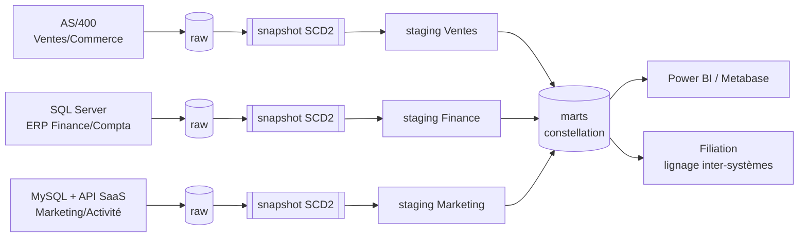
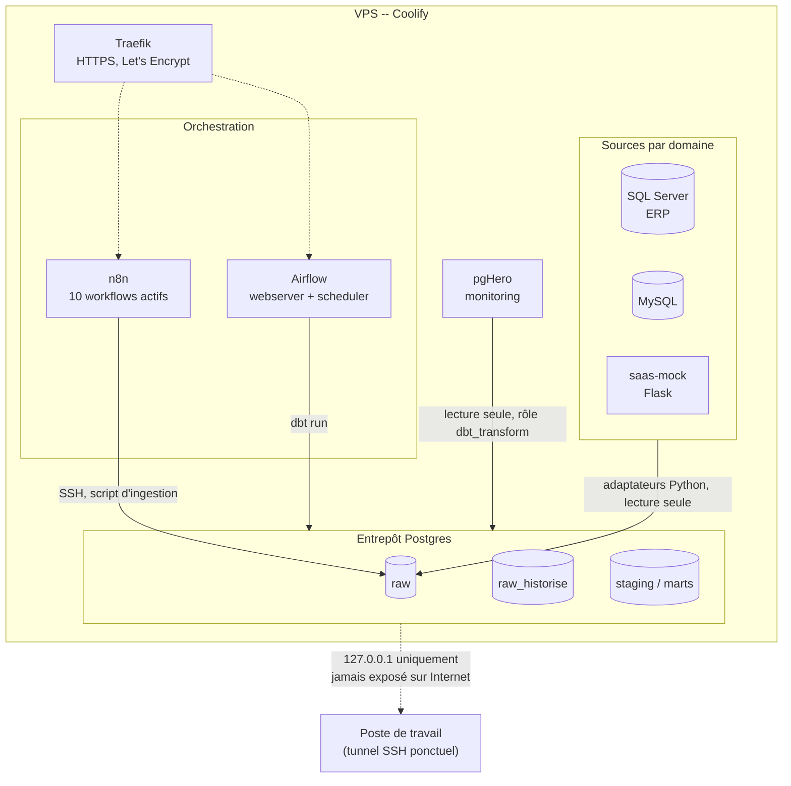

# Bilan complet du projet

Rendu de synthèse : chiffres clés, architecture logique, infrastructure de
déploiement, tous les outils, et les 3 avant/après chiffrés — un point
d'entrée unique pour prendre le projet dans son ensemble, sans tout relire
phase par phase.

> **Aucun identifiant, mot de passe, hostname ou IP réels dans ce document
> ni dans les schémas ci-dessous** — les secrets vivent uniquement en
> variables d'environnement / directement sur le serveur, jamais commités
> (voir la section [Sécurité & gouvernance](#sécurité--gouvernance)).
> Les schémas d'infrastructure sont volontairement génériques sur ce point.

## En un coup d'œil

| | |
|---|---|
| Domaines métier | 3 (Ventes/Commerce, Finance/Compta, Marketing/Activité) |
| Sources réelles | AS/400 · SQL Server (ERP) · MySQL + API SaaS |
| Modèles dbt | 24 (12 staging + 12 marts) |
| Snapshots SCD2 | 3 |
| Tests dbt | 51/51 + 3/3 tests unitaires |
| Sources avec freshness déclarée | 12/12 |
| Modèles sous contrat de schéma | 3 (un par domaine, ceux consommés par la BI) |
| Modèles incrémentaux | 3 |
| Workflows n8n actifs | 14 (3 ingestion + 7 ops + 4 hérités du Projet 18) |
| Phases terminées | 7 sur 8 (la 8ᵉ, Hermès Agent, optionnelle, en standby) |
| Coût | 0 € (infra VPS déjà engagée pour le Projet 18) |

## Architecture logique

Même schéma en 5 étapes répété à l'identique sur les 3 domaines, qui
convergent vers un entrepôt en **modèle constellation** (dimensions
partagées, plusieurs faits) :

`dim_date` est la dimension réellement partagée entre les 3 domaines —
`fait_ventes`, `fait_ecritures`, `fait_envois` s'y rattachent tous par
valeur de date. Détail complet du principe medallion et du modèle
constellation : [`docs/analyse-transverse.md`](analyse-transverse.md).

## Infrastructure de déploiement

Un seul VPS (réutilisé du [Projet 18](https://github.com/valentinratigniet-byte/projet-18-monitoring-energie-rte),
pas une dépense nouvelle), Coolify comme PaaS auto-hébergé, Traefik pour
le routage HTTPS. **Adresse et identifiants volontairement absents du
schéma** — seule la topologie compte ici.

**Décisions de sécurité réseau, assumées :**
- L'entrepôt n'écoute qu'en local sur le VPS — jamais de port ouvert sur
  Internet. Un accès ponctuel (ex. Filiation, Phase 7) passe par un
  tunnel SSH éphémère, supprimé après usage.
- Airflow n'était exposé que sur `127.0.0.1` tant que son bon
  fonctionnement n'était pas vérifié — routage HTTPS public ajouté
  seulement après, en dernière étape.
- Aucun service de ce projet n'a de port applicatif ouvert publiquement
  sans passer par Traefik (HTTPS, certificat valide vérifié).

## Outils

Inventaire complet — lien officiel, tâche, pourquoi ce choix, comment il
est déclenché — dans [`docs/outils.md`](outils.md). Résumé par catégorie :

| Catégorie | Outils |
|---|---|
| Sources | SQL Server, MySQL, AS/400 (simulé), PostgreSQL |
| Ingestion | Python, psycopg2, pymssql, PyMySQL, openpyxl, Faker, SQLAlchemy, sqlglot, Paramiko |
| Transformation | dbt-core + dbt-postgres, pg_trgm |
| Orchestration | Apache Airflow, n8n |
| Infrastructure | Docker, Coolify, Traefik, Let's Encrypt |
| Qualité / gouvernance | pgHero, script maison, Filiation, norme Factur-X |
| BI | Power BI, Metabase |
| CI/CD | GitHub Actions, gh CLI |

## Avant / après, les 3 domaines

Chiffres mesurés, jamais recopiés d'une version antérieure sans
revérification (deux erreurs de mesure historiques — taux de mojibake
Marketing, taux SIREN invalide Finance — ont été trouvées et corrigées de
cette façon). Détail et méthode dans `avant.md`/`apres.md` de chaque
domaine.

### Ventes/Commerce (AS/400 + Excel)

| Indicateur | Avant | Après |
|---|---|---|
| Clients | 314 (28 doublons non résolus) | 314 (doublons flagués, visibles) |
| Commandes | 2320 (dates sur 2 formats, statuts en 7 variantes) | 2320 (1 format, 3 statuts + `INCONNU`) |
| Chiffre d'affaires HT | non calculable (centimes-texte) | **15 092 645,63 €** |
| Remises rattachées à un client AS/400 | 0 (aucune clé commune) | 3 sur 16 (19 %), confiance mesurée |

### Finance/Compta (l'ERP SQL Server)

| Indicateur | Avant | Après |
|---|---|---|
| Fournisseurs | 80 (1 SIREN invalide/absent) | 80 (SIREN normalisé et flagué) |
| Écritures comptables | 866 (11 doublons de saisie exacts) | **855** (doublons supprimés) |
| Montant TTC total | non calculable (2 formats texte) | **7 240 138,82 €** |
| Rapprochement factures — canal Factur-X | — | **91 % (387/426)** |
| Rapprochement factures — canal non structuré | — | **44 % (190/428)** |
| Accès à l'IBAN fournisseur | non contrôlé | `role_finance` uniquement |

### Marketing/Activité (MySQL + API SaaS)

| Indicateur | Avant | Après |
|---|---|---|
| Contacts | 206 (5,8 % doublons probables) | 206 (`contact_doublon_probable` flagué, visible) |
| Envois | 755 (statuts en 6+ variantes FR/EN) | 755 (4 statuts canoniques + `INCONNU`) |
| Cohérence stats SaaS vs MySQL | non vérifiée | **8/8 campagnes cohérentes** |
| Accès de la Direction aux données personnelles | non contrôlé | **aucun** (0 table, vérifié par lecture réelle) |
| Mécanismes SaaS (OAuth2/polling/webhook/reverse ETL) | non éprouvés | **4/4 vérifiés réellement** |

**Constat honnête transverse** : sur les 3 domaines, une donnée douteuse
(doublon, mojibake, SIREN invalide) est **flaguée**, jamais fusionnée ou
corrigée automatiquement — la décision reste humaine. Le taux de
correction affiché n'est donc jamais 100 % par construction ; c'est
documenté comme un choix, pas une limite technique subie.

## Sécurité & gouvernance

- **Lecture seule sur toute source externe.** AS/400, SQL Server (l'ERP),
  MySQL, l'API SaaS : jamais un `INSERT`/`UPDATE` depuis le pipeline.
- **RLS multi-rôles vérifiée par `SET ROLE` + lecture réelle** sur les 3
  domaines (`role_rh`/`role_finance`/`role_direction`/`role_commercial`/
  `role_marketing`), pas seulement des policies déclarées.
- **Sécurité colonne en plus de la RLS ligne** sur l'IBAN fournisseur —
  un `GRANT SELECT` global aurait rendu le `REVOKE` colonne inopérant,
  corrigé en ne l'accordant jamais globalement à `role_direction`.
- **Minimisation d'accès** sur les données personnelles Marketing —
  `role_direction` n'a aucun accès aux tables contact, seulement à
  l'agrégat `fait_performance_campagnes`.
- **Moindre privilège partout** — rôles applicatifs scopés (`ingestion`
  ne peut pas créer de schéma, `dbt_transform` lit `raw` via un droit
  explicite `FOR ROLE`), jamais de superuser par défaut.
- **Secrets jamais commités.** Écrits directement sur le serveur (VPS) ou
  en variables d'environnement CI ; les fichiers versionnés
  (`.env.example`, `run_*.sh.example`) documentent uniquement la forme
  attendue, jamais une valeur réelle. La CI utilise des mots de passe
  placeholders valables uniquement le temps du run, distincts de la prod.
- **Accès distant scopé** — la deploy key GitHub utilisée pour le refresh
  automatisé de Filiation est limitée en écriture à ce seul dépôt
  (`gh repo deploy-key add --allow-write`), pas un token de compte
  entier.
- **Entrepôt jamais exposé sur Internet** — accès ponctuel uniquement via
  tunnel SSH éphémère, supprimé après usage.

## Statut final

Phases 1 à 7 terminées et vérifiées : infrastructure, les 3 domaines,
consolidation transverse, housekeeping, Filiation branché, DAG dbt de
production réel, 14 workflows n8n actifs et testés. Seule la Phase 8
(Hermès Agent, optionnelle) reste en standby.

**Pour aller plus loin :**
[`guide-realisation.md`](guide-realisation.md) (le journal complet, phase
par phase) · [`construction-etl-erp-dbt.md`](construction-etl-erp-dbt.md)
(la vue ETL/ERP/dbt, avec captures et pièges réels) ·
[`outils.md`](outils.md) (chaque outil en détail) ·
[`analyse-transverse.md`](analyse-transverse.md) (le livrable d'analyse
inter-domaines).
