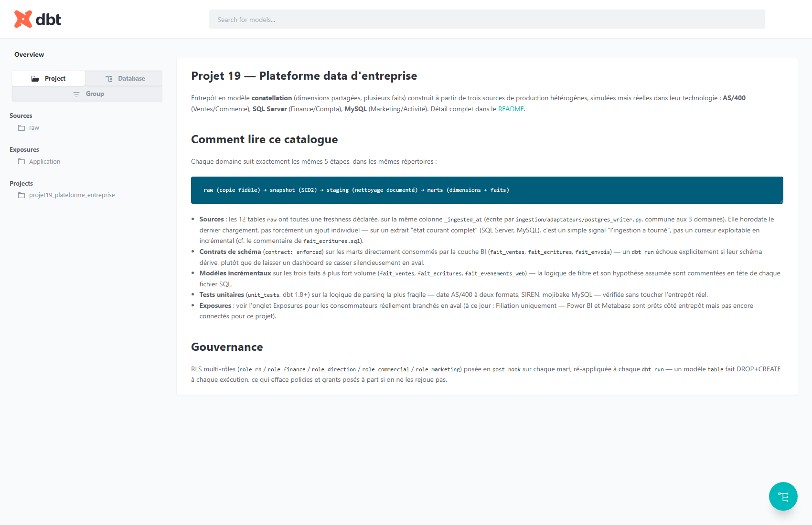
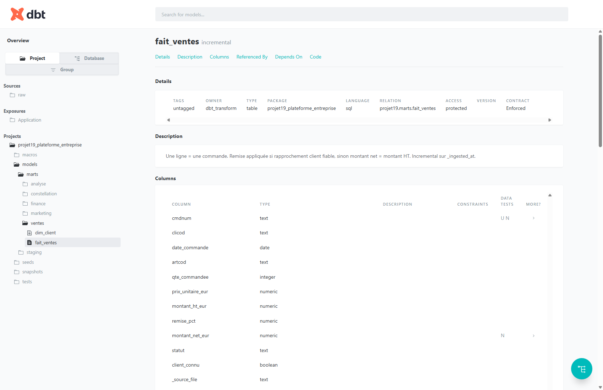
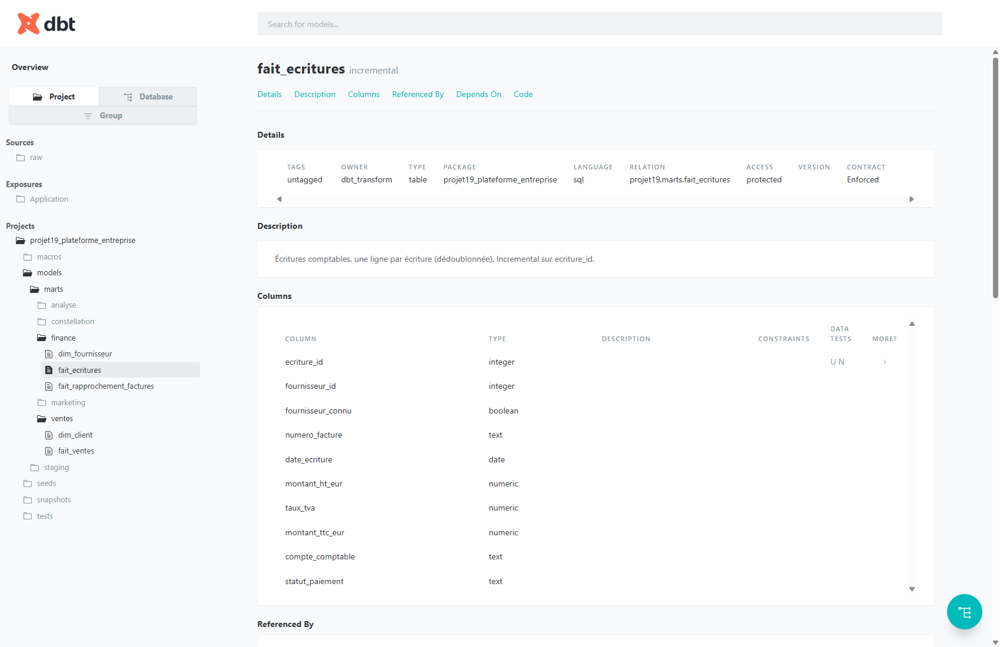
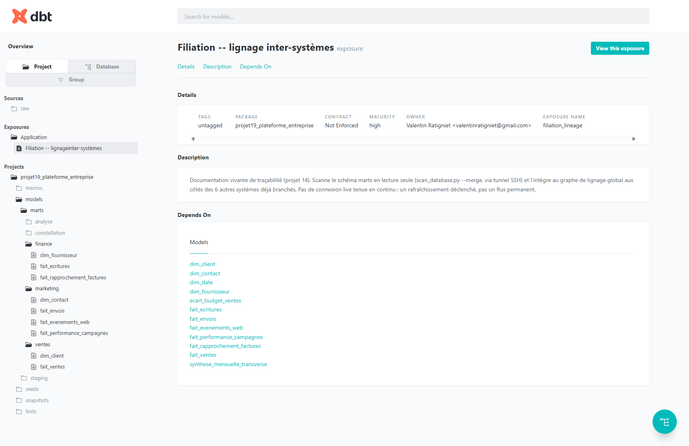

# Construire ce projet — ETL, ERP, dbt

Vue transversale du [guide de réalisation](guide-realisation.md) (674 lignes,
écrites phase par phase) : plutôt que de relire chronologiquement les 7
phases, ce document extrait 3 fils — comment l'ingestion (ETL) a été
bâtie, comment les sources de type ERP ont été traitées, et quels pièges
dbt reviennent indépendamment du domaine — avec, pour chacun, comment le
refaire sans retomber dans le même bug. Les outils cités sont détaillés
dans [`docs/outils.md`](outils.md).

## 1. ETL — un adaptateur par type de source, pas par domaine

Le principe qui a tenu sur les 3 domaines sans jamais être réécrit : un
adaptateur par *type* de source (fichier plat, Excel, SQL Server, CSV,
Factur-X, MySQL, JSON, API REST), réutilisé tel quel où qu'il serve.
L'orchestration spécifique à un domaine reste un petit script séparé
(`domaines/<domaine>/ingestion.py`) qui appelle ces briques génériques.

**Le writer commun, écrit en premier.** Avant le premier adaptateur de
lecture, une seule fonction d'écriture Postgres (`ingestion/adaptateurs/
postgres_writer.py`), réutilisée par les 3 domaines : tout en `TEXT` (le
typage arrive en staging dbt, pas à l'ingestion), deux colonnes de
traçabilité ajoutées automatiquement (`_source_file`, `_ingested_at`).
Deux fonctions, un seul choix à faire par table :

```python
def remplacer_table(conn, schema, table, lignes, source_file):
    """TRUNCATE + reload -- pour une source qui exporte l'état
    courant complet à chaque fois (ex. fichier clients AS/400)."""
    ...

def ajouter_lignes(conn, schema, table, lignes, source_file):
    """Append, idempotent au niveau fichier -- un source_file déjà
    marqué ingéré est sauté, sinon rejouer le workflow n8n
    dupliquerait tout à chaque exécution."""
    if deja_ingere(conn, schema, table, source_file):
        return 0
    ...
```

**Construction, dans l'ordre réellement suivi :**

1. Le writer commun (ci-dessus) — sans lui, rien d'autre ne peut écrire dans `raw`.
2. Un lecteur par type de source — `fichier_plat.py`, `excel.py`, `sqlserver.py`, `csv_file.py`, `facturx.py`, `mysql.py`, `json_file.py`, `api_rest.py` (client OAuth2 avec refresh). Chacun ne fait qu'une chose : lire et retourner des lignes.
3. L'orchestration par domaine — choisit quelle table cible, quel adaptateur, et `remplacer_table` ou `ajouter_lignes` pour chaque source.
4. Conteneurisation — le VPS n'a ni `psycopg2` ni `openpyxl` installés nativement : image dédiée `projet19-ingestion` (216 Mo), pas d'installation système.
5. Orchestration n8n — un workflow par domaine, puis 7 workflows transverses (housekeeping, sauvegarde, vérification RLS post-déploiement, RGPD...).

**Pièges réels rencontrés :**

- **Idempotence oubliée au premier essai** — en relançant le script d'ingestion une 2ᵉ fois, `raw.ventes_commandes` a doublé : `ajouter_lignes` réinjectait tous les fichiers à chaque exécution. Corrigé avec une table manifeste `raw._fichiers_ingeres` (table cible + nom de fichier) — un fichier déjà ingéré est sauté.
- **Un rôle applicatif sans `CREATE SCHEMA`** — le rôle `ingestion` n'a que le droit de créer des tables dans un schéma déjà existant (moindre privilège décidé dès le cadrage). Corrigé en retirant la création de schéma du code : `raw` est déjà créé une fois par l'init de l'entrepôt.
- **Un en-tête Excel saisi à la main casse le SQL** — une colonne nommée `"Remise (%)"` contient un `%` qui casse le parsing de `psycopg2.extras.execute_values` une fois utilisée comme identifiant. Corrigé en sanitisant les *noms* de colonnes avant de les utiliser comme identifiants SQL — jamais les valeurs.

> **Pour refaire :** écrire le writer commun (avec son idempotence) avant
> le premier adaptateur spécifique, et tester la **2ᵉ exécution** d'un
> script d'ingestion avant de le considérer fini — la plupart des bugs
> d'ETL ne se voient qu'au deuxième passage, jamais au premier.

### CDC

Tous les autres tableaux de ce projet sont ingérés par relecture complète
(`remplacer_table`) ou par accumulation de nouveaux fichiers
(`ajouter_lignes`) — les deux relisent une extraction entière à chaque
run, même si rien n'a changé. `raw.finance_fournisseurs` fait exception :
**Change Data Capture (CDC) natif SQL Server**, qui ne lit que ce qui a
réellement changé dans le journal de transactions depuis le dernier LSN
traité, pas une extraction complète comparée après coup.

**Pourquoi ce tableau précisément** : une fiche fournisseur se modifie
(IBAN, raison sociale — fusion/rachat) alors qu'une écriture comptable ne
se modifie jamais (elle s'annule par une nouvelle écriture) — CDC a du
sens sur une dimension qui change, pas sur un flux d'événements qui
s'accumule.

**Activation** (`domaines/finance-compta/source/simulateur_sqlserver.py`,
idempotente — tolère d'être rappelée) :

```python
EXEC sys.sp_cdc_enable_db;
EXEC sys.sp_cdc_enable_table @source_schema=N'dbo', @source_name=N'Fournisseurs',
     @role_name=NULL, @supports_net_changes=1;
```

Nécessite `MSSQL_AGENT_ENABLED: "true"` dans le conteneur SQL Server —
c'est le job SQL Agent que cette commande démarre qui déverse réellement
le journal de transactions dans les tables de changement. **Sans lui,
aucune erreur ne le signale** : les tables de changement restent
silencieusement vides, seul un test qui compare avant/après le révèle.

**Lecture** (`ingestion/adaptateurs/sqlserver_cdc.py`) :

```python
DECLARE @from binary(10) = sys.fn_cdc_increment_lsn(@dernier_lsn_traite);
DECLARE @to   binary(10) = sys.fn_cdc_get_max_lsn();
SELECT * FROM cdc.fn_cdc_get_all_changes_dbo_Fournisseurs(@from, @to, 'all');
```

Chaque ligne porte `__$operation` (1=delete, 2=insert, 3=update avant,
4=update après — l'image "avant" est filtrée, jamais utile pour l'état
courant) et `__$start_lsn` (converti en hex, conservé dans `raw` sous
`cdc_lsn`/`cdc_operation` — pas des artefacts internes jetés, la preuve
que la donnée vient réellement du CDC). Le filigrane (dernier LSN traité)
vit dans `raw._cdc_watermarks`, une ligne par table CDC.

**Premier appel = instantané complet, jamais du CDC seul.** CDC ne voit
rien d'antérieur à `sp_cdc_enable_table` — il n'a aucun moyen de
restituer l'état des fournisseurs déjà présents avant son activation.
`ingerer_fournisseurs_cdc()` détecte l'absence de filigrane et fait un
`SELECT *` classique une seule fois, pose le filigrane au **LSN maximal
courant** (pas minimal), puis bascule sur le CDC seul aux appels
suivants — sinon les changements captés depuis l'activation seraient
appliqués une seconde fois par-dessus l'instantané.

**Écrit dans une table qui reflète l'état courant, pas un journal.**
`postgres_writer.appliquer_cdc()` upsert sur `FournisseurID` (index
unique créé au premier appel) et supprime les lignes dont
`__$operation` = delete — ni `remplacer_table` (tout recharger) ni
`ajouter_lignes` (tout accumuler) ne conviennent : ici seules les lignes
réellement changées arrivent, il faut les fusionner dans l'état
existant, pas les empiler ni tout écraser.

**Vérifié en conditions réelles, pas supposé** — 3 exécutions
successives contre un vrai SQL Server avec CDC actif :

| Exécution | Ce qui a changé côté SQL Server | Résultat dans `raw.finance_fournisseurs` |
|---|---|---|
| 1 (amorçage) | 80 fournisseurs déjà en base au 1ᵉʳ lancement | 80 lignes insérées, filigrane posé au LSN courant |
| 2 | 4 fournisseurs modifiés (IBAN/raison sociale) via `simuler_maj_fournisseurs` | **4 lignes mises à jour en place** — total resté à 80, pas 84 |
| 3 | Aucun changement côté source | **0 ligne lue** — CDC renvoie un résultat vide, pas une erreur |

`dbt snapshot`/`dbt run`/`dbt test` rejoués sans aucune modification en
aval (`stg_finance_fournisseurs`, `dim_fournisseur`) — les colonnes CDC
en plus dans `raw` ne cassent rien, 13/13 tests toujours PASS.

> **Pour refaire :** activer CDC **après** avoir réfléchi à l'amorçage —
> c'est le piège le plus probable, pas la syntaxe `sp_cdc_enable_table`
> elle-même. Tester explicitement le cas "zéro changement" avant de le
> considérer fini : un CDC qui plante silencieusement sur une liste vide
> ne se voit qu'au 2ᵉ ou 3ᵉ run, jamais au premier.

**Avant / après, mesuré — domaine Ventes/Commerce (AS/400 + Excel)**
(détail complet et méthode : [`avant.md`](../domaines/ventes-commerce/avant.md) /
[`apres.md`](../domaines/ventes-commerce/apres.md)) :

| Indicateur | Avant | Après |
|---|---|---|
| Clients | 314 (28 doublons non résolus) | 314 (doublons flagués, visibles) |
| Commandes | 2320 (dates sur 2 formats, statuts en 7 variantes) | 2320 (1 format, 3 statuts + `INCONNU`) |
| Chiffre d'affaires HT | non calculable (montants en centimes-texte) | **15 092 645,63 €** |
| Remises rattachées à un client AS/400 | 0 (aucune clé commune) | 3 sur 16 (19 %), avec confiance mesurée |

**Constat honnête** : le rapprochement flou (`pg_trgm`) ne rattache que 3
des 16 remises négociées avec un niveau de confiance jugé fiable — pas un
échec du pipeline, une vraie limite du rapprochement par nom révélée
plutôt que masquée. Les 13 remises restantes n'affectent pas
`fait_ventes` (pas de remise fantôme appliquée), mais restent
concrètement non exploitées côté pilotage tant qu'un `CLICOD` n'est pas
saisi à la source.

## 2. ERP — la source qu'on ne touche jamais

Deux systèmes se comportent comme un vrai ERP : SQL Server (Finance/Compta,
*littéralement* l'ERP comptable — fournisseurs et écritures y sont peuplés
directement, pas exportés en fichier) et l'AS/400 (Ventes/Commerce, ERP de
gestion commerciale, traité en export batch, jamais en connexion directe).

**Lire un ERP, sans jamais y écrire** (`ingestion/adaptateurs/sqlserver.py`,
code réel, intégral) :

```python
"""Adaptateur générique -- SQL Server. Un seul lecteur réutilisable,
pas un par domaine."""
import pymssql

def lire_sqlserver(host, port, user, password, database, requete):
    conn = pymssql.connect(server=host, port=port, user=user,
                            password=password, database=database)
    try:
        with conn.cursor(as_dict=True) as cur:
            cur.execute(requete)  # toujours un SELECT, jamais un INSERT/UPDATE
            return list(cur)
    finally:
        conn.close()
```

Fournisseurs et écritures comptables passent par `remplacer_table` :
l'ERP représente l'état courant complet, pas un flux d'événements à
accumuler — chaque run récupère l'intégralité de la table telle qu'elle
existe maintenant dans l'ERP.

**Les vrais défauts d'un ERP, absorbés plutôt qu'ignorés** — simuler un
ERP réaliste, c'est simuler ses défauts, pas une base propre :

| Défaut observé | Où | Comment il est absorbé en aval |
|---|---|---|
| Dates ambiguës | AS/400 (`CMDDAT`) | Deux formats tentés (YYYYMMDD puis DDMMYYYY), dérive rendue visible via un flag `date_format_derive`, jamais corrigée en silence. |
| Aucune colonne de modif fiable | AS/400 + SQL Server | Snapshot dbt en stratégie `check` (comparaison de colonnes réelles) plutôt que `timestamp`. |
| Numérotation propre à l'ERP | Écritures SQL Server vs factures Factur-X | Rapprochement par SIREN + montant, jamais par numéro — les deux mondes ne partagent pas la même numérotation. |
| Doublons de saisie | Écritures comptables | *Dédoublonnés* en staging (contrairement aux commandes Ventes) : un doublon comptable est une vraie erreur de saisie (double-clic), pas un enregistrement distinct à garder. |
| SIREN mal formaté | Fournisseurs | Normalisé (espaces supprimés) et flagué invalide plutôt que rejeté — une facture reste rattachable même si son SIREN est mal renseigné. |

**Sécurité spécifique à une donnée ERP sensible.** L'IBAN des
fournisseurs devait être invisible pour `role_direction` mais visible
pour `role_finance`. Bug Postgres réel rencontré : un `GRANT SELECT`
global posé sur la table rend inopérant un `REVOKE SELECT (colonne)`
posé ensuite — vérifié via `has_column_privilege`, le revoke n'avait
mesurablement aucun effet. Corrigé en n'accordant **jamais** le SELECT
global à ce rôle : uniquement les colonnes explicitement listées, IBAN
exclue.

> **Pour refaire :** historiser (snapshot) **avant** tout nettoyage,
> jamais après — un ERP en "remplacement complet" à chaque extraction ne
> garde aucun historique lui-même ; c'est au pipeline de le faire, sur la
> donnée la plus brute possible.

**Avant / après, mesuré — domaine Finance/Compta (l'ERP SQL Server)**
(détail complet et méthode : [`avant.md`](../domaines/finance-compta/avant.md) /
[`apres.md`](../domaines/finance-compta/apres.md)) :

| Indicateur | Avant | Après |
|---|---|---|
| Fournisseurs | 80 (1 SIREN invalide/absent) | 80 (SIREN normalisé et flagué) |
| Écritures comptables | 866 (11 doublons de saisie exacts inclus) | **855** (doublons supprimés) |
| Montant TTC total | non calculable (2 formats texte FR/US) | **7 240 138,82 €** |
| Factures rattachées à une écriture — canal Factur-X (structuré) | — | **91 % (387/426)** |
| Factures rattachées à une écriture — canal non structuré (PDF/OCR) | — | **44 % (190/428)** |
| Accès à l'IBAN fournisseur | non contrôlé | `role_finance` uniquement (colonne restreinte) |

**Constat honnête** : l'écart 91 % vs 44 % n'est pas un artefact du
pipeline — c'est une mesure directe du **coût réel du papier/PDF non
structuré** : le canal non structuré perd le SIREN dans 60 % des cas et
produit un montant illisible dans 15 % des cas. Un argument chiffré
concret pour prioriser la migration Factur-X des fournisseurs restants,
pas une intuition.

## 3. dbt — cinq couches, les pièges qui reviennent

Le détail pas-à-pas complet (snapshot → staging → marts → tests → docs)
et les 5 fonctionnalités avancées ajoutées ensuite (incremental,
contracts, freshness, exposures, unit tests) sont dans le guide de
réalisation et les modèles eux-mêmes (`dbt/models/`). Cette section
retient les pièges dbt qui ne sont *pas* spécifiques à un domaine.

| Piège | Symptôme | Correctif |
|---|---|---|
| Colonnes brutes citées en majuscules | `column does not exist` dans le snapshot | Citer les colonnes (`"CLICOD"`) partout où elles sont référencées, y compris dans `unique_key`/`check_cols`. |
| `ALTER DEFAULT PRIVILEGES` ne suffit pas | `dbt_transform` ne peut pas lire les tables `raw` | Ne s'applique qu'aux objets créés PAR le rôle qui exécute la commande — utiliser `FOR ROLE ingestion` puisque les tables raw sont créées par ce rôle-là. |
| Snapshot qui écrit dans un schéma en lecture seule | `permission denied` sur `raw` | `target_schema` déplacé vers `raw_historise`, possédé par `dbt_transform` — garde la séparation ingestion/transformation. |
| RLS qui disparaît au run suivant | 2ᵉ vérification RLS échoue après une 1ʳᵉ réussie | Un modèle `table` fait DROP+CREATE à chaque `dbt run` — poser GRANT/policies en `post_hook` du modèle, jamais dans un script séparé. |
| Seed dans le mauvais schéma | `permission denied for schema raw` au premier `dbt seed` | Un seed n'est pas une source ingérée — `seeds: +schema: marts` dans `dbt_project.yml`. |

> **Pour refaire :** vérifier l'idempotence d'un snapshot dès son premier
> succès — relancer `dbt snapshot` une 2ᵉ fois sans changement de donnée
> doit produire `INSERT 0 0`, sinon le SCD2 ne fonctionne pas réellement,
> même si la commande n'a rien retourné en erreur.

### Captures réelles — `dbt docs generate`, entrepôt local rechargé pour l'occasion

Pas la production (l'entrepôt de prod n'est volontairement pas exposé sur
Internet, cf. Phase 7 du guide de réalisation) — un entrepôt Postgres
local reconstruit spécifiquement pour vérifier ces fonctionnalités avant
de les documenter.



*Page d'accueil du catalogue dbt, avant vide, maintenant un vrai doc
block qui explique comment lire le projet — sources avec freshness,
contrats, modèles incrémentaux, tests unitaires, exposures.*



*`fait_ventes` : badge "incremental" et "CONTRACT: Enforced" lus
directement dans le manifest après un run réel, 13 colonnes typées. C'est
en vérifiant cette page qu'un vrai `dbt run` a détecté `_ingested_at`
déclaré `TIMESTAMP` au lieu de `TIMESTAMPTZ` — corrigé avant cette
capture, pas après.*



*Même principe sur le domaine Finance/Compta — contrat de schéma et
incremental (curseur `ecriture_id`, pas `_ingested_at` : voir la partie
ERP ci-dessus pour pourquoi).*



*Un seul consommateur déclaré en aval : Filiation, réellement branché
(Phase 7). Power BI et Metabase sont prêts côté entrepôt mais pas
réellement connectés à ce projet à ce jour — volontairement absents de
cette page plutôt qu'inventés.*

## 4. Acheminement — du dernier domaine ingéré au premier `dbt run`

Ni ETL, ni ERP, ni dbt à proprement parler — la mécanique qui relie les
deux mondes. Jusqu'ici le DAG `dbt_pipeline` ne tournait qu'au cron
(5h UTC), une marge large mais aveugle : que les 3 domaines aient fini à
2h05 ou à 4h55, dbt attendait 5h quand même.

**Déclenchement événementiel, cron en filet de sécurité, pas un
remplacement.** Les 3 workflows n8n d'ingestion (`ventes-commerce`,
`finance-compta`, `marketing-activite`) appellent désormais l'API
Airflow (`POST /dags/dbt_pipeline/dagRuns`, via `ops/declencher_dag.sh.example`
— best-effort, `|| echo ... >&2` plutôt qu'un échec qui remonterait dans
n8n) juste après leur propre ingestion. Le cron 5h UTC reste actif,
inchangé — filet de sécurité si n8n est indisponible ou si l'appel API
échoue, pas remplacé par l'événementiel.

**La vraie difficulté n'est pas d'appeler l'API, c'est de ne pas lancer
dbt trop tôt.** Les 3 domaines ingèrent à des heures différentes (2h/3h/4h)
sans se connaître entre eux — le premier qui finit (Ventes, 2h) ne sait
pas si Finance et Marketing ont fini. Une porte en tête du DAG
(`attendre_les_3_domaines`, `ShortCircuitOperator`) répond à deux
questions avant de laisser passer :

```python
def _tous_domaines_ingeres_aujourdhui() -> bool:
    # 1. Un run reussi a-t-il deja eu lieu aujourd'hui ? -- evite de
    #    rejouer dbt en double si plusieurs domaines declenchent le DAG
    #    le meme jour (typiquement les 3).
    aujourdhui = pendulum.now("UTC").date()
    runs_reussis = DagRun.find(dag_id="dbt_pipeline", state=DagRunState.SUCCESS)
    if any(r.logical_date and r.logical_date.date() == aujourdhui for r in runs_reussis):
        return False
    # 2. Les 3 domaines ont-ils une donnee fraiche du jour ? -- une table
    #    temoin par domaine, jamais raw.finance_fournisseurs (le CDC peut
    #    legitimement n'avoir "rien de nouveau" un jour donne, cf. section CDC).
    for table in ["ventes_commandes", "finance_ecritures", "marketing_contacts"]:
        if not _frais_aujourdhui(table):
            return False
    return True
```

Un retour `False` n'est **pas un échec** : `ShortCircuitOperator` saute
proprement toutes les tâches en aval sans déclencher `notifier_echec` —
le déclenchement suivant (un autre domaine, ou le cron 5h UTC) retentera
normalement. C'est le premier domaine qui finit qui déclenche le plus de
"sauts propres", pas une anomalie : Ventes (2h) sautera systématiquement
tant que Finance et Marketing n'ont pas fini.

**Vérifié contre un vrai Airflow, pas seulement parsé.** Pas
d'environnement Airflow complet versionné dans ce dépôt (webserver +
scheduler + base de métadonnées), mais rien n'empêche d'en démarrer un
jetable pour vérifier : `apache/airflow:2.10.3-python3.12` en mode
`standalone` (webserver + scheduler + triggerer + admin auto-créé),
branché sur un vrai `raw` Postgres via `--network entrepot_default`, DAG
monté en volume. Séquence réellement rejouée par API (`curl`, comme le
ferait `declencher_dag.sh.example`), pas simulée :

| Scénario déclenché | Attendu | Observé |
|---|---|---|
| `marketing_contacts` vide (2 domaines prêts sur 3) | porte = saut propre | `attendre_les_3_domaines` OK, `dbt_seed` **skipped** |
| Les 3 domaines fraîchement peuplés | porte laisse passer | `dbt_seed` **failed** (pas *skipped* — normal, pas de vrai projet dbt monté dans ce test minimal) |
| Nouveau déclenchement, rien n'a encore réellement réussi | repasse la porte | `dbt_seed` de nouveau **failed**, pas *skipped* |
| `dbt_docs_generate` forcé à *success* (simule un run complet) | porte bloque le doublon | `dbt_seed` **skipped** |

**2 vrais bugs trouvés par ce test, invisibles à la simple lecture du
code :**

- **Auth API par défaut = cookie de session, pas Basic Auth.** Airflow
  2.10 n'active que `airflow.api.auth.backend.session` par défaut — un
  `curl -u user:pass` classique (exactement ce que fait
  `declencher_dag.sh.example`) recevait un 401 silencieux. Corrigé en
  ajoutant `airflow.api.auth.backend.basic_auth` à
  `AIRFLOW__API__AUTH_BACKENDS` dans `airflow/docker-compose.yml`.
- **`DagRun.state == 'success'` même quand tout a été sauté.** Un
  `ShortCircuitOperator` qui retourne `False` marque les tâches en aval
  `skipped`, pas `failed` — et un DagRun sans aucune tâche en échec est
  `success`, y compris quand rien n'a réellement tourné. La 1ʳᵉ version
  de `_tous_domaines_ingeres_aujourdhui()` vérifiait `DagRun.state`
  directement : le tout premier déclenchement prématuré de la journée
  (Ventes, 2h, avant que Finance/Marketing aient fini) aurait
  définitivement bloqué dbt pour le reste du jour, cron 5h UTC inclus.
  Corrigé en vérifiant l'état de la **dernière tâche réelle**
  (`dbt_docs_generate`), pas l'état du DagRun.

> **Pour refaire :** un déclenchement événementiel sans porte de garde
> est plus dangereux qu'utile — il ferait tourner dbt sur un tiers de la
> donnée du jour, silencieusement "à l'heure", jamais vu comme une
> anomalie tant que personne ne compare les volumes. Et la porte
> elle-même mérite un vrai Airflow jetable pour être vérifiée : les deux
> bugs ci-dessus ne se voient ni à la lecture, ni au simple parsing du
> DAG, seulement à l'exécution réelle des 4 scénarios ci-dessus.
> après.

## Ordre de construction, si c'était à refaire

L'ordre réellement suivi sur les 7 phases — chaque étape ne dépend que de
la précédente :

1. **Infra partagée minimale** — entrepôt Postgres + rôles à privilège minimal (`ingestion`, `dbt_transform`) avant tout code.
2. **Un domaine complet, du writer au mart** — pas les 3 en parallèle : un seul jusqu'au bout (ingestion → snapshot → staging → marts → RLS vérifiée) pour laisser le patron se stabiliser avant de le répéter.
3. **Répéter sur les domaines suivants** — chaque nouveau domaine réutilise les adaptateurs génériques déjà écrits ; n'en ajouter que pour un type de source vraiment nouveau.
4. **Consolidation transverse** — dimension partagée (`dim_date`) et analyse inter-domaines seulement une fois les 3 domaines individuellement vérifiés.
5. **Housekeeping et documentation vivante** — `dbt docs`, index/bloat, lignage, une fois qu'il y a quelque chose de stable à documenter.
6. **Orchestration de production** — DAG Airflow réel + workflows n8n testés avec de vrais appels, en dernier puisqu'il orchestre tout ce qui précède.

---

Voir aussi : [`guide-realisation.md`](guide-realisation.md) (le journal
complet, phase par phase), [`dbt-possibilites-integrations.md`](dbt-possibilites-integrations.md)
(dbt en général, en partant de zéro — progiciels génériques, intégrations,
possibilités au-delà de ce projet) et [`outils.md`](outils.md) (chaque
outil, pourquoi ce choix, comment il est déclenché).
