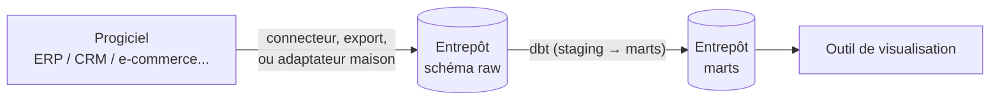

# dbt — possibilités, intégrations, connexions progiciels

Ce document part de zéro : il ne suppose pas que dbt est déjà connu. Les
autres docs (`construction-etl-erp-dbt.md`, `guide-realisation.md`) racontent
*ce qui a été construit dans ce projet précis* ; celui-ci prend du recul et
explique *ce que dbt permet en général* — pour situer ce projet dans
l'écosystème dbt réel, pas seulement dans son propre périmètre.

## 0. dbt, en partant de zéro

**dbt** (*data build tool*) transforme de la donnée déjà chargée dans un
entrepôt, en écrivant cette transformation comme du **SQL versionné,
testé et documenté** — pas comme des requêtes lancées à la main ou des
scripts Python dispersés.

Deux idées suffisent à comprendre pourquoi dbt existe :

- **ELT plutôt qu'ETL** — on charge la donnée brute dans l'entrepôt
  *d'abord* (`raw`), on la transforme *ensuite*, dans l'entrepôt lui-même
  (`staging` → `marts`). Avantage concret : la source brute reste
  disponible pour rejouer une transformation différente, sans tout
  ré-extraire depuis le système d'origine.
- **La transformation comme du code, pas comme des requêtes perdues** —
  chaque transformation est un fichier `.sql` versionné dans git, testable,
  documenté, avec ses dépendances déclarées explicitement via `ref()` et
  `source()`. dbt compile ce graphe et l'exécute dans le bon ordre — ce
  projet a 24 modèles, dbt sait tout seul dans quel ordre les construire.

C'est tout. Le reste de ce document détaille ce que ça permet concrètement.

## 1. Connexions aux progiciels — le principe, généralisé

**dbt ne se connecte jamais à un progiciel.** Il se connecte uniquement à
l'entrepôt (Postgres, BigQuery, Snowflake...). Le pont entre un progiciel
et l'entrepôt est toujours fait par un outil *séparé*, en amont de dbt.
C'est la frontière architecturale la plus importante à comprendre — et
elle n'est pas spécifique à ce projet, elle est vraie pour tout usage de
dbt en entreprise.



Ce projet illustre ce principe avec 3 systèmes qui se comportent comme de
vrais progiciels (AS/400, SQL Server, MySQL — détail dans
`construction-etl-erp-dbt.md`, section ERP), chacun lu par un adaptateur
Python dédié, jamais par dbt directement. Au-delà de ce projet, les
familles de progiciels qu'un projet dbt croise le plus souvent, en
générique :

| Famille | Exemples génériques | Comment le pont se fait, typiquement |
|---|---|---|
| ERP | SAP S/4HANA, Sage, Cegid, Oracle NetSuite, Microsoft Dynamics 365, Odoo | Export batch (comme l'AS/400 ici), connecteur natif, ou réplication CDC (Debezium, Fivetran) vers `raw` |
| CRM | Salesforce, HubSpot, Dynamics CRM | Connecteur managé (Fivetran, Airbyte) ou API REST paginée — même principe que l'adaptateur API SaaS de ce projet (domaine Marketing) |
| E-commerce | Shopify, Magento, PrestaShop | Export/API du back-office, souvent déjà proposé en connecteur prêt à l'emploi par les outils d'ingestion managés |
| Comptabilité | QuickBooks, Pennylane, Sage Compta | Export CSV/API — même logique que l'ERP SQL Server de ce projet (Finance/Compta) |
| Outils SaaS marketing | Mailchimp, Brevo, ActiveCampaign | Webhook (push temps réel) + polling API — même double mécanisme que le mock SaaS Marketing de ce projet |

**Ce qui ne change jamais, quel que soit le progiciel** : dbt commence
*après* que la donnée soit posée dans `raw`. Un progiciel mal fichu (dates
ambiguës, doublons, numérotation propre à l'outil) reste un problème
d'ingestion et de staging — jamais un problème que dbt "corrige à la
connexion", puisqu'il n'y a pas de connexion directe à corriger.

## 2. Intégrations — l'écosystème autour de dbt

### Orchestrateurs

dbt ne se déclenche pas tout seul — quelque chose doit lancer
`dbt run`/`dbt test` selon un calendrier ou un événement :

| Orchestrateur | Où dbt s'intègre | Ce projet |
|---|---|---|
| **Apache Airflow** | `BashOperator`/`dbt Cloud provider` dans un DAG, retries fins, sensors, backfill natif | Utilisé — DAG `dbt_pipeline.py`, quotidien 5h UTC |
| **dbt Cloud (scheduler intégré)** | Pas d'orchestrateur externe : dbt Cloud propose son propre planificateur de jobs | Non utilisé ici (dbt-core open source, pas dbt Cloud) |
| **Dagster / Prefect** | Intégrations officielles (`dagster-dbt`, `prefect-dbt`) qui exposent chaque modèle dbt comme un actif/une tâche suivie individuellement | Non utilisé ici — Prefect sert ailleurs dans le portfolio (Projet 10) pour l'extraction, pas pour dbt |
| **n8n / low-code** | Simple appel `dbt run` en ligne de commande via un nœud SSH/Exec | Utilisé ailleurs dans le portfolio (Projet 18) pour un pipeline plus petit |

### CI/CD et workflow git

dbt est pensé pour vivre dans un dépôt git comme n'importe quel projet
logiciel :

- **Revue par Pull Request** — un changement de modèle SQL se relit comme
  du code, avant merge, pas après un run manuel en prod.
- **CI "classique"** — rejouer `dbt run`/`dbt test` contre un entrepôt
  jetable à chaque push (GitHub Actions, GitLab CI, Azure DevOps). C'est
  ce que fait `.github/workflows/ci.yml` de ce projet : entrepôt +
  3 sources réelles + dbt, rejoué à chaque push.
- **Slim CI (`state:modified` + `--defer`)** — au lieu de tout rejouer,
  dbt ne reconstruit que les modèles réellement modifiés (et leurs
  descendants), en s'appuyant sur les tables déjà construites en prod pour
  le reste (`--defer`). Beaucoup plus rapide sur un gros projet. **Non
  construit ici** (documenté comme piste, cf. `construction-etl-erp-dbt.md`)
  faute d'un environnement de dev séparé de la prod pour le tester
  proprement.
- **dbt Cloud CI** — équivalent packagé : un job CI se déclenche
  automatiquement sur chaque PR, sans configuration YAML à écrire.

### Outils de visualisation (BI)

dbt ne fait jamais de restitution — il prépare des tables (`marts`) que
n'importe quel outil BI peut lire directement :

| Outil | Connexion à dbt | Ce projet |
|---|---|---|
| **Power BI** | Connecteur PostgreSQL/BigQuery/Snowflake natif sur le schéma `marts` | Prêt côté entrepôt, **pas encore connecté à ce jour** (cf. exposures ci-dessous) |
| **Metabase** | Idem, connexion directe au schéma `marts` | Idem — prêt, pas connecté |
| **Tableau, Looker, Looker Studio** | Même principe : connexion SQL directe aux marts | Utilisés ailleurs dans l'écosystème dbt, pas dans ce portfolio |
| **dbt Semantic Layer (MetricFlow)** | Couche de métriques définies une fois dans dbt, interrogée par les outils BI compatibles (pas une simple table) | Fonctionnalité plus récente et plus avancée que ce que ce projet utilise — mentionnée pour situer, pas construite ici |

### IDE et outils de développement

- **dbt Cloud IDE** — éditeur web intégré (autocomplétion `ref()`,
  prévisualisation de requête compilée).
- **VS Code + extension "dbt Power User"** — équivalent local, utilisé
  pour ce projet (dbt-core en CLI, pas dbt Cloud).
- **CLI `dbt-core`** — `dbt run`, `dbt test`, `dbt docs generate` : la
  base commune à toutes les intégrations ci-dessus, c'est elle qui tourne
  réellement dans ce projet (image `ghcr.io/dbt-labs/dbt-postgres`).

### Catalogues et gouvernance tierce

dbt génère un `manifest.json` (graphe complet : modèles, colonnes, tests,
lignage) que n'importe quel outil tiers peut lire — c'est exactement ce
que fait [Filiation](https://github.com/valentinratigniet-byte/projet-14-filiation)
(projet maison de ce portfolio) pour enrichir son lignage inter-systèmes.
Des outils de gouvernance/catalogue du marché (Atlan, Select Star, Castor)
font la même chose de façon plus large — ils consomment le manifest dbt
comme une source de vérité, sans jamais modifier les modèles eux-mêmes.

## 3. Possibilités — ce que dbt permet au-delà de ce qui est montré ailleurs

### Matérialisations

Comment un modèle est physiquement construit dans l'entrepôt — un choix
par modèle, dans sa config :

| Matérialisation | Ce que dbt fait | Quand l'utiliser |
|---|---|---|
| `view` | Crée une vue SQL, recalculée à chaque lecture | Modèle léger, peu lu, ou juste intermédiaire (staging) |
| `table` | `DROP` + `CREATE` complet à chaque run | Modèle lu souvent, volume raisonnable — ce que ce projet utilise par défaut sur `marts` |
| `incremental` | N'ajoute/ne met à jour que les nouvelles lignes | Gros volume qui grandit avec le temps — utilisé sur `fait_ventes`/`fait_ecritures` (cf. `construction-etl-erp-dbt.md`) |
| `ephemeral` | N'existe jamais dans l'entrepôt, juste inlinée en CTE dans les modèles qui la référencent | Logique intermédiaire partagée, jamais interrogée seule |

### Macros et Jinja

Un modèle dbt est du SQL enrichi de **Jinja** (le même moteur de templates
que Flask/Django). Une **macro** est une fonction réutilisable écrite en
Jinja/SQL — exemple générique, hors de ce projet :

```sql

    round({{ colonne }} * 100)::int


-- utilisation dans un modèle :
select {{ euros_vers_centimes('montant_ht_eur') }} as montant_centimes
```

Ce projet utilise Jinja pour ses conditions (``,
cf. `construction-etl-erp-dbt.md`) mais ne définit pas de macro
personnalisée — le volume de logique répétée ne le justifiait pas encore.

### Packages (dbt Hub)

L'écosystème dbt publie des **packages** réutilisables, installables via
`packages.yml` — équivalent d'une bibliothèque tierce en Python :

- **`dbt-utils`** — macros génériques (`generate_surrogate_key`,
  `date_spine` pour générer une dimension de dates, tests
  `equal_rowcount`...).
- **`dbt-expectations`** — tests de qualité de données plus riches que
  les tests génériques natifs (inspiré de Great Expectations) : plages de
  valeurs, distributions, regex.
- **`dbt-date`**, **`codegen`** — utilitaires de dates, génération
  automatique de fichiers `.yml` de doc/tests.

**Non installés dans ce projet** — le générateur de `dim_date` est écrit
à la main (`generate_series` SQL direct), et les tests restent les tests
génériques natifs (`not_null`, `unique`, `accepted_values`,
`relationships`) plus quelques tests singuliers SQL. Un choix
raisonnable à ce volume, mais `dbt-utils` serait la première dépendance à
ajouter si le projet grandissait.

### Seeds

Une **seed** est une petite table de référence versionnée directement en
CSV dans le repo (pas une source externe ingérée) — utile pour un
référentiel stable qui change rarement (codes pays, taux de TVA,
budget prévisionnel...). Ce projet en a une (le seed budget, cf. bilan
dans `guide-realisation.md`) : `dbt seed` la charge dans `marts`
directement (pas `raw` — une seed n'est pas une donnée "à historiser",
c'est déjà la vérité versionnée dans git).

### Environnements et profils

`profiles.yml` définit un ou plusieurs **targets** (dev, prod...) — même
projet dbt, connexion différente selon l'environnement. Ce projet utilise
un seul target `prod` en pratique (`PGHOST`/`PGUSER`... lus depuis les
variables d'environnement du conteneur Airflow, cf. `docker-compose.yml`)
mais le mécanisme permettrait un `target dev` isolé sans changer une
ligne de SQL — c'est justement ce qui manque pour construire la Slim CI
mentionnée plus haut.

### Fonctionnalités déjà construites dans ce projet (rappel, détail ailleurs)

Snapshots (SCD2), tests génériques et singuliers, contracts de schéma,
source freshness, exposures, unit tests — toutes déjà construites et
vérifiées dans ce projet. Détail pas-à-pas et captures réelles :
[`construction-etl-erp-dbt.md`](construction-etl-erp-dbt.md) et
[`guide-realisation.md`](guide-realisation.md).

### Portabilité multi-entrepôt

Le SQL écrit dans les modèles dbt migre presque sans changement d'un
entrepôt à un autre — c'est l'**adapter** dbt (`dbt-postgres`,
`dbt-bigquery`, `dbt-snowflake`, `dbt-databricks`...) qui traduit les
commandes génériques (matérialisation, snapshot...) dans le dialecte SQL
et les mécanismes propres à chaque moteur. Ce projet utilise
`dbt-postgres` ; le [Projet 13](https://github.com/valentinratigniet-byte/projet-13-entrepot-central-bigquery)
de ce même portfolio reprend le **même modèle en étoile** sous
`dbt-bigquery` — la preuve concrète que la portabilité n'est pas
seulement théorique.

---

Voir aussi : [`construction-etl-erp-dbt.md`](construction-etl-erp-dbt.md)
(ce qui a été réellement construit dans ce projet, avec le code et les
pièges rencontrés) et [`outils.md`](outils.md) (chaque outil du
portfolio, choix et lien officiel).
