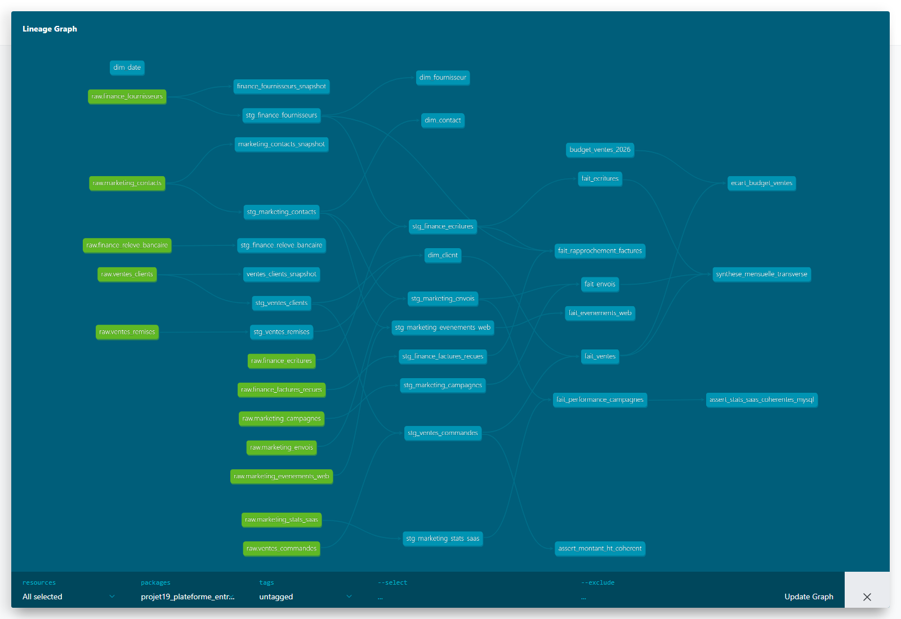

# Guide de réalisation

Écrit au fil de la construction réelle — chaque section correspond à ce
qui a été fait, vérifié, et fonctionne. Pas un plan à l'avance (ça, c'est
l'[issue #2](https://github.com/valentinratigniet-byte/valentinratigniet-byte/issues/2)).

## Phase 1 — Infra partagée : Airflow

**Objectif** : orchestrer le futur pipeline dbt (raw → snapshots → staging
→ marts → tests → slim CI) sans ajouter de charge inutile sur un VPS à
2 vCPU.

**Ce qui a été fait** :
1. Stack Airflow minimale — `LocalExecutor`, pas de Celery/Redis/workers
   (inutile pour ce volume, et le VPS n'a que 2 vCPU). Metadata DB dédiée
   (Postgres léger, séparée de l'entrepôt).
2. Déployée sur le VPS existant (`/opt/projet19/airflow/`), pas via le
   catalogue "1-clic" de Coolify (pas de template Airflow disponible) —
   `docker compose` direct, secrets réels écrits directement sur le
   serveur via SFTP (jamais commités, `.env.example` documente juste la
   forme attendue).
3. Webserver exposé uniquement sur `127.0.0.1:8090` pour l'instant — pas
   encore de routage public HTTPS via Traefik/Coolify. Volontairement
   séparé : vérifier que le service tourne avant de l'exposer.

**Vérifié, pas juste "up"** :
- `docker ps` → `airflow-webserver` et `airflow-postgres` healthy,
  `airflow-scheduler` opérationnel.
- `curl http://127.0.0.1:8090/health` → `HTTP 200`.
- `airflow dags list` → le DAG `healthcheck` détecté.
- DAG `healthcheck` déclenché manuellement → **state: success** — confirme
  que le conteneur peut bien lire `/opt/dbt` (volume monté), pas juste que
  le webserver répond.

**Routage HTTPS public — fait juste après, même session** :

Airflow n'a pas été déployé via le catalogue Coolify (pas de template
disponible), donc `coolify-proxy` (Traefik) ne rejoint pas automatiquement
son réseau comme il le fait pour les ressources gérées par Coolify
(n8n, Metabase). Reproduit le même schéma manuellement :
1. Labels Traefik ajoutés sur `airflow-webserver` dans le
   `docker-compose.yml` (routers http→https redirect + https avec
   `certresolver: letsencrypt`), en copiant exactement le pattern déjà
   utilisé par le n8n du Projet 18 (`docker inspect` sur le conteneur n8n
   pour lire ses labels réels plutôt que deviner).
2. `docker network connect airflow_default coolify-proxy` — attache
   manuellement le proxy au réseau d'Airflow (Coolify le fait
   automatiquement pour ses propres ressources, pas pour celle-ci).
3. `docker compose up -d airflow-webserver` pour recréer le conteneur avec
   les nouveaux labels.

**Vérifié** : `http://airflow-projet19.76.13.43.130.sslip.io/health` →
`302` (redirection vers HTTPS) ; `https://.../health` → `200`, avec
vérification **stricte** du certificat (pas de `-k`) qui passe — donc un
vrai certificat Let's Encrypt valide, pas juste servi en HTTPS auto-signé.
Fonctionné du premier coup, contrairement au Projet 18 où l'équivalent
avait demandé un contournement via la base Coolify — différence : ici
c'est une ressource neuve avec labels corrects dès le départ, pas une
ressource existante mal configurée à corriger après coup.

**Pas encore fait à l'issue de la Phase 1** : le vrai DAG de production
(remplace `healthcheck.py`).

## Phase 2 — Domaine Ventes/Commerce (en cours)

**Simulateurs d'usage** — deux sources écrites et vérifiées :
- `domaines/ventes-commerce/source/simulateur_as400.py` : 8 mois de
  fichiers plats à largeur fixe (clients + commandes), conventions AS/400.
  Défauts confirmés dans le contenu généré (pas juste documentés) :
  dérive de format de date sur 2 mois, doublons clients, statuts de
  commande orthographiés de façon incohérente, ~3% de commandes avec
  `CLICOD` orphelin. Auto-check : largeur de ligne fixe respectée sur tous
  les fichiers.
- `domaines/ventes-commerce/source/simulateur_excel_remises.py` : 2
  fichiers Excel concurrents (`v3`, `v4_FINAL`), remises qui divergent
  réellement entre les deux pour les mêmes clients, une formule cassée
  (`#REF!`).
- Fichiers générés non commités (`.gitignore`) — déterministes (seed
  fixe), régénérés à la demande par les scripts.

**Entrepôt Postgres déployé et vérifié** :
- `entrepot/docker-compose.yml` — Postgres auto-hébergé sur le VPS
  (`/opt/projet19/entrepot/`), même schéma que le déploiement Airflow
  (secrets écrits directement sur le serveur, jamais commités).
- Vérifié : schéma `raw` créé (`\dn`), rôles `ingestion` et
  `dbt_transform` créés sans privilège superuser (`\du`), réseau
  `entrepot_default` connecté à Airflow (scheduler + webserver) et à n8n
  pour un accès par nom de conteneur.

**Adaptateurs d'ingestion écrits, conteneurisés et vérifiés** :
- `ingestion/adaptateurs/` — fichier plat (largeur fixe), Excel, écriture
  Postgres générique. Un par TYPE de source, réutilisables par les autres
  domaines (doctrine du cadrage), pas réécrits par domaine.
- `domaines/ventes-commerce/ingestion.py` — orchestration spécifique au
  domaine (quel spec, quelle table `raw`, remplacement vs ajout).
- Host du VPS sans psycopg2/openpyxl → conteneurisé (`ingestion/Dockerfile`,
  image `projet19-ingestion`, 216 Mo), pas d'installation système.
- 2 bugs réels rencontrés et corrigés pendant le build (pas anticipés à
  l'avance) : (1) le rôle `ingestion` n'a pas le droit de `CREATE SCHEMA`
  (seulement des tables dans un schéma existant) — corrigé en retirant
  cette instruction, le schéma `raw` est déjà créé par l'entrepôt ;
  (2) un en-tête Excel saisi à la main (`"Remise (%)"`) contient un `%`
  qui casse le parsing SQL de `psycopg2.extras.execute_values` — corrigé
  en sanitisant les noms de colonnes (pas les valeurs) avant de les
  utiliser comme identifiants SQL.
- **Vérifié réellement** (pas juste "exit 0") : `raw.ventes_clients`
  314 lignes, `raw.ventes_commandes` 2320 lignes (= somme exacte des 8
  mois simulés), `raw.ventes_remises` 25 lignes (9 de v3 + 16 de v4,
  cohérent) — et un `SELECT` direct confirme les doublons clients
  (`CL9xxxxx`, 14 lignes) et le `_source_file` bien tracé par ligne.

**dbt — snapshots + staging écrits et vérifiés** (exécuté via l'image
officielle `ghcr.io/dbt-labs/dbt-postgres:1.8.latest`, pas d'image maison) :
- `snapshots/ventes_clients_snapshot.sql` — SCD type 2 (stratégie `check`,
  pas `timestamp` : l'AS/400 ne fournit pas de colonne de dernière
  modification fiable) sur `raw.ventes_clients`.
- `models/staging/ventes/` — 3 modèles avec de vraies règles de nettoyage,
  pas des exemples pédagogiques : `stg_ventes_clients` (doublons probables
  flagués via nom normalisé, pas supprimés), `stg_ventes_commandes`
  (détection du format de date YYYYMMDD vs DDMMYYYY, statuts regroupés
  par préfixe, centimes→euros, FK partielle flaguée via `client_connu`),
  `stg_ventes_remises` (réconciliation v3/v4 par version + date
  d'ingestion, formule Excel cassée détectée et exclue sans planter).
- **9/9 tests dbt passent**, dont un test singulier
  (`assert_montant_ht_coherent`, vérifie `montant = qté × prix`).

**3 vrais bugs rencontrés et corrigés** (pas anticipés à l'avance) :
1. Colonnes brutes créées avec identifiants cités en majuscules
  (`"CLICOD"`) — le snapshot dbt les référençait sans guillemets, Postgres
  les cherchait en minuscules → `column does not exist`. Corrigé en
  citant les colonnes dans la config du snapshot.
2. `ALTER DEFAULT PRIVILEGES` ne s'applique qu'aux objets créés PAR le
  rôle qui exécute la commande — les tables `raw` sont créées par
  `ingestion`, pas par `postgres` → `dbt_transform` ne pouvait pas les
  lire. Corrigé avec la variante `FOR ROLE ingestion`.
3. Le snapshot tentait d'écrire dans le schéma `raw` (possédé par
  `ingestion`, lecture seule pour `dbt_transform`) → `permission denied`.
  Corrigé en déplaçant `target_schema` vers `raw_historise`, un schéma
  que `dbt_transform` possède — garde la séparation des privilèges
  ingestion/transformation plutôt que d'élargir les droits.

**Idempotence vérifiée** : un 2e `dbt snapshot` sans changement de donnée
→ `INSERT 0 0` (aucune ligne dupliquée), confirme que le mécanisme SCD2
fonctionne réellement, pas juste "la commande s'exécute sans erreur".

**Marts écrits et vérifiés — `dim_client` + `fait_ventes`** :
- Rapprochement flou nom Excel (saisi à la main) → CLINOM AS/400 via
  `pg_trgm` (similarité de trigrammes) plutôt qu'un simple `=` — les noms
  ne matchent jamais exactement entre les deux sources.
- **Vrai problème de qualité trouvé et corrigé** : au seuil 0.4, deux faux
  positifs réels (`Legendre SARL` et `Lesage S.A.R.L.` matchaient tous les
  deux sur `Lefèvre Sarl`, le suffixe juridique commun gonflant le score)
  — remonté à 0.5 pour les exclure. **Résultat final : seulement 3 des 16
  remises Excel se rattachent avec confiance à un client AS/400** — la
  majorité des remises négociées ne peut pas être automatiquement
  réconciliée sans revue humaine. Un vrai résultat, pas la conclusion
  espérée, gardé tel quel.
- `fait_ventes` : grain = une commande, `montant_net_eur` calculé avec la
  remise rapprochée quand elle existe, sinon = montant HT (pas de remise
  inventée). 2320 lignes, cohérent avec le staging.
- Schémas dbt renommés `staging`/`marts` (au lieu de `raw_staging`/
  `raw_marts`, comportement par défaut de dbt qui concatène le schéma du
  profil) via un override `generate_schema_name` — cohérent avec la
  terminologie du cadrage.
- **14/14 tests dbt passent** (5 nouveaux sur les marts).

**RLS multi-rôles écrite et VÉRIFIÉE par `SET ROLE`** (`domaines/ventes-commerce/rls.sql` + `test_rls.py`, même discipline que le Projet 18) :
- `role_rh` — aucun accès (0 ligne sur les 2 tables, pas de justification
  métier à voir la donnée commerciale).
- `role_finance` / `role_direction` — accès complet (2320/314 lignes,
  y compris les commandes annulées, nécessaires pour la réconciliation
  budgétaire et le pilotage).
- `role_commercial` — commandes actives uniquement, `statut <> 'ANNULEE'`
  (2052/2320 lignes) — vue opérationnelle, les annulations ne relèvent
  pas du quotidien commercial.
- **8/8 cas vérifiés réellement** par `SET ROLE` + comptage, pas
  seulement policies déclarées.

**2 vrais pièges supplémentaires rencontrés et corrigés en finissant la Phase 2** :

1. **Idempotence de l'ingestion** — en testant le script qui sera appelé
   par n8n, je l'ai relancé une 2e fois : `raw.ventes_commandes` a
   doublé (4640 lignes au lieu de 2320), parce que `ajouter_lignes`
   réinjectait tous les fichiers à chaque exécution, pas seulement les
   nouveaux. Corrigé avec une table manifeste `raw._fichiers_ingeres`
   (table cible + nom de fichier) — un fichier déjà ingéré est sauté,
   pas ré-ajouté. Vérifié : 2 exécutions consécutives → 2320 lignes les
   deux fois (la 2e n'ajoute rien, correctement).
2. **RLS qui disparaît à chaque `dbt run`** — un modèle dbt matérialisé
   en `table` fait un `DROP` + `CREATE` à chaque exécution : les
   `GRANT`/policies RLS posés à part (script séparé) étaient donc
   effacés au run suivant. Découvert en relançant `dbt run` après avoir
   vérifié la RLS une première fois — le 2e test échouait
   (`permission denied`). Corrigé en déplaçant grants + policies dans un
   `post_hook` du modèle dbt lui-même (`config(post_hook=[...])`,
   idempotent via `DROP POLICY IF EXISTS` avant chaque `CREATE POLICY`)
   — réappliqué automatiquement à chaque run, pas un script qu'on oublie
   de rejouer. **Vérifié sur 2 runs consécutifs, 8/8 cas RLS OK les deux
   fois.**

**Workflow n8n** — export JSON prêt (`n8n/ventes-commerce-ingestion-workflow.json`,
Schedule Trigger quotidien 2h + noeud SSH qui appelle
`run_ingestion.sh` sur le VPS, secret hors du JSON). **Import dans n8n et
configuration de la credential SSH restent une étape manuelle** — comme
pour le déploiement initial de n8n au Projet 18, pas automatisable sans
clé API n8n déjà en main.

**Reste réellement ouvert (Phase 2)** : import manuel du workflow n8n.

## Phase 3 — Domaine Finance/Compta

**Sources déployées et vérifiées** :
- **SQL Server** (édition Developer forcée, `MSSQL_PID=Developer`, 0€) —
  déployé sur le VPS, healthy. Fournisseurs + écritures comptables peuplés
  directement en base (pas un fichier à ingérer, l'ERP EST la source).
- **CSV relevé bancaire** — export mensuel, délimiteur `;` (convention
  française), montants en texte format FR.
- **Factur-X** — XML structuré (EN16931-inspiré) pour les fournisseurs
  migrés + texte OCR-like dégradé pour les non-migrés, taux de migration
  croissant 20%→65% sur 8 mois simulés.

**Bug de conception majeur trouvé et corrigé — événements non corrélés** :
la première version générait les montants des écritures SQL Server et des
factures Factur-X de façon **totalement indépendante** (deux tirages
aléatoires séparés) — techniquement deux sources différentes, mais censées
représenter la MÊME réalité économique (une facture reçue = une écriture
comptable). Résultat : un taux de rapprochement quasi nul (moins de 2%),
qui n'était pas une vraie découverte mais un artefact du simulateur.
Corrigé avec `generer_evenements.py` — une liste canonique d'événements
partagée par les deux simulateurs (même fournisseur, même montant), avec
une couverture volontairement imparfaite (90% ont écriture+facture, 5%
écriture seule, 5% facture seule) pour que le taux de rapprochement mesure
un vrai phénomène plutôt qu'un bug.

**Adaptateurs d'ingestion** : `ingestion/adaptateurs/{sqlserver,csv_file,facturx}.py`
(génériques, réutilisables) + `domaines/finance-compta/ingestion.py`
(orchestration : fournisseurs/écritures = `remplacer_table` car l'ERP
représente l'état courant complet, pas un export ; relevé bancaire et
factures reçues = `ajouter_lignes`, idempotent). Vérifié : 80 fournisseurs,
866 écritures, 553 lignes de relevé, 854 factures reçues — idempotence
confirmée sur relance.

**dbt — snapshot + staging + marts** (exécuté via l'image officielle
dbt-postgres) : snapshot SCD2 sur les fournisseurs, 4 modèles staging avec
règles de nettoyage réelles (montants FR/US → numeric, SIREN normalisé,
doublons de saisie comptable **dédoublonnés** — contrairement aux
commandes Ventes, ici ce sont de vrais doublons de saisie, pas des
enregistrements distincts), 3 marts (`dim_fournisseur`, `fait_ecritures`,
`fait_rapprochement_factures`). **26/26 tests dbt passent.**

**Trouvaille analytique réelle — rapprochement facture/écriture** : après
correction du bug de corrélation, **91% des factures Factur-X (structurées)
se rapprochent automatiquement** d'une écriture comptable, contre
**seulement 44% des factures non structurées** (SIREN/montant absents ou
illisibles à l'OCR). Un argument chiffré concret en faveur de la réforme
de facturation électronique, mesuré sur la donnée simulée elle-même.

**RLS multi-rôles + sécurité colonne — nouveauté par rapport à Ventes** :
en plus de la RLS ligne (`role_rh`=0, `role_finance`/`role_direction`=tout),
**restriction au niveau colonne** sur `dim_fournisseur.iban` (donnée
bancaire sensible) : `role_direction` ne peut pas la lire, `role_finance`
oui. **Bug Postgres réel rencontré** : un `GRANT SELECT` global sur la
table rend inopérant un `REVOKE SELECT (colonne)` posé après — le grant
table prime toujours sur le revoke colonne (vérifié via
`has_column_privilege`, le revoke n'avait aucun effet mesurable). Corrigé
en n'accordant **jamais** le SELECT global à `role_direction` : uniquement
les colonnes explicitement listées, IBAN exclue. **8/8 cas vérifiés** par
`SET ROLE` + tentative de lecture réelle de la colonne (pas juste les
GRANT déclarés).

**Reste réellement ouvert (Phase 3)** : ~~workflow n8n, documentation du
domaine~~ — fait dans la foulée (cf. Phase 3 dans le README du domaine).

## Phase 4 — Domaine Marketing/Activité (le plus riche des 3)

**Socle d'événements partagé étendu à un 3e domaine** — même discipline
que Finance/Compta : `generer_evenements.py` génère contacts/campagnes/
envois/événements web cohérents entre eux (funnel envoi → ouverture →
clic → visite réel), consommés par les simulateurs MySQL et JSON.

**Sources déployées et vérifiées** :
- **MySQL 8** (0€, self-hosted) — contacts/campagnes/envois, avec un
  défaut MySQL-spécifique original : mojibake réel (bug de charset
  latin1/utf8mb4 simulé par un vrai aller-retour d'encodage, pas un texte
  aléatoire). **Erreur de mesure trouvée et corrigée en préparant les
  schémas avant/après** (voir `domaines/marketing-activite/apres.md`) :
  le taux documenté initialement (~8 %) confondait le taux de *tirage*
  du générateur avec le taux de défaut *visible* — le bug ne se voit que
  sur un nom déjà accentué, mesuré à 0/206 occurrence visible sur ce jeu.
- **Flux JSON événementiel** — structure semi-structurée (objet
  `contexte` imbriqué), aplati à l'ingestion via un nouvel adaptateur
  générique `json_file.py`.
- **Mock d'API SaaS** (`saas-mock/`, Flask, conteneurisé) — la brique la
  plus originale du projet : **4 mécanismes réellement implémentés et
  vérifiés**, pas simulés en apparence :
  1. **OAuth2** — jetons courts (30s, volontairement) pour forcer un
     vrai cycle de refresh ; vérifié en attendant réellement 32
     secondes puis en confirmant qu'un nouveau jeton différent est
     acquis automatiquement.
  2. **Polling paginé** — `/api/campagnes/stats`, 8 campagnes
     récupérées sur plusieurs pages.
  3. **Webhook push** — `/webhooks/declencher` fait un vrai appel HTTP
     sortant ; vérifié avec un récepteur temporaire (conteneur
     `webhook-echo` sur le réseau partagé) qui confirme la réception
     (HTTP 200), pas juste que l'appel a été tenté.
  4. **Reverse ETL** — `/api/segments` reçoit un segment calculé dans
     l'entrepôt (124 contacts engagés, jamais désabonnés) ; vérifié en
     relisant `/api/segments` côté SaaS pour confirmer la réception
     réelle, pas juste un code retour 200.

**Adaptateurs génériques ajoutés** : `mysql.py`, `json_file.py`,
`api_rest.py` (`ClientOAuth2` — acquisition + refresh, réutilisable pour
toute future API du même type).

**dbt — snapshot + staging + marts** : snapshot SCD2 contacts, 5 modèles
staging (email normalisé, mojibake **flagué pas réparé** — une réparation
SQL à l'aveugle risquerait de fabriquer un texte faux —, statuts FR/EN
regroupés, typo UTM "emial" corrigée explicitement), 4 marts dont
`fait_performance_campagnes` qui **recoupe les stats SaaS avec un calcul
indépendant depuis MySQL** — 8/8 campagnes cohérentes, testé
(`assert_stats_saas_coherentes_mysql`). **45/45 tests dbt du projet
entier passent.**

**RLS — minimisation d'accès, pas seulement RLS ligne** : nouveauté par
rapport à Ventes/Finance, `role_direction` n'a **aucun GRANT** sur
`dim_contact`/`fait_envois`/`fait_evenements_web` (données personnelles)
— seulement sur l'agrégat `fait_performance_campagnes`. Un premier essai
avait oublié le `GRANT` pour `role_rh` sur ces tables (l'accès était
refusé par absence de privilège plutôt que filtré à 0 ligne par RLS,
incohérent avec les autres domaines) — corrigé pour rester cohérent :
`role_rh` a le grant + une policy RLS qui renvoie 0 ligne partout,
`role_direction` n'a le grant nulle part sauf sur l'agrégat. **9/9 cas
vérifiés** par `SET ROLE` + tentative de lecture réelle (pas juste les
GRANT déclarés).

**Reverse ETL vérifié en conditions réelles** : `reverse_etl.py` calcule
le segment en SQL sur `marts.fait_envois`, l'envoie via `api_rest.py`, et
relit `/api/segments` côté SaaS pour confirmer que les 124 contacts sont
bien arrivés — pas une supposition sur le code retour.

**Workflow n8n** — export prêt, avec un webhook trigger en plus du pull
quotidien (représente le canal "push" du SaaS, cohérent avec le mock).

## Les 3 domaines sont terminés

Ventes/Commerce (Phase 2), Finance/Compta (Phase 3), Marketing/Activité
(Phase 4) sont tous construits, vérifiés et documentés.

## Phase 5 — Consolidation constellation + analyse transverse

**Constellation réelle** : `marts.dim_date` (calendaire, 2025-12 à
2026-09) partagée entre les 3 domaines — `fait_ventes`, `fait_ecritures`,
`fait_envois` s'y rattachent par valeur de date, pas de surrogate key
ajoutée aux faits déjà vérifiés (aurait obligé à les reconstruire pour un
gain marginal).

**Bug de config rencontré** : le premier `dbt seed` a échoué
(`permission denied for schema raw`) — le seed (budget hypothèse) allait
par défaut dans `raw`, schéma que `dbt_transform` ne possède pas.
Corrigé en configurant `seeds: +schema: marts` dans `dbt_project.yml` —
un seed vit à côté des marts qui le consomment, ce n'est pas une source
ingérée.

**`docs/analyse-transverse.md` — le livrable obligatoire du cadrage,
écrit** :
- **Écart Prix/Volume** (méthode Projet 15, réutilisée directement) sur
  les vraies données `fait_ventes` face à un budget hypothèse labellisée
  (dbt seed `budget_ventes_2026.csv`) — écart volume massivement
  favorable à partir d'avril, écart prix volatil, cohérent avec les
  données déjà documentées dans `domaines/ventes-commerce/apres.md`.
- **Recherche de corrélation marketing → ventes — résultat honnête :
  aucune trouvée.** Les clics marketing oscillent sans tendance (25 à
  37/mois) pendant que le CA Ventes croît de +169 % — pas un échec de
  l'analyse, une vraie découverte : **les domaines Ventes et Marketing
  n'ont aucune entité commune** (clients AS/400 B2B ≠ contacts CRM
  marketing), donc aucune causalité n'est mesurable dans ce modèle en
  l'état. Recommandation posée : une dimension "tiers" partagée serait
  le vrai prochain chantier de consolidation, pas encore fait.
- `dbt docs generate` vérifié fonctionnel (catalogue + lineage sur 24
  modèles/3 snapshots/51 tests/12 sources) — le dictionnaire global
  promis, pas dupliqué à la main. Capture réelle du graphe de lineage
  complet (généré via tunnel SSH contre l'entrepôt, servi en statique
  localement, pas une maquette) :

  

  On y voit la vraie constellation : les 3 couloirs sources (vert, `raw.*`)
  convergent vers leurs snapshots/staging respectifs (une colonne par
  domaine), puis vers les marts (à droite) — `dim_date`/`ecart_budget_ventes`/
  `synthese_mensuelle_transverse` visiblement raccordés aux 3 domaines à
  la fois, la preuve visuelle du modèle constellation plutôt qu'une
  affirmation textuelle.

**51/51 tests dbt du projet entier passent** (24 modèles, 3 snapshots,
1 seed, 12 sources).

## Phase 6 — Housekeeping transverse

**Script maison** (`docs/housekeeping/script_maison.py`) — index
inutilisés + bloat/fragmentation, sur les **3 vraies bases** du projet
(Postgres/entrepôt, SQL Server, MySQL). L'AS/400 n'a pas de base à
auditer (simulé en fichiers plats, pas de connexion live), exclu pour
cette raison structurelle, pas un oubli.

**2 bugs de faux positifs trouvés et corrigés avant de publier un
résultat** (mesuré pas inventé, jusqu'au bout) :
1. La détection SQL Server remontait **182 "index inutilisés"** qui
   étaient en réalité des objets système internes (`sys.*`,
   `plan_persist_*`, `sqlagent_*`) — la requête ne filtrait pas
   `is_ms_shipped = 0`. Corrigé, résultat réel : 0 index métier inutilisé.
2. La détection Postgres remontait **12 clés primaires** comme
   "candidates à la suppression" — une PK sert à l'unicité, `idx_scan=0`
   dessus ne veut rien dire de mal. Corrigé en excluant les PK via
   `pg_index.indisprimary`, résultat réel : 0.

**Trouvailles réelles conservées** : `raw._fichiers_ingeres` (table
manifeste d'idempotence) à 36,4 % de lignes mortes (cohérent avec les
relances répétées pendant les tests) ; `EcrituresComptables` (SQL Server)
à 11,1 % de fragmentation sur son index de clé primaire.

**pgHero déployé et vérifié** (`docs/housekeeping/docker-compose.yml`,
port `127.0.0.1:8091`) — connecté à l'entrepôt via `dbt_transform`,
confirmé en listant les vraies tables du projet sur sa page `/space`
(pas une capture d'écran, un vrai `curl` qui retourne `dim_client`,
`fait_ventes`, etc.). A détecté lui-même que `pg_stat_statements` n'est
pas activé sur cet entrepôt — une vraie limite constatée, pas supposée.

**`docs/housekeeping/comparatif.md`** — pganalyze comparé sur
documentation (outil payant, décision 0€ du cadrage), pgHero et le
script maison réellement déployés. Constat : **aucun outil du marché ne
couvre à lui seul les 3 technologies du projet** — le script maison
comble le blanc laissé par pganalyze/pgHero sur SQL Server et MySQL.

## Phase 7 — Filiation branché

Intégration additive du Projet 19 dans l'outil
[Filiation](https://github.com/valentinratigniet-byte/projet-14-filiation),
même outil que pour le Projet 18.

**Outil utilisé : `scan_database.py --merge`, jamais
`extract_filiation.py --target`.** Ce dernier est une opération de
REMPLACEMENT destructive, pensée pour rafraîchir dans le temps les
données d'UN SEUL projet dbt déjà suivi — l'utiliser pour ajouter un
DEUXIÈME système indépendant avait déjà effacé 4248 nœuds (80 → 5) lors
d'un incident passé sur ce même outil. `scan_database.py --merge` est au
contraire additif par construction : il introspecte une base quelconque
via SQLAlchemy (lecture seule, SELECT/introspection uniquement) et
fusionne avec les nœuds réels déjà présents au lieu de tout remplacer,
en préfixant les ids par système pour éviter toute collision.

**Connexion.** L'entrepôt `projet19-postgres` n'écoute qu'en
`127.0.0.1:5440` sur le VPS (jamais exposé sur Internet, cohérent avec
la doctrine d'accès minimal appliquée à toutes les bases du projet).
Comme pour toutes les actions distantes de ce projet, la connexion
s'est faite via un tunnel SSH éphémère (script Python `paramiko` jetable,
supprimé immédiatement après usage) plutôt que d'ouvrir le port
publiquement pour l'occasion.

**Résultat.** 38 tables/vues scannées sur les schémas `raw`/`staging`/
`marts`, fusionnées avec les 99 nœuds déjà réels dans l'outil (6
systèmes précédents dont le Projet 18) → **137 nœuds réels au total, 7
systèmes**. Vérifié : le label `"Projet 19 - Plateforme entreprise"` est
bien présent dans `index.html`, et aucun identifiant/mot de passe n'a
fuité dans le rendu (grep sur la chaîne de connexion utilisée — 0
occurrence), conforme à la garantie de l'outil ("les identifiants ne
sont jamais écrits dans le HTML").

**Rebase avant push.** Le dépôt Filiation reçoit aussi un refresh
quotidien automatisé du Projet 18 (CI, 6h UTC, `refresh-eco2mix.yml`) —
deux commits de ce refresh étaient arrivés sur `origin/main` entre le
scan et le push. Plutôt que de résoudre un conflit à la main sur un
`index.html` généré de ~55 000 lignes, `git reset --hard origin/main`
puis re-scan à l'identique par-dessus (le scan est déterministe et
reproductible, aucun travail réel perdu) — résultat identique (38
tables, 137 nœuds), poussé proprement.

**Pas de refresh quotidien automatisé pour ce système**, à la
différence du Projet 18. Le refresh CI du Projet 18 fonctionne parce que
Supabase est un endpoint public (accessible depuis un runner GitHub
Actions). L'entrepôt du Projet 19 est volontairement non exposé sur
Internet — l'exposer publiquement pour permettre un scan automatisé
quotidien contredirait la doctrine RLS/accès minimal appliquée
partout ailleurs dans ce projet. Décision assumée, pas un oubli : le
scan restera ponctuel, relancé manuellement (via le même tunnel SSH) si
le schéma évolue significativement.

## Statut du projet

Phases 1 à 7 terminées et vérifiées. Il ne reste que la Phase 8
(optionnelle, Hermès Agent — en standby).
