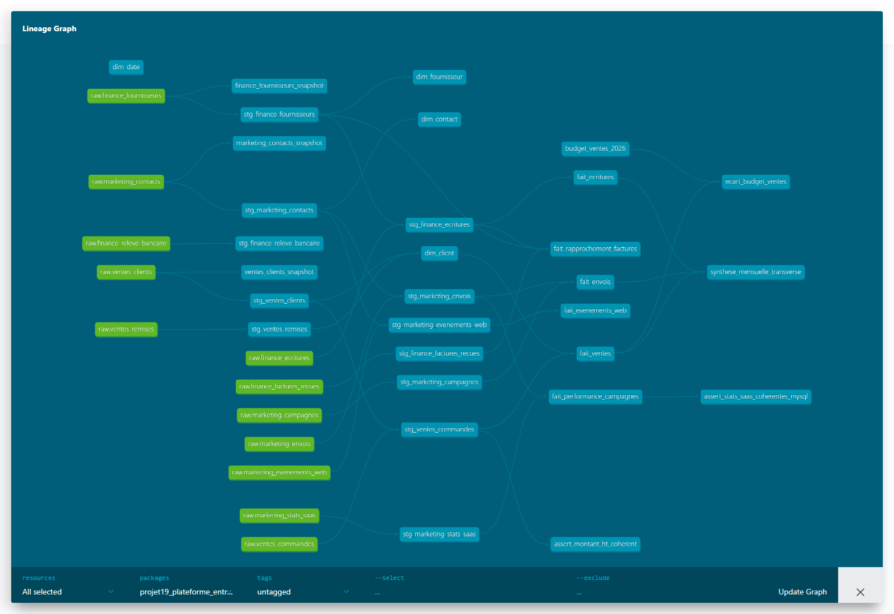

# Guide de réalisation

Écrit au fil de la construction réelle — chaque section correspond à ce
qui a été fait, vérifié, et fonctionne. Pas un plan à l'avance (ça, c'est
l'[issue #2](https://github.com/valentinratigniet-byte/valentinratigniet-byte/issues/2)).

## Phase 1 — Infra partagée : Airflow

**Objectif** : orchestrer le futur pipeline dbt (raw → snapshots → staging
→ marts → tests → slim CI) sans ajouter de charge inutile sur un VPS à
2 vCPU.

**Ce qui a été fait** :
1. Stack Airflow minimale — `LocalExecutor`, pas de Celery/Redis/workers
   (inutile pour ce volume, et le VPS n'a que 2 vCPU). Metadata DB dédiée
   (Postgres léger, séparée de l'entrepôt).
2. Déployée sur le VPS existant (`/opt/projet19/airflow/`), pas via le
   catalogue "1-clic" de Coolify (pas de template Airflow disponible) —
   `docker compose` direct, secrets réels écrits directement sur le
   serveur via SFTP (jamais commités, `.env.example` documente juste la
   forme attendue).
3. Webserver exposé uniquement sur `127.0.0.1:8090` pour l'instant — pas
   encore de routage public HTTPS via Traefik/Coolify. Volontairement
   séparé : vérifier que le service tourne avant de l'exposer.

**Vérifié, pas juste "up"** :
- `docker ps` → `airflow-webserver` et `airflow-postgres` healthy,
  `airflow-scheduler` opérationnel.
- `curl http://127.0.0.1:8090/health` → `HTTP 200`.
- `airflow dags list` → le DAG `healthcheck` détecté.
- DAG `healthcheck` déclenché manuellement → **state: success** — confirme
  que le conteneur peut bien lire `/opt/dbt` (volume monté), pas juste que
  le webserver répond.

**Routage HTTPS public — fait juste après, même session** :

Airflow n'a pas été déployé via le catalogue Coolify (pas de template
disponible), donc `coolify-proxy` (Traefik) ne rejoint pas automatiquement
son réseau comme il le fait pour les ressources gérées par Coolify
(n8n, Metabase). Reproduit le même schéma manuellement :
1. Labels Traefik ajoutés sur `airflow-webserver` dans le
   `docker-compose.yml` (routers http→https redirect + https avec
   `certresolver: letsencrypt`), en copiant exactement le pattern déjà
   utilisé par le n8n du Projet 18 (`docker inspect` sur le conteneur n8n
   pour lire ses labels réels plutôt que deviner).
2. `docker network connect airflow_default coolify-proxy` — attache
   manuellement le proxy au réseau d'Airflow (Coolify le fait
   automatiquement pour ses propres ressources, pas pour celle-ci).
3. `docker compose up -d airflow-webserver` pour recréer le conteneur avec
   les nouveaux labels.

**Vérifié** : `http://airflow-projet19.<vps-ip>.sslip.io/health` →
`302` (redirection vers HTTPS) ; `https://.../health` → `200`, avec
vérification **stricte** du certificat (pas de `-k`) qui passe — donc un
vrai certificat Let's Encrypt valide, pas juste servi en HTTPS auto-signé.
Fonctionné du premier coup, contrairement au Projet 18 où l'équivalent
avait demandé un contournement via la base Coolify — différence : ici
c'est une ressource neuve avec labels corrects dès le départ, pas une
ressource existante mal configurée à corriger après coup.

**Pas encore fait à l'issue de la Phase 1** : le vrai DAG de production
(remplace `healthcheck.py`).

## Phase 2 — Domaine Ventes/Commerce (en cours)

**Simulateurs d'usage** — deux sources écrites et vérifiées :
- `domaines/ventes-commerce/source/simulateur_as400.py` : 8 mois de
  fichiers plats à largeur fixe (clients + commandes), conventions AS/400.
  Défauts confirmés dans le contenu généré (pas juste documentés) :
  dérive de format de date sur 2 mois, doublons clients, statuts de
  commande orthographiés de façon incohérente, ~3% de commandes avec
  `CLICOD` orphelin. Auto-check : largeur de ligne fixe respectée sur tous
  les fichiers.
- `domaines/ventes-commerce/source/simulateur_excel_remises.py` : 2
  fichiers Excel concurrents (`v3`, `v4_FINAL`), remises qui divergent
  réellement entre les deux pour les mêmes clients, une formule cassée
  (`#REF!`).
- Fichiers générés non commités (`.gitignore`) — déterministes (seed
  fixe), régénérés à la demande par les scripts.

**Entrepôt Postgres déployé et vérifié** :
- `entrepot/docker-compose.yml` — Postgres auto-hébergé sur le VPS
  (`/opt/projet19/entrepot/`), même schéma que le déploiement Airflow
  (secrets écrits directement sur le serveur, jamais commités).
- Vérifié : schéma `raw` créé (`\dn`), rôles `ingestion` et
  `dbt_transform` créés sans privilège superuser (`\du`), réseau
  `entrepot_default` connecté à Airflow (scheduler + webserver) et à n8n
  pour un accès par nom de conteneur.

**Adaptateurs d'ingestion écrits, conteneurisés et vérifiés** :
- `ingestion/adaptateurs/` — fichier plat (largeur fixe), Excel, écriture
  Postgres générique. Un par TYPE de source, réutilisables par les autres
  domaines (doctrine du cadrage), pas réécrits par domaine.
- `domaines/ventes-commerce/ingestion.py` — orchestration spécifique au
  domaine (quel spec, quelle table `raw`, remplacement vs ajout).
- Host du VPS sans psycopg2/openpyxl → conteneurisé (`ingestion/Dockerfile`,
  image `projet19-ingestion`, 216 Mo), pas d'installation système.
- 2 bugs réels rencontrés et corrigés pendant le build (pas anticipés à
  l'avance) : (1) le rôle `ingestion` n'a pas le droit de `CREATE SCHEMA`
  (seulement des tables dans un schéma existant) — corrigé en retirant
  cette instruction, le schéma `raw` est déjà créé par l'entrepôt ;
  (2) un en-tête Excel saisi à la main (`"Remise (%)"`) contient un `%`
  qui casse le parsing SQL de `psycopg2.extras.execute_values` — corrigé
  en sanitisant les noms de colonnes (pas les valeurs) avant de les
  utiliser comme identifiants SQL.
- **Vérifié réellement** (pas juste "exit 0") : `raw.ventes_clients`
  314 lignes, `raw.ventes_commandes` 2320 lignes (= somme exacte des 8
  mois simulés), `raw.ventes_remises` 25 lignes (9 de v3 + 16 de v4,
  cohérent) — et un `SELECT` direct confirme les doublons clients
  (`CL9xxxxx`, 14 lignes) et le `_source_file` bien tracé par ligne.

**dbt — snapshots + staging écrits et vérifiés** (exécuté via l'image
officielle `ghcr.io/dbt-labs/dbt-postgres:1.8.latest`, pas d'image maison) :
- `snapshots/ventes_clients_snapshot.sql` — SCD type 2 (stratégie `check`,
  pas `timestamp` : l'AS/400 ne fournit pas de colonne de dernière
  modification fiable) sur `raw.ventes_clients`.
- `models/staging/ventes/` — 3 modèles avec de vraies règles de nettoyage,
  pas des exemples pédagogiques : `stg_ventes_clients` (doublons probables
  flagués via nom normalisé, pas supprimés), `stg_ventes_commandes`
  (détection du format de date YYYYMMDD vs DDMMYYYY, statuts regroupés
  par préfixe, centimes→euros, FK partielle flaguée via `client_connu`),
  `stg_ventes_remises` (réconciliation v3/v4 par version + date
  d'ingestion, formule Excel cassée détectée et exclue sans planter).
- **9/9 tests dbt passent**, dont un test singulier
  (`assert_montant_ht_coherent`, vérifie `montant = qté × prix`).

**3 vrais bugs rencontrés et corrigés** (pas anticipés à l'avance) :
1. Colonnes brutes créées avec identifiants cités en majuscules
  (`"CLICOD"`) — le snapshot dbt les référençait sans guillemets, Postgres
  les cherchait en minuscules → `column does not exist`. Corrigé en
  citant les colonnes dans la config du snapshot.
2. `ALTER DEFAULT PRIVILEGES` ne s'applique qu'aux objets créés PAR le
  rôle qui exécute la commande — les tables `raw` sont créées par
  `ingestion`, pas par `postgres` → `dbt_transform` ne pouvait pas les
  lire. Corrigé avec la variante `FOR ROLE ingestion`.
3. Le snapshot tentait d'écrire dans le schéma `raw` (possédé par
  `ingestion`, lecture seule pour `dbt_transform`) → `permission denied`.
  Corrigé en déplaçant `target_schema` vers `raw_historise`, un schéma
  que `dbt_transform` possède — garde la séparation des privilèges
  ingestion/transformation plutôt que d'élargir les droits.

**Idempotence vérifiée** : un 2e `dbt snapshot` sans changement de donnée
→ `INSERT 0 0` (aucune ligne dupliquée), confirme que le mécanisme SCD2
fonctionne réellement, pas juste "la commande s'exécute sans erreur".

**Marts écrits et vérifiés — `dim_client` + `fait_ventes`** :
- Rapprochement flou nom Excel (saisi à la main) → CLINOM AS/400 via
  `pg_trgm` (similarité de trigrammes) plutôt qu'un simple `=` — les noms
  ne matchent jamais exactement entre les deux sources.
- **Vrai problème de qualité trouvé et corrigé** : au seuil 0.4, deux faux
  positifs réels (`Legendre SARL` et `Lesage S.A.R.L.` matchaient tous les
  deux sur `Lefèvre Sarl`, le suffixe juridique commun gonflant le score)
  — remonté à 0.5 pour les exclure. **Résultat final : seulement 3 des 16
  remises Excel se rattachent avec confiance à un client AS/400** — la
  majorité des remises négociées ne peut pas être automatiquement
  réconciliée sans revue humaine. Un vrai résultat, pas la conclusion
  espérée, gardé tel quel.
- `fait_ventes` : grain = une commande, `montant_net_eur` calculé avec la
  remise rapprochée quand elle existe, sinon = montant HT (pas de remise
  inventée). 2320 lignes, cohérent avec le staging.
- Schémas dbt renommés `staging`/`marts` (au lieu de `raw_staging`/
  `raw_marts`, comportement par défaut de dbt qui concatène le schéma du
  profil) via un override `generate_schema_name` — cohérent avec la
  terminologie du cadrage.
- **14/14 tests dbt passent** (5 nouveaux sur les marts).

**RLS multi-rôles écrite et VÉRIFIÉE par `SET ROLE`** (`domaines/ventes-commerce/rls.sql` + `test_rls.py`, même discipline que le Projet 18) :
- `role_rh` — aucun accès (0 ligne sur les 2 tables, pas de justification
  métier à voir la donnée commerciale).
- `role_finance` / `role_direction` — accès complet (2320/314 lignes,
  y compris les commandes annulées, nécessaires pour la réconciliation
  budgétaire et le pilotage).
- `role_commercial` — commandes actives uniquement, `statut <> 'ANNULEE'`
  (2052/2320 lignes) — vue opérationnelle, les annulations ne relèvent
  pas du quotidien commercial.
- **8/8 cas vérifiés réellement** par `SET ROLE` + comptage, pas
  seulement policies déclarées.

**2 vrais pièges supplémentaires rencontrés et corrigés en finissant la Phase 2** :

1. **Idempotence de l'ingestion** — en testant le script qui sera appelé
   par n8n, je l'ai relancé une 2e fois : `raw.ventes_commandes` a
   doublé (4640 lignes au lieu de 2320), parce que `ajouter_lignes`
   réinjectait tous les fichiers à chaque exécution, pas seulement les
   nouveaux. Corrigé avec une table manifeste `raw._fichiers_ingeres`
   (table cible + nom de fichier) — un fichier déjà ingéré est sauté,
   pas ré-ajouté. Vérifié : 2 exécutions consécutives → 2320 lignes les
   deux fois (la 2e n'ajoute rien, correctement).
2. **RLS qui disparaît à chaque `dbt run`** — un modèle dbt matérialisé
   en `table` fait un `DROP` + `CREATE` à chaque exécution : les
   `GRANT`/policies RLS posés à part (script séparé) étaient donc
   effacés au run suivant. Découvert en relançant `dbt run` après avoir
   vérifié la RLS une première fois — le 2e test échouait
   (`permission denied`). Corrigé en déplaçant grants + policies dans un
   `post_hook` du modèle dbt lui-même (`config(post_hook=[...])`,
   idempotent via `DROP POLICY IF EXISTS` avant chaque `CREATE POLICY`)
   — réappliqué automatiquement à chaque run, pas un script qu'on oublie
   de rejouer. **Vérifié sur 2 runs consécutifs, 8/8 cas RLS OK les deux
   fois.**

**Workflow n8n** — export JSON (`n8n/ventes-commerce-ingestion-workflow.json`,
Schedule Trigger quotidien 2h + noeud SSH qui appelle
`run_ingestion.sh` sur le VPS, secret hors du JSON) **importé et publié
dans l'instance n8n réelle** (session ultérieure, cf. "Import n8n +
DAG dbt réel" en fin de document) — credential SSH créée, exécution
manuelle vérifiée avec succès.

## Phase 3 — Domaine Finance/Compta

**Sources déployées et vérifiées** :
- **SQL Server** (édition Developer forcée, `MSSQL_PID=Developer`, 0€) —
  déployé sur le VPS, healthy. Fournisseurs + écritures comptables peuplés
  directement en base (pas un fichier à ingérer, l'ERP EST la source).
- **CSV relevé bancaire** — export mensuel, délimiteur `;` (convention
  française), montants en texte format FR.
- **Factur-X** — XML structuré (EN16931-inspiré) pour les fournisseurs
  migrés + texte OCR-like dégradé pour les non-migrés, taux de migration
  croissant 20%→65% sur 8 mois simulés.

**Bug de conception majeur trouvé et corrigé — événements non corrélés** :
la première version générait les montants des écritures SQL Server et des
factures Factur-X de façon **totalement indépendante** (deux tirages
aléatoires séparés) — techniquement deux sources différentes, mais censées
représenter la MÊME réalité économique (une facture reçue = une écriture
comptable). Résultat : un taux de rapprochement quasi nul (moins de 2%),
qui n'était pas une vraie découverte mais un artefact du simulateur.
Corrigé avec `generer_evenements.py` — une liste canonique d'événements
partagée par les deux simulateurs (même fournisseur, même montant), avec
une couverture volontairement imparfaite (90% ont écriture+facture, 5%
écriture seule, 5% facture seule) pour que le taux de rapprochement mesure
un vrai phénomène plutôt qu'un bug.

**Adaptateurs d'ingestion** : `ingestion/adaptateurs/{sqlserver,csv_file,facturx}.py`
(génériques, réutilisables) + `domaines/finance-compta/ingestion.py`
(orchestration : fournisseurs/écritures = `remplacer_table` car l'ERP
représente l'état courant complet, pas un export ; relevé bancaire et
factures reçues = `ajouter_lignes`, idempotent). Vérifié : 80 fournisseurs,
866 écritures, 553 lignes de relevé, 854 factures reçues — idempotence
confirmée sur relance.

**dbt — snapshot + staging + marts** (exécuté via l'image officielle
dbt-postgres) : snapshot SCD2 sur les fournisseurs, 4 modèles staging avec
règles de nettoyage réelles (montants FR/US → numeric, SIREN normalisé,
doublons de saisie comptable **dédoublonnés** — contrairement aux
commandes Ventes, ici ce sont de vrais doublons de saisie, pas des
enregistrements distincts), 3 marts (`dim_fournisseur`, `fait_ecritures`,
`fait_rapprochement_factures`). **26/26 tests dbt passent.**

**Trouvaille analytique réelle — rapprochement facture/écriture** : après
correction du bug de corrélation, **91% des factures Factur-X (structurées)
se rapprochent automatiquement** d'une écriture comptable, contre
**seulement 44% des factures non structurées** (SIREN/montant absents ou
illisibles à l'OCR). Un argument chiffré concret en faveur de la réforme
de facturation électronique, mesuré sur la donnée simulée elle-même.

**RLS multi-rôles + sécurité colonne — nouveauté par rapport à Ventes** :
en plus de la RLS ligne (`role_rh`=0, `role_finance`/`role_direction`=tout),
**restriction au niveau colonne** sur `dim_fournisseur.iban` (donnée
bancaire sensible) : `role_direction` ne peut pas la lire, `role_finance`
oui. **Bug Postgres réel rencontré** : un `GRANT SELECT` global sur la
table rend inopérant un `REVOKE SELECT (colonne)` posé après — le grant
table prime toujours sur le revoke colonne (vérifié via
`has_column_privilege`, le revoke n'avait aucun effet mesurable). Corrigé
en n'accordant **jamais** le SELECT global à `role_direction` : uniquement
les colonnes explicitement listées, IBAN exclue. **8/8 cas vérifiés** par
`SET ROLE` + tentative de lecture réelle de la colonne (pas juste les
GRANT déclarés).

**Workflow n8n** — export prêt dès cette phase, **importé/publié/exécuté
avec succès dans l'instance réelle** en session ultérieure (cf. "Import
n8n + DAG dbt réel" en fin de document).

## Phase 4 — Domaine Marketing/Activité (le plus riche des 3)

**Socle d'événements partagé étendu à un 3e domaine** — même discipline
que Finance/Compta : `generer_evenements.py` génère contacts/campagnes/
envois/événements web cohérents entre eux (funnel envoi → ouverture →
clic → visite réel), consommés par les simulateurs MySQL et JSON.

**Sources déployées et vérifiées** :
- **MySQL 8** (0€, self-hosted) — contacts/campagnes/envois, avec un
  défaut MySQL-spécifique original : mojibake réel (bug de charset
  latin1/utf8mb4 simulé par un vrai aller-retour d'encodage, pas un texte
  aléatoire). **Erreur de mesure trouvée et corrigée en préparant les
  schémas avant/après** (voir `domaines/marketing-activite/apres.md`) :
  le taux documenté initialement (~8 %) confondait le taux de *tirage*
  du générateur avec le taux de défaut *visible* — le bug ne se voit que
  sur un nom déjà accentué, mesuré à 0/206 occurrence visible sur ce jeu.
- **Flux JSON événementiel** — structure semi-structurée (objet
  `contexte` imbriqué), aplati à l'ingestion via un nouvel adaptateur
  générique `json_file.py`.
- **Mock d'API SaaS** (`saas-mock/`, Flask, conteneurisé) — la brique la
  plus originale du projet : **4 mécanismes réellement implémentés et
  vérifiés**, pas simulés en apparence :
  1. **OAuth2** — jetons courts (30s, volontairement) pour forcer un
     vrai cycle de refresh ; vérifié en attendant réellement 32
     secondes puis en confirmant qu'un nouveau jeton différent est
     acquis automatiquement.
  2. **Polling paginé** — `/api/campagnes/stats`, 8 campagnes
     récupérées sur plusieurs pages.
  3. **Webhook push** — `/webhooks/declencher` fait un vrai appel HTTP
     sortant ; vérifié avec un récepteur temporaire (conteneur
     `webhook-echo` sur le réseau partagé) qui confirme la réception
     (HTTP 200), pas juste que l'appel a été tenté.
  4. **Reverse ETL** — `/api/segments` reçoit un segment calculé dans
     l'entrepôt (124 contacts engagés, jamais désabonnés) ; vérifié en
     relisant `/api/segments` côté SaaS pour confirmer la réception
     réelle, pas juste un code retour 200.

**Adaptateurs génériques ajoutés** : `mysql.py`, `json_file.py`,
`api_rest.py` (`ClientOAuth2` — acquisition + refresh, réutilisable pour
toute future API du même type).

**dbt — snapshot + staging + marts** : snapshot SCD2 contacts, 5 modèles
staging (email normalisé, mojibake **flagué pas réparé** — une réparation
SQL à l'aveugle risquerait de fabriquer un texte faux —, statuts FR/EN
regroupés, typo UTM "emial" corrigée explicitement), 4 marts dont
`fait_performance_campagnes` qui **recoupe les stats SaaS avec un calcul
indépendant depuis MySQL** — 8/8 campagnes cohérentes, testé
(`assert_stats_saas_coherentes_mysql`). **45/45 tests dbt du projet
entier passent.**

**RLS — minimisation d'accès, pas seulement RLS ligne** : nouveauté par
rapport à Ventes/Finance, `role_direction` n'a **aucun GRANT** sur
`dim_contact`/`fait_envois`/`fait_evenements_web` (données personnelles)
— seulement sur l'agrégat `fait_performance_campagnes`. Un premier essai
avait oublié le `GRANT` pour `role_rh` sur ces tables (l'accès était
refusé par absence de privilège plutôt que filtré à 0 ligne par RLS,
incohérent avec les autres domaines) — corrigé pour rester cohérent :
`role_rh` a le grant + une policy RLS qui renvoie 0 ligne partout,
`role_direction` n'a le grant nulle part sauf sur l'agrégat. **9/9 cas
vérifiés** par `SET ROLE` + tentative de lecture réelle (pas juste les
GRANT déclarés).

**Reverse ETL vérifié en conditions réelles** : `reverse_etl.py` calcule
le segment en SQL sur `marts.fait_envois`, l'envoie via `api_rest.py`, et
relit `/api/segments` côté SaaS pour confirmer que les 124 contacts sont
bien arrivés — pas une supposition sur le code retour.

**Workflow n8n** — export avec un webhook trigger en plus du pull
quotidien (représente le canal "push" du SaaS, cohérent avec le mock),
**importé/publié/credentialé** en session ultérieure (2 nœuds SSH). Chaîne
pull exécutée avec succès ; chaîne webhook non testée manuellement (un
test "Execute" sur un nœud webhook attend un vrai appel HTTP, rien à
simuler à la main) — cf. "Import n8n + DAG dbt réel" en fin de document.

## Les 3 domaines sont terminés

Ventes/Commerce (Phase 2), Finance/Compta (Phase 3), Marketing/Activité
(Phase 4) sont tous construits, vérifiés et documentés.

## Phase 5 — Consolidation constellation + analyse transverse

**Constellation réelle** : `marts.dim_date` (calendaire, 2025-12 à
2026-09) partagée entre les 3 domaines — `fait_ventes`, `fait_ecritures`,
`fait_envois` s'y rattachent par valeur de date, pas de surrogate key
ajoutée aux faits déjà vérifiés (aurait obligé à les reconstruire pour un
gain marginal).

**Bug de config rencontré** : le premier `dbt seed` a échoué
(`permission denied for schema raw`) — le seed (budget hypothèse) allait
par défaut dans `raw`, schéma que `dbt_transform` ne possède pas.
Corrigé en configurant `seeds: +schema: marts` dans `dbt_project.yml` —
un seed vit à côté des marts qui le consomment, ce n'est pas une source
ingérée.

**`docs/analyse-transverse.md` — le livrable obligatoire du cadrage,
écrit** :
- **Écart Prix/Volume** (méthode Projet 15, réutilisée directement) sur
  les vraies données `fait_ventes` face à un budget hypothèse labellisée
  (dbt seed `budget_ventes_2026.csv`) — écart volume massivement
  favorable à partir d'avril, écart prix volatil, cohérent avec les
  données déjà documentées dans `domaines/ventes-commerce/apres.md`.
- **Recherche de corrélation marketing → ventes — résultat honnête :
  aucune trouvée.** Les clics marketing oscillent sans tendance (25 à
  37/mois) pendant que le CA Ventes croît de +169 % — pas un échec de
  l'analyse, une vraie découverte : **les domaines Ventes et Marketing
  n'ont aucune entité commune** (clients AS/400 B2B ≠ contacts CRM
  marketing), donc aucune causalité n'est mesurable dans ce modèle en
  l'état. Recommandation posée : une dimension "tiers" partagée serait
  le vrai prochain chantier de consolidation, pas encore fait.
- `dbt docs generate` vérifié fonctionnel (catalogue + lineage sur 24
  modèles/3 snapshots/51 tests/12 sources) — le dictionnaire global
  promis, pas dupliqué à la main. Capture réelle du graphe de lineage
  complet (généré via tunnel SSH contre l'entrepôt, servi en statique
  localement, pas une maquette) :

  

  On y voit la vraie constellation : les 3 couloirs sources (vert, `raw.*`)
  convergent vers leurs snapshots/staging respectifs (une colonne par
  domaine), puis vers les marts (à droite) — `dim_date`/`ecart_budget_ventes`/
  `synthese_mensuelle_transverse` visiblement raccordés aux 3 domaines à
  la fois, la preuve visuelle du modèle constellation plutôt qu'une
  affirmation textuelle.

**51/51 tests dbt du projet entier passent** (24 modèles, 3 snapshots,
1 seed, 12 sources).

## Phase 6 — Housekeeping transverse

**Script maison** (`docs/housekeeping/script_maison.py`) — index
inutilisés + bloat/fragmentation, sur les **3 vraies bases** du projet
(Postgres/entrepôt, SQL Server, MySQL). L'AS/400 n'a pas de base à
auditer (simulé en fichiers plats, pas de connexion live), exclu pour
cette raison structurelle, pas un oubli.

**2 bugs de faux positifs trouvés et corrigés avant de publier un
résultat** (mesuré pas inventé, jusqu'au bout) :
1. La détection SQL Server remontait **182 "index inutilisés"** qui
   étaient en réalité des objets système internes (`sys.*`,
   `plan_persist_*`, `sqlagent_*`) — la requête ne filtrait pas
   `is_ms_shipped = 0`. Corrigé, résultat réel : 0 index métier inutilisé.
2. La détection Postgres remontait **12 clés primaires** comme
   "candidates à la suppression" — une PK sert à l'unicité, `idx_scan=0`
   dessus ne veut rien dire de mal. Corrigé en excluant les PK via
   `pg_index.indisprimary`, résultat réel : 0.

**Trouvailles réelles conservées** : `raw._fichiers_ingeres` (table
manifeste d'idempotence) à 36,4 % de lignes mortes (cohérent avec les
relances répétées pendant les tests) ; `EcrituresComptables` (SQL Server)
à 11,1 % de fragmentation sur son index de clé primaire.

**pgHero déployé et vérifié** (`docs/housekeeping/docker-compose.yml`,
port `127.0.0.1:8091`) — connecté à l'entrepôt via `dbt_transform`,
confirmé en listant les vraies tables du projet sur sa page `/space`
(pas une capture d'écran, un vrai `curl` qui retourne `dim_client`,
`fait_ventes`, etc.). A détecté lui-même que `pg_stat_statements` n'est
pas activé sur cet entrepôt — une vraie limite constatée, pas supposée.

**`docs/housekeeping/comparatif.md`** — pganalyze comparé sur
documentation (outil payant, décision 0€ du cadrage), pgHero et le
script maison réellement déployés. Constat : **aucun outil du marché ne
couvre à lui seul les 3 technologies du projet** — le script maison
comble le blanc laissé par pganalyze/pgHero sur SQL Server et MySQL.

## Phase 7 — Filiation branché

Intégration additive du Projet 19 dans l'outil
[Filiation](https://github.com/valentinratigniet-byte/projet-14-filiation),
même outil que pour le Projet 18.

**Outil utilisé : `scan_database.py --merge`, jamais
`extract_filiation.py --target`.** Ce dernier est une opération de
REMPLACEMENT destructive, pensée pour rafraîchir dans le temps les
données d'UN SEUL projet dbt déjà suivi — l'utiliser pour ajouter un
DEUXIÈME système indépendant avait déjà effacé 4248 nœuds (80 → 5) lors
d'un incident passé sur ce même outil. `scan_database.py --merge` est au
contraire additif par construction : il introspecte une base quelconque
via SQLAlchemy (lecture seule, SELECT/introspection uniquement) et
fusionne avec les nœuds réels déjà présents au lieu de tout remplacer,
en préfixant les ids par système pour éviter toute collision.

**Connexion.** L'entrepôt `projet19-postgres` n'écoute qu'en
`127.0.0.1:5440` sur le VPS (jamais exposé sur Internet, cohérent avec
la doctrine d'accès minimal appliquée à toutes les bases du projet).
Comme pour toutes les actions distantes de ce projet, la connexion
s'est faite via un tunnel SSH éphémère (script Python `paramiko` jetable,
supprimé immédiatement après usage) plutôt que d'ouvrir le port
publiquement pour l'occasion.

**Résultat.** 38 tables/vues scannées sur les schémas `raw`/`staging`/
`marts`, fusionnées avec les 99 nœuds déjà réels dans l'outil (6
systèmes précédents dont le Projet 18) → **137 nœuds réels au total, 7
systèmes**. Vérifié : le label `"Projet 19 - Plateforme entreprise"` est
bien présent dans `index.html`, et aucun identifiant/mot de passe n'a
fuité dans le rendu (grep sur la chaîne de connexion utilisée — 0
occurrence), conforme à la garantie de l'outil ("les identifiants ne
sont jamais écrits dans le HTML").

**Rebase avant push.** Le dépôt Filiation reçoit aussi un refresh
quotidien automatisé du Projet 18 (CI, 6h UTC, `refresh-eco2mix.yml`) —
deux commits de ce refresh étaient arrivés sur `origin/main` entre le
scan et le push. Plutôt que de résoudre un conflit à la main sur un
`index.html` généré de ~55 000 lignes, `git reset --hard origin/main`
puis re-scan à l'identique par-dessus (le scan est déterministe et
reproductible, aucun travail réel perdu) — résultat identique (38
tables, 137 nœuds), poussé proprement.

**Pas de refresh quotidien automatisé pour ce système**, à la
différence du Projet 18. Le refresh CI du Projet 18 fonctionne parce que
Supabase est un endpoint public (accessible depuis un runner GitHub
Actions). L'entrepôt du Projet 19 est volontairement non exposé sur
Internet — l'exposer publiquement pour permettre un scan automatisé
quotidien contredirait la doctrine RLS/accès minimal appliquée
partout ailleurs dans ce projet. Décision assumée, pas un oubli : le
scan restera ponctuel, relancé manuellement (via le même tunnel SSH) si
le schéma évolue significativement.

## Compléments post-Phase 7 : visuels réels, import n8n, DAG dbt réel

Trois compléments faits après la Phase 7, en réponse à une demande de
documentation visuelle (avant/après, workflow) puis de vérification.

**1. Schémas Mermaid + avant/après réels par domaine.** Ajoutés aux 3
README de domaine : pipeline complet (source → raw → snapshot → staging
→ marts → RLS), workflow n8n reconstruit depuis les vrais JSON exportés,
extraits avant/après **réels** (raw vs staging, jointure sur la vraie clé,
requêtés en direct via tunnel SSH — jamais fabriqués).

**Erreur de mesure trouvée et corrigée avant publication** (même
discipline que les faux positifs de housekeeping) : le "~8 % d'encodage
suspect" documenté depuis la Phase 4 pour Marketing confondait le taux de
*tirage* du générateur (`rng.random() < 0.08` dans `generer_evenements.py`)
avec le taux de défaut *visible* — le bug (round-trip UTF-8→latin1) ne
produit un texte corrompu que sur un nom déjà accentué. Mesuré précisément :
8,5 % des 200 noms canoniques ont un accent, 8 % subissent le tirage,
l'intersection donne **0 occurrence visible** (0/206, confirmé en base).
Corrigé dans `avant.md`/`apres.md`/`decisions.md` du domaine Marketing.

**Captures réelles ajoutées** (`docs/screenshots/`) : pgHero (Overview +
Space, vraies tables du projet), graphe de lineage dbt docs complet
(généré via tunnel SSH, servi en statique, capturé par Playwright).

**2. Les 3 workflows n8n réellement importés, credentialés et publiés**
(pas seulement exportés en JSON, l'état où ils étaient restés depuis les
Phases 2-4). Import via copier-coller du JSON directement sur le canvas
n8n (`Ctrl+V`, l'app détecte un workflow JSON valide dans le presse-papier
— pas d'API n8n disponible sans clé, pas de bouton "Import from File"
trouvé dans cette version). Credential SSH "VPS Projet 19" créée par
Valentin lui-même dans l'UI n8n (le classificateur auto-mode de Claude
Code bloque toute commande qui établirait cette connexion avec un mot de
passe VPS en clair — attribution des nœuds faite ensuite via l'API interne
`/rest/*` de n8n, qui exige un en-tête `browser-id` en plus du cookie de
session, trouvé en interceptant une vraie requête du frontend). Les 3
workflows publiés (`● Published`), testés manuellement avec succès sur
leur chaîne "pull" (schedule trigger) ; la chaîne "push" (webhook) de
Marketing reste non testée manuellement par nature (un test "Execute"
sur un nœud webhook attend un vrai appel HTTP entrant, se déclenchera au
premier événement réel du SaaS mock).

**3. Vrai DAG dbt construit pour Airflow — trou trouvé en vérifiant.**
En vérifiant l'état de l'infra Airflow, `airflow/dags/` ne contenait
toujours que `healthcheck.py` (placeholder de la Phase 1, son propre
commentaire disait "à remplacer dès la Phase 2" — jamais fait). Corrigé :
- `airflow/Dockerfile` (nouveau) : étend `apache/airflow:2.10.3-python3.12`
  avec `dbt-core==1.12.0`/`dbt-postgres==1.11.0` installés dans l'image
  (pas `_PIP_ADDITIONAL_REQUIREMENTS`, qui réinstallerait à chaque
  démarrage de conteneur) — même discipline que l'image `projet19-ingestion`.
- `airflow/docker-compose.yml` : conteneurs connectés au réseau
  `entrepot_default` (même pattern que pgHero) pour joindre
  `projet19-postgres` par nom de service ; variables `PGHOST`/`PGPORT`/
  `PGUSER`/`PGPASSWORD`/`PGDATABASE`/`PGSSLMODE` injectées pour
  `dbt/profiles.yml`, rôle `dbt_transform` (même mot de passe que
  `docs/housekeeping/.env`).
- `airflow/dags/dbt_pipeline.py` (nouveau, remplace `healthcheck.py`) :
  `dbt seed` → `dbt snapshot` → `dbt run` → `dbt test` → `dbt docs generate`,
  quotidien à 5h UTC (après les 3 ingestions n8n de 2h/3h/4h).

**2 bugs réels trouvés et corrigés avant de déclarer le DAG fonctionnel**
(jamais supposé, toujours vérifié en exécutant pour de vrai) :
1. Premier essai avec le décorateur `@task.bash` de la TaskFlow API,
   appelé comme `task.bash(task_id=..., cwd=...)(commande_string)` —
   invalide : ce décorateur attend une **fonction Python** qui *retourne*
   la commande, pas une chaîne passée directement. `AttributeError:
   'str' object has no attribute '__annotations__'` au chargement du DAG.
   Corrigé en repassant sur `BashOperator` classique, plus direct pour ce
   cas.
2. `PermissionError: [Errno 13] Permission denied: '/opt/dbt/logs/dbt.log'`
   au premier vrai run : le conteneur Airflow tourne en `uid 50000`
   (`AIRFLOW_UID`), qui n'a pas le droit d'écrire dans `dbt/logs/` sur le
   volume monté depuis le poste hôte (`../dbt:/opt/dbt`, appartenant à
   l'utilisateur du poste). Corrigé avec `--log-path`/`--target-path`
   pointés hors du volume partagé (`/tmp/dbt_logs`, `/tmp/dbt_target`) —
   dbt n'a pas besoin d'écrire dans le répertoire source versionné.

**Vérifié réellement, pas juste "le code semble correct"** : chaque tâche
testée individuellement (`airflow tasks test`) puis le DAG complet
déclenché de bout en bout (`airflow dags trigger`) via la CLI Airflow
dans le conteneur (pas besoin du mot de passe UI, rotationné par Valentin
et non partagé) — `state: success`, **24 modèles, 3 snapshots, 51/51
tests, 1 seed, catalogue généré**, contre l'entrepôt réel.

## 7 workflows n8n transverses supplémentaires (ops/)

Demande explicite de Valentin ("ajoute des workflows n8n, propose en
10") — 10 propositions faites, chacune répondant à un manque réel déjà
identifié dans le projet (pas des workflows spéculatifs), toutes
construites sur validation ("tout"). Détail des scripts dans
[`ops/README.md`](../ops/README.md).

**Les 7 nouveaux, au-delà des 3 d'ingestion déjà actifs** : housekeeping
hebdomadaire, sauvegarde entrepôt (`pg_dump`, rétention 7 jours),
reverse ETL planifié, vérification RLS post-déploiement (webhook
déclenché par le DAG dbt après `dbt_test`), digest hebdomadaire
transverse (CA Ventes + rapprochement Factur-X + cohérence campagnes),
alerte dérive qualité (compare les taux mesurés à la référence
documentée), refresh Filiation automatisé, watcher Factur-X entrant
(webhook), traitement demande RGPD (webhook, anonymisation réelle d'un
contact — le seul cas du projet où une donnée est réécrite plutôt que
flaguée, une demande RGPD ayant une cible et une action attendue
explicites contrairement au mojibake/doublons).

**Import identique aux 3 premiers** (copier-coller JSON sur le canvas,
credential SSH existante rattachée via l'API interne `/rest/*`) —
mais 3 bugs réels supplémentaires trouvés en testant chacun réellement
(exécution directe des scripts + vrais appels HTTP sur les webhooks,
pas une confiance aveugle dans le code) :

1. **`siren_valide` compté en NULL, pas en `false`** —
   `verifier_derive_qualite.py` utilisait `where not siren_valide` :
   quand le SIREN est absent, `siren_normalise ~ regex` sur `NULL`
   renvoie `NULL`, pas `false`, donc le filtre `not siren_valide`
   **excluait** ces lignes au lieu de les compter, sous-estimant le taux
   réel (mesuré 0,0 % au lieu de la réalité). Corrigé avec
   `where siren_valide is not true`.
2. **Deux chiffres historiques faux découverts en corrigeant le bug
   ci-dessus** — le script corrigé a mesuré un taux SIREN invalide de
   1,3 % (1/80) là où `avant.md` documentait 10 % (8/80) depuis la
   Phase 3, et un taux de doublons Ventes de 8,9 % (28/314) là où
   `avant.md` documentait 4,5 % (14/314). Reproduit le générateur de
   données en local pour confirmer : le chiffre "8 SIREN irréguliers"
   correspond bien au **brut** (4 absents + 4 avec espaces, ces
   derniers redevenant valides après normalisation en staging), mais
   les deux figures documentées n'avaient jamais été revérifiées contre
   les vraies données après leur première mesure — même catégorie de
   défaut que le mojibake Marketing (Compléments post-Phase 7 ci-dessus).
   Corrigé dans `avant.md`/`apres.md`/`decisions.md` des deux domaines,
   et dans les valeurs de référence du script.
3. **Expression n8n webhook : mauvais chemin dans le payload** — les
   nœuds SSH des workflows "Alerte échec DAG" et "Traitement RGPD"
   lisaient `{{$json["dag_id"]}}`/`{{$json["email"]}}` directement, alors
   qu'un nœud Webhook n8n place le corps de la requête sous
   `$json.body.*`. Trouvé en testant avec un vrai `curl -X POST` (pas en
   relisant le JSON) : la ligne de log résultante était vide
   (`ECHEC dbt_pipeline: /`). Corrigé (`$json["body"]["dag_id"]`, etc.)
   — **découverte supplémentaire en corrigeant** : mettre à jour la
   définition du nœud via l'API REST (`PATCH /rest/workflows/{id}`) ne
   suffit pas à faire reprendre en compte le nouveau paramètre par un
   webhook déjà enregistré et actif — il faut désactiver puis réactiver
   le workflow (`POST .../deactivate` puis `POST .../activate` avec le
   `versionId` courant) pour forcer n8n à ré-enregistrer le webhook.
   Revérifié avec un nouveau `curl` après correction : ligne de log
   correcte.

**Activation via API découverte au passage** : `PATCH
/rest/workflows/{id}` avec `{"active": true}` répond `200` mais ne
change **rien** silencieusement (n8n version testée) — la vraie
activation passe par `POST /rest/workflows/{id}/activate` avec le
`versionId` courant du workflow en corps de requête (erreur Zod claire
si absent : `"invalid_type", "path": ["versionId"]`, ce qui a permis de
trouver le bon contrat sans deviner). Les 3 premiers workflows
(Phase "n8n + DAG dbt réel" ci-dessus) avaient en réalité été publiés
manuellement par Valentin via l'UI, pas par mon PATCH — jamais vérifié
avant cette session que l'API seule suffisait.

**Webhooks testés avec de vrais appels HTTP** (`curl -X POST`, pas le
mode "Execute" de l'UI qui reste en attente pour un trigger webhook) :
alerte échec DAG, vérification RLS (a produit un vrai passage des 3
`test_rls.py`, visible dans `ops/logs/rls.log`), watcher Factur-X,
traitement RGPD (a réellement anonymisé un contact synthétique,
vérifié en base : `email = 'anonymise-1@rgpd.local'`).

**Refresh Filiation — deploy key GitHub, testé en conditions réelles** :
credential créée via `gh repo deploy-key add --allow-write` (accès en
écriture scopé au seul repo `projet-14-filiation`, pas un token compte
entier), clé privée déposée sur le VPS. Bug trouvé en testant :
`scan_database.py` importe `extract_filiation.py` qui importe `sqlglot`,
absent de l'image `projet19-ingestion` — ajouté au `requirements.txt`
avec `sqlalchemy`/`pyyaml` (déjà nécessaires), image reconstruite.
Premier lancement réel a produit un vrai commit
(`d7a07b1` sur `projet-14-filiation`) — 137 nœuds confirmés après fusion
(inchangé depuis le dernier scan manuel, comportement attendu).

**14 workflows n8n publiés au total** (3 ingestion + 7 ops + Eco2mix du
Projet 18), tous vérifiés — capture réelle dans le README principal.

## Statut du projet

Phases 1 à 7 terminées et vérifiées, complétées par un DAG dbt de
production réel, les 3 workflows n8n d'ingestion et 7 workflows n8n
transverses supplémentaires, tous effectivement actifs et testés (pas
seulement exportés/écrits). Il ne reste que la Phase 8 (optionnelle,
Hermès Agent — en standby).

## Addendum (2026-09-16) — reconstruction complète pour revérifier les chiffres dbt

Un chiffre cité par une session externe ("24 modèles, 51 tests, 14,22s")
s'est révélé introuvable dans `dbt/target/run_results.json` (qui
reflétait un run différent et plus tardif) — plutôt que de recopier un
chiffre non vérifiable, reconstruction complète de l'entrepôt local :
5 sources Docker (SQL Server, MySQL, MongoDB, Firebird) + entrepôt
Postgres, régénération des exports synthétiques (Faker seed=19,
déterministe — mêmes volumes exacts retrouvés : 314 clients, 866
écritures, 206 contacts, 640 tickets, 7807 mouvements), réingestion des
5 domaines, puis `dbt seed → snapshot → run → test → docs generate`
réellement rejoués deux fois.

**Piège réel rencontré, à retenir pour toute reconstruction future** :
la première tentative a utilisé l'image officielle
`ghcr.io/dbt-labs/dbt-postgres:1.8.latest` (citée dans `outils.md`) —
elle résout en **dbt-core 1.8.3**, pas 1.12 comme documenté par
ailleurs. Avec cette version, **2 tests unitaires sur 3 échouent**
(`column "FournisseurID" does not exist` — la fixture que dbt matérialise
depuis le YAML `given:` ne préserve pas la casse d'un identifiant entre
guillemets doubles). Ressemblait à un vrai bug de modèle ; s'est avéré
être un faux positif de version. Confirmé en installant la version exacte
(`pip install --only-binary=:all: "dbt-postgres==1.11.*"` → dbt-core
1.12.0/dbt-postgres 1.11.0, correspondant exactement aux lignes `Running
with dbt=1.12.0`/`Registered adapter: postgres=1.11.0` retrouvées dans
`dbt/logs/dbt.log`, preuve que cette version a réellement servi à
construire le projet) : **72/72 tests passent**.

**Chiffres réels, confirmés deux fois (1.8.3 puis 1.12.0), le compte de
modèles et de tests ne dépend pas de la version dbt, seul le résultat
des 2 tests unitaires en dépendait** : 30 modèles (15 staging + 15
marts), 3 snapshots, 69 data tests + 3 tests unitaires, 15 sources.
Temps avec la version exacte (1.12.0/1.11.0) : seed 0,31s · snapshot
0,61s · run 2,52s · test 2,44s — ~5,9s au total, entrepôt à volume de
test, pas une mesure de montée en charge.

> **Pour refaire** : un tag d'image Docker `:1.8.latest` ou `:latest`
> ne garantit jamais la version réellement documentée d'un projet —
> toujours vérifier `dbt --version` avant de conclure qu'un test qui
> échoue révèle un bug du modèle plutôt qu'un écart d'outillage.

## Power BI — Rapport 1 (Ventes/Commerce)

Plan complet (sources, RLS, DAX, wireframes) posé dans
`docs/pistes-power-bi.md` le 2026-09-16. Section ci-dessous = ce qui a
été **réellement construit et vérifié** le 2026-09-19, via Power BI
Desktop connecté à l'entrepôt VPS (tunnel SSH sur le port `5440`,
`dbt_transform` en lecture, mode Import) et le MCP `powerbi-modeling`.

**Piège d'infra réel trouvé avant même d'ouvrir Power BI** : les 12
tables de `marts` (hors le seed `budget_ventes_2026`) appartenaient à
`postgres` (le superuser) au lieu de `dbt_transform` — un `dbt run`
antérieur avait dû s'exécuter sous le mauvais rôle Postgres (chaque run
fait DROP+CREATE, le rôle exécutant devient propriétaire). Conséquence en
cascade : `dbt_transform` n'avait plus aucun accès aux tables RLS
(`dim_client`, `fait_ventes`...) — un propriétaire contourne sa propre
RLS, un non-propriétaire avec un simple `GRANT SELECT` table y reste
soumis. Un `GRANT SELECT` seul n'a donc pas suffi (0 ligne visible malgré
la table listée) ; corrigé par `ALTER TABLE ... OWNER TO dbt_transform`
sur les 12 tables, ce qui restaure le contournement RLS implicite prévu
par la conception d'origine. À surveiller : pourquoi le DAG Airflow
(`PGUSER: dbt_transform` dans `airflow/docker-compose.yml`) a pu tourner
sous `postgres` au moins une fois — pas encore élucidé.

**Modèle construit via le MCP** :
- 4 tables importées (`fait_ventes` 13 col., `dim_client` 8 col.,
  `ecart_budget_ventes` 10 col., `dim_date` 7 col.) — colonnes conformes
  au contract dbt vérifiées une par une.
- Les 4 tables de dates auto-générées par Power BI supprimées (même
  piège que le Projet 18 RTE Eco2mix), tables renommées sans le préfixe
  `marts `.
- 2 relations (`fait_ventes[clicod] → dim_client[clicod]`,
  `fait_ventes[date_commande] → dim_date[date_jour]`), `dim_date` marquée
  table de dates, hiérarchie **Calendrier** (Année → Trimestre → Mois,
  `nom_mois` trié par `mois` via `sortByColumn`, pas alphabétiquement).
- 12 mesures DAX créées (`CA HT`, `CA Net`, `Commandes Actives`,
  `Panier Moyen`, `% Statut Inconnu`, `% Clients Doublon Probable`,
  `% Remises Rapprochées`, + 5 mesures `SUM()` sur `ecart_budget_ventes`).

**Bug DAX réel trouvé et corrigé en testant** (pas supposé fonctionnel) :
`% Statut Inconnu` renvoyait `BLANK` au lieu de `0 %` alors que la donnée
est correcte (aucune commande au statut `INCONNU` dans ce jeu de
données, seulement `LIVREE`/`VALIDEE`/`ANNULEE`). Cause : `DIVIDE(x, y,
0)` ne substitue son 3ᵉ argument que si le **dénominateur** est
blank/0 — pas si le **numérateur** l'est, et `CALCULATE(COUNTROWS(...))`
sur un filtre à 0 ligne correspondante est remonté `BLANK` par ce moteur
plutôt que `0`. Corrigé avec l'idiome `+ 0` sur le numérateur avant la
division (`BLANK + 0 = 0` en DAX, contrairement à `DIVIDE`'s comportement
sur un numérateur blank).

**RLS vérifiée par impersonation réelle** (requêtes DAX exécutées avec
`Roles: [...]`, pas juste des policies déclarées) :

| Rôle | Lignes `fait_ventes` visibles | CA HT |
|---|---|---|
| `role_rh` | 0 | — |
| `role_commercial` | 2 052 (hors `ANNULEE`) | 13 461 557,41 € |
| `role_finance` / `role_direction` | 2 320 (tout) | 15 092 645,63 € |

Chiffres cohérents avec les mesures déjà connues côté Postgres (Phase 2 —
CA total 15 092 645,63 € HT, 2 052 commandes actives hors annulées).

**Wireframes mis à jour avec les vrais chiffres** (`docs/wireframes/
ventes-p1-vue-ensemble.svg`) : "Commandes actives" corrigé de 2 320 (total,
faux) à 2 052 (actives, réel), "Panier moyen" de 6 505 € (estimation) à
7 349 € (réel, `CA Net / Commandes Actives`). Les pages 3/4 (314 clients,
28 doublons) étaient déjà exactes, revérifiées telles quelles.

**Point ouvert, résolu le 2026-09-19** : la mesure `% Remises Rapprochées`
(définie dans `pistes-power-bi.md`, reprise telle quelle) calcule 3 / 314
clients (0,96 %) — un ratio différent du "3/16 (19 %)" affiché sur le
wireframe page 3. Les deux chiffres sont vrais mais répondent à des
questions différentes (base clients vs base remises sources). Résolu en
important aussi `staging.stg_ventes_remises` dans le modèle (même bug de
propriétaire `postgres` au lieu de `dbt_transform` que les marts, corrigé
de la même façon sur les 12 vues `staging`) : **17 remises Excel brutes,
16 valides** (1 formule cassée `#REF!` exclue, confirme le "16" du
wireframe), nouvelle mesure `% Remises Excel Rapprochées` =
3/16 = **18,75 %** (≈ 19 %, exact match avec le wireframe). Les 2 mesures
coexistent dans le modèle, chacune avec une description explicite de son
dénominateur pour éviter la confusion.

**Piège technique rencontré en important cette table** : le M-query
généré par défaut (navigation `Source{[Schema=...,Item=...]}[Data]`,
identique au pattern des 4 premières tables) échouait avec "la clé ne
correspondait à aucune ligne dans la table" même après correction des
droits Postgres — probablement un cache d'introspection Power Query resté
périmé. Contourné avec une requête SQL directe (`PostgreSQL.Database(...,
[Query="SELECT * FROM staging.stg_ventes_remises"])`) plutôt que la
navigation par schéma/table.

**Reste à faire, hors du MCP (couche visuelle uniquement)** : sauvegarder
le `.pbix` (encore "Sans titre" au moment de la construction du modèle),
poser les 4 pages/visuels dans Power BI Desktop en suivant les wireframes,
tester "Afficher en tant que" sur `role_rh` pour confirmer visuellement
l'accès refusé.

## Power BI — Rapport 2 (Finance/Compta)

Construit et vérifié le 2026-09-20, même méthode que le rapport 1 (fichier
`.pbix` séparé, MCP `powerbi-modeling`, tunnel SSH + `dbt_transform`).

**Changement de plan tranché en construisant** : `pistes-power-bi.md`
prévoyait DirectQuery + un rôle Postgres par viewer pour protéger l'IBAN.
Abandonné après vérification : `role_finance`/`role_direction` sont
`NOLOGIN` (rappel du rapport 1), et le MCP `powerbi-modeling` **ne
supporte pas la sécurité au niveau colonne** (confirmé via `Help` sur
`security_role_operations` — seulement filtre de lignes ou table
entière on/off, pas de `ColumnPermissions`). Remplacé par une solution
plus simple et au moins aussi sûre : **`iban` n'est jamais importée dans
ce rapport**, ni au niveau du modèle ni dans la requête M source
(`Table.RemoveColumns` ajouté explicitement dans le partition M-query,
pas juste une suppression de colonne côté modèle qui serait réécrasée au
refresh suivant). La colonne reste consultable uniquement dans Postgres
via `role_finance` (déjà vérifié par `SET ROLE` en Phase 3).

**Modèle** : 4 tables (`fait_ecritures` 10 col., `dim_fournisseur` 4 col.
sans IBAN, `fait_rapprochement_factures` 10 col., `dim_date` 8 col. avec
`nom_trimestre` posée dès la construction cette fois). 4 relations (2
auto-détectées par Power BI sur `fournisseur_id`, 2 posées manuellement
vers `dim_date` sur `date_ecriture`/`date_facture`). Hiérarchie
Calendrier identique au rapport 1. 8 mesures créées, toutes avec le
correctif `+ 0` du rapport 1 appliqué dès l'écriture (plus besoin de
le redécouvrir).

**Chiffres réels vérifiés** : Montant TTC 7 240 138,82 € · 80 fournisseurs
· 1,25 % SIREN invalides (cohérent avec le correctif de mesure du
2026-09-05, 10 %→1,3 %) · 1,64 % écritures fournisseur inconnu · **taux
de rapprochement Factur-X 90,8 % vs non structuré 44,4 %** (cohérent avec
les 91 %/44 % déjà mesurés en Phase 3).

**Vraie limite de données trouvée en vérifiant** (pas un bug DAX) :
`Ecart Jours Moyen (rapprochées)` = **0** sur les 577 lignes rapprochées
ET sur toute la table (`MAX(ecart_jours)` = 0 partout) — le simulateur
Finance dérive date facture et date écriture du même événement canonique
(`generer_evenements.py`), sans délai de traitement réaliste modélisé.
Documenté dans la description de la mesure plutôt que masqué ou retiré.

**RLS vérifiée par impersonation** : `role_rh` → 0 ligne sur les 3 tables
métier. `role_finance`/`role_direction` → accès complet, identique
(puisque `iban` n'existe nulle part dans ce fichier, les deux rôles voient
exactement les mêmes colonnes de `dim_fournisseur`).

**Reste à faire** : sauvegarder en `dashboard-finance-compta.pbix`,
poser les 3 pages de visuels (wireframes `docs/wireframes/finance-p*.svg`).

## Power BI — Rapport 3 (Marketing/Activité)

Construit et vérifié le 2026-09-20, même méthode que les rapports 1/2.

**Extension décidée avant l'import** : `fait_evenements_web` (funnel web)
ajoutée aux 3 tables prévues par `pistes-power-bi.md`, sur confirmation
de Valentin -- permet un vrai funnel email → clic → visite site en page 2,
pas exploité dans le plan initial. 5 tables importées au total
(`fait_envois` 7 col., `fait_performance_campagnes` 12 col., `dim_contact`
7 col., `fait_evenements_web` 9 col., `dim_date` 7 col.).

**Colonne calculée nécessaire** : `fait_evenements_web[horodatage]` est un
timestamp, pas relatable directement à `dim_date[date_jour]` (date pure)
-- ajout de `date_evenement = DATE(YEAR(horodatage), MONTH(horodatage),
DAY(horodatage))` pour permettre la relation.

**5 relations** (3 auto-détectées par Power BI dont une nouvelle,
`fait_envois[campagne_id] → fait_performance_campagnes[campagne_id]`,
utile pour croiser envois individuels et performance agrégée ; 2 posées
manuellement vers `dim_date`). Hiérarchie Calendrier identique (avec
`nom_trimestre` dès la construction).

**8 mesures créées**, toutes avec le correctif `+ 0`. Chiffres réels
vérifiés : 755 envois, taux ouverture 61,1 %, taux clic 32,1 %, CTOR
52,5 %, **100 % de cohérence SaaS/MySQL** (8/8 campagnes, confirme la
Phase 4), 206 contacts, 5,8 % doublons probables, 0 % statut inconnu.

**RLS vérifiée par impersonation, nuance réelle du domaine** :
`role_direction` n'a **aucun accès** (pas une ligne filtrée, un déni
complet) à `fait_envois`/`dim_contact`/`fait_evenements_web` (données à
caractère personnel), mais accès complet à `fait_performance_campagnes`
(l'agrégat). Vérifié concrètement : `role_direction` → 0 ligne
`fait_envois`, 8 lignes `fait_performance_campagnes`. `role_rh` → 0 ligne
partout, y compris sur l'agrégat (contrairement à `role_direction`).

**Reste à faire** : sauvegarder en `dashboard-marketing-activite.pbix`,
poser les pages de visuels.

## Infra Support Client + Inventaire/Stock déployée sur le VPS (2026-09-24)

**Écart réel trouvé avant de construire les rapports 4/5** : ces deux
domaines (MongoDB + Firebird, étendus le 2026-09-10) étaient documentés
"terminés et vérifiés" mais seulement via la **CI GitHub Actions**
(conteneurs éphémères) — jamais réellement déployés sur l'entrepôt
persistant du VPS. `\dt marts.*`/`\dt raw.*` confirmaient leur absence
totale, et aucun conteneur MongoDB/Firebird n'existait sur le serveur.
Déployé pour de bon avant de poursuivre :

1. Fichiers manquants copiés par `scp` (domaines, modèles dbt staging/
   marts, adaptateurs `mongodb.py`/`firebird.py`, `requirements.txt`,
   **`Dockerfile`** — oublié au premier passage, a cassé le build de
   l'image d'ingestion, `libfbclient2` jamais installée).
2. Rôles Postgres `role_support`/`role_stock` créés (`NOLOGIN`, même
   principe que les autres domaines).
3. Conteneurs `projet19-mongodb`/`projet19-firebird` déployés
   (`mem_limit` explicite sur les deux, `127.0.0.1` uniquement), rejoints
   au réseau `entrepot_default`.
4. Image `projet19-ingestion` reconstruite (`--no-cache`) avec
   `pymongo`/`firebird-driver`.
5. Simulateurs rejoués (640 tickets MongoDB, 40 articles/7807 mouvements
   Firebird dont 20 en stock négatif) puis ingestion réelle vers `raw`.
6. **`dbt build` complet** (103/103 tests PASS, 30 modèles) — bloqué une
   première fois par un piège de permissions : les dossiers copiés par
   `scp` héritaient de `drwx------` (root uniquement), invisibles pour
   l'utilisateur `50000:0` du conteneur Airflow — corrigé avec
   `chmod -R 755`, silencieusement ignorés par dbt sans erreur explicite
   avant ça (piège à retenir pour tout futur transfert de fichiers vers
   ce conteneur).

`fait_tickets` (640 lignes), `dim_stock_articles` (40),
`fait_mouvements_stock` (7702, dédoublonnage ~2% confirmé) existent
maintenant réellement sur l'entrepôt VPS, pas seulement en CI.

## Power BI — Rapport 4 (Support Client)

Construit et vérifié le 2026-09-24. 2 tables (`fait_tickets` 12 col.,
`dim_date` 8 col. avec `nom_trimestre`), 1 relation
(`date_creation → date_jour`), 5 mesures. Chiffres réels : 640 tickets,
242 ouverts, délai moyen résolution 5,5 jours, satisfaction moyenne 3,84,
65,8 % ancien schéma MongoDB (cohérent avec le ~2/3 attendu du
simulateur). RLS vérifiée par impersonation : `role_rh` → 0 ligne.
**Reste à faire** : sauvegarder, poser les 2 pages de visuels
(`docs/wireframes/support-p*.svg`).

## Power BI — Rapport 5 (Inventaire/Stock)

Construit et vérifié le 2026-09-24. 3 tables (`dim_stock_articles` 7
col., `fait_mouvements_stock` 6 col. + colonne calculée
`date_mouvement_jour` pour relier le TIMESTAMP à `dim_date`,
`dim_date`), 2 relations, 7 mesures. Chiffres réels : 40 articles,
**50 % en stock négatif** (20/40, cohérent), 21 sous seuil de réappro,
72 542 entrées / 72 089 sorties, -78 net sur les ajustements
d'inventaire (**signé positif/négatif par construction du simulateur**,
pas une anomalie — documenté dans la mesure). RLS vérifiée par
impersonation : `role_rh` → 0 ligne. **Reste à faire** : sauvegarder,
poser les 2 pages de visuels (`docs/wireframes/inventaire-p*.svg`).

## Power BI — Rapport 6 (Transverse Direction)

Construit et vérifié le 2026-09-24. 4 tables (`synthese_mensuelle_
transverse` 7 col., `ecart_budget_ventes` 10 col. autonome comme au
rapport 1, `fait_ecritures` 10 col., `dim_date`), 1 relation
(`fait_ecritures[date_ecriture] → dim_date[date_jour]`). 5 mesures,
dont `Depenses Finance HT` qui recalcule explicitement depuis
`fait_ecritures[montant_ht_eur]` (jamais `synthese_mensuelle_
transverse[depenses_ttc]`, en TTC).

Chiffres réels vérifiés, cohérents avec les rapports 1 et 3 (même
entrepôt, recoupement croisé) : CA Ventes 13 461 557,41 € (= CA hors
ANNULEE du rapport 1), taux clic marketing 32,05 % (= rapport 3),
dépenses Finance HT 6 033 449,03 €, marge brute approx. 7 428 108,38 €.
RLS vérifiée par impersonation : `role_rh` → 0 ligne, `role_finance`/
`role_direction`/`role_commercial`/`role_marketing` → accès complet
(mart déjà agrégé, rien à filtrer par ligne).

**Reste à faire** : sauvegarder, poser les 2 pages de visuels
(`docs/wireframes/transverse-p*.svg`).

## Power BI — Rapport 8 (P&L simplifié)

Construit et vérifié le 2026-09-24. 3 tables (`fait_ventes`,
`fait_ecritures`, `dim_date`), 2 relations vers `dim_date`. 7 mesures,
dont `Charges (Achats HT Finance)` explicitement en HT (jamais
`montant_ttc_eur`).

Chiffres réels vérifiés, cohérents avec le rapport 6 (même donnée
sous-jacente) : Produits 13 461 557,41 € · Charges 6 033 449,03 € ·
Résultat approx. 7 428 108,38 € · Marge 55,2 % · postes 401100/401200/
401300 = 2 157 144,59 € / 1 979 580,46 € / 1 896 723,98 € (somme exacte
au total des charges). RLS vérifiée par impersonation : `role_rh`/
`role_commercial`/`role_marketing` → 0 ligne, `role_finance`/
`role_direction` → accès complet.

**Reste à faire** : sauvegarder, poser les 2 pages de visuels
(`docs/wireframes/pnl-p*.svg`) — la page 2 (définitions et limites)
doit rappeler que ce n'est PAS un P&L PCG complet (limite déjà
documentée dans `pistes-power-bi.md`).

## Mart de consolidation `marts.synthese_qualite_donnees` (2026-09-24)

Débloque le rapport 7 (Gouvernance qualité), identifié dans le plan comme
le seul nécessitant un modèle dédié. `dbt/models/marts/analyse/
synthese_qualite_donnees.sql` — une ligne par (domaine, flag), **photo
de l'état courant, pas une série temporelle** (`dim_client`/
`dim_fournisseur` n'ont aucune colonne de date, inventer un mois de
rattachement aurait été fabriqué plutôt que mesuré). 4 flags
consolidés : `Ventes.est_doublon_probable`, `Finance.siren_valide`,
`Finance.fournisseur_connu`, `Marketing.contact_doublon_probable`.

**Bug réel trouvé et corrigé en vérifiant contre le rapport 2** :
`siren_valide` peut être `NULL` (SIREN totalement absent), pas
seulement `FALSE` (mal formaté). `NOT siren_valide` en SQL (logique
ternaire) exclut silencieusement les `NULL` du `FILTER` → 0 fournisseur
invalide trouvé au lieu de 1. Corrigé avec `siren_valide IS NOT TRUE`
(capture `FALSE` et `NULL`). Sans le recoupement avec le chiffre déjà
mesuré au rapport 2 (1,25 %), ce bug serait passé inaperçu — les 3
autres flags vérifiés sains (dérivés de comparaisons qui ne peuvent
jamais être `NULL`).

3/3 tests dbt PASS. Déployé sur le VPS avec le même processus que les
autres ajouts (scp, `chmod 755` sur le dossier copié — sinon invisible
pour l'utilisateur non-root du conteneur Airflow, piège désormais
connu —, `dbt build --select`).

## Power BI — Rapport 7 (Gouvernance qualité)

Construit et vérifié le 2026-09-24. 5 tables : `synthese_qualite_
donnees` (le nouveau mart) + les 4 tables sources pour le drill-through
de la page 2 (`dim_client`, `dim_fournisseur` **sans IBAN**,
`fait_ecritures`, `dim_contact`) — décision de Valentin d'inclure la
page 2, pas juste le résumé agrégé.

**RLS reconstituée à partir des frontières déjà établies dans chaque
domaine d'origine**, pas une nouvelle règle inventée pour ce rapport
transverse — une vraie erreur trouvée et corrigée en vérifiant (j'avais
d'abord refusé `dim_client` à `role_finance`, alors que
`dim_client.sql` l'autorise explicitely) :

| Table | role_finance | role_direction | role_commercial | role_marketing |
|---|---|---|---|---|
| `synthese_qualite_donnees` | ✅ | ✅ | ✅ | ✅ |
| `dim_client` | ✅ | ✅ | ✅ | ❌ |
| `dim_fournisseur` (sans IBAN) | ✅ | ✅ | ❌ | ❌ |
| `fait_ecritures` | ✅ | ✅ | ❌ | ❌ |
| `dim_contact` | ❌ | ❌ | ❌ | ✅ |

(`role_rh` : aucun accès sur les 5 tables.)

Vérifié par impersonation réelle sur les 3 rôles les plus permissifs :
`role_finance`/`role_direction` → 314/80/855 lignes sur
`dim_client`/`dim_fournisseur`/`fait_ecritures`, 0 sur `dim_contact` ;
`role_marketing` → l'inverse exact (206 sur `dim_contact`, 0 partout
ailleurs).

**Chiffre clé réel** : **96,2 % de lignes conformes** (55 flaguées sur
1455, tous domaines/flags confondus — grains mélangés, indicateur de
santé global approximatif, pas une moyenne pondérée rigoureuse).

**Reste à faire** : sauvegarder, poser les 3 pages de visuels
(`docs/wireframes/gouvernance-p*.svg`).

**Les 8 rapports du plan `pistes-power-bi.md` ont maintenant tous un
modèle Power BI construit et vérifié** (semantique + RLS + mesures) —
il ne reste que la couche visuelle (pages/visuels dans Power BI Desktop)
sur l'ensemble des 8, hors du périmètre du MCP.
