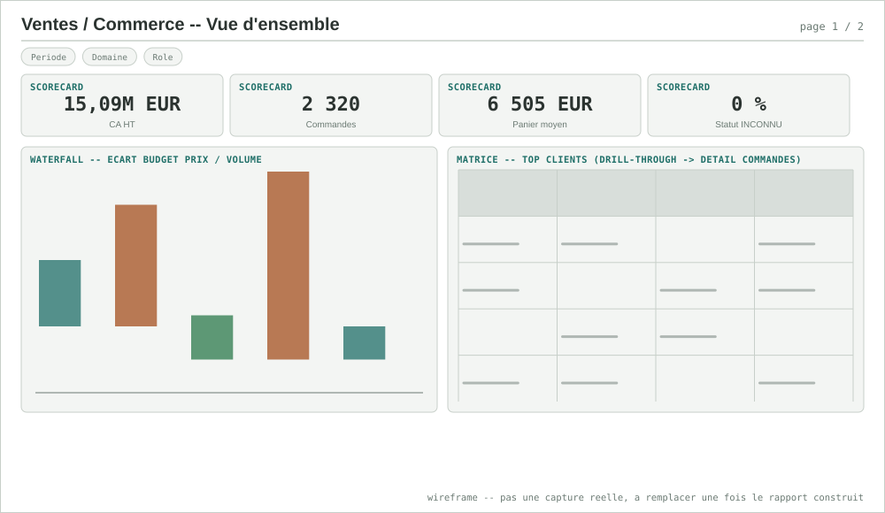
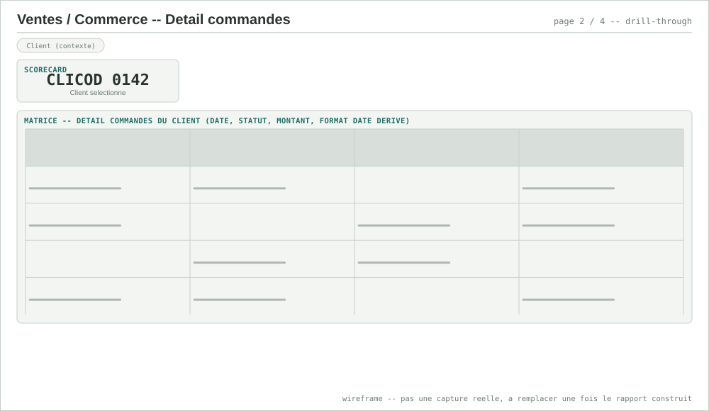
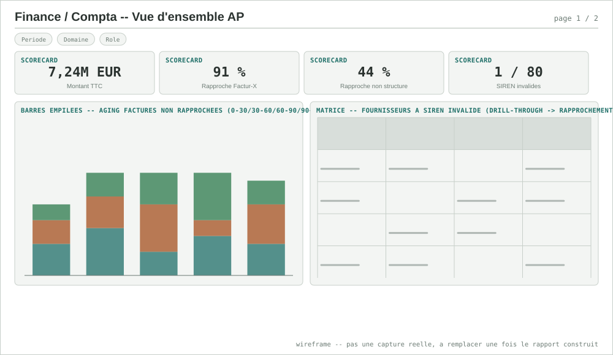
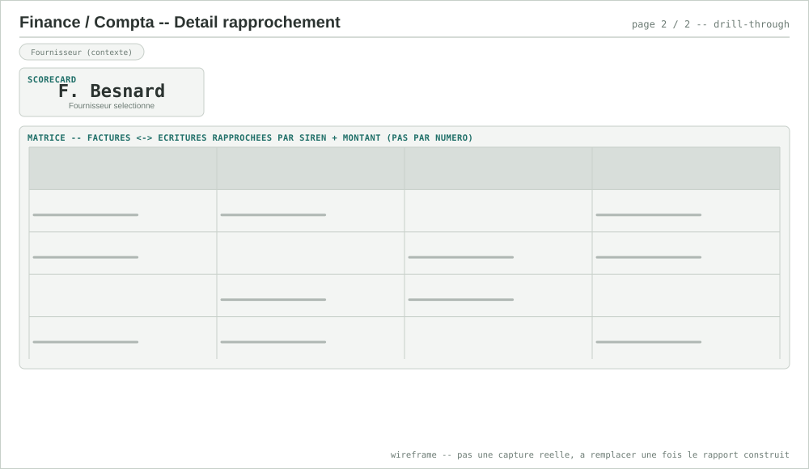
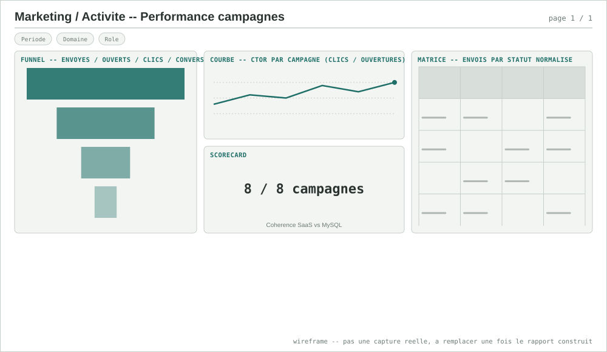
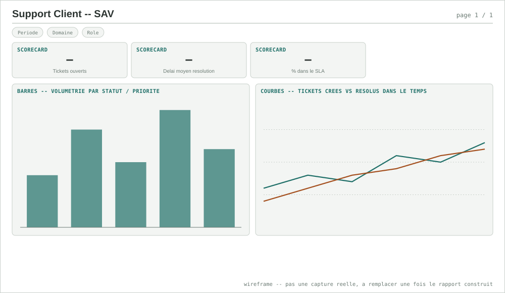
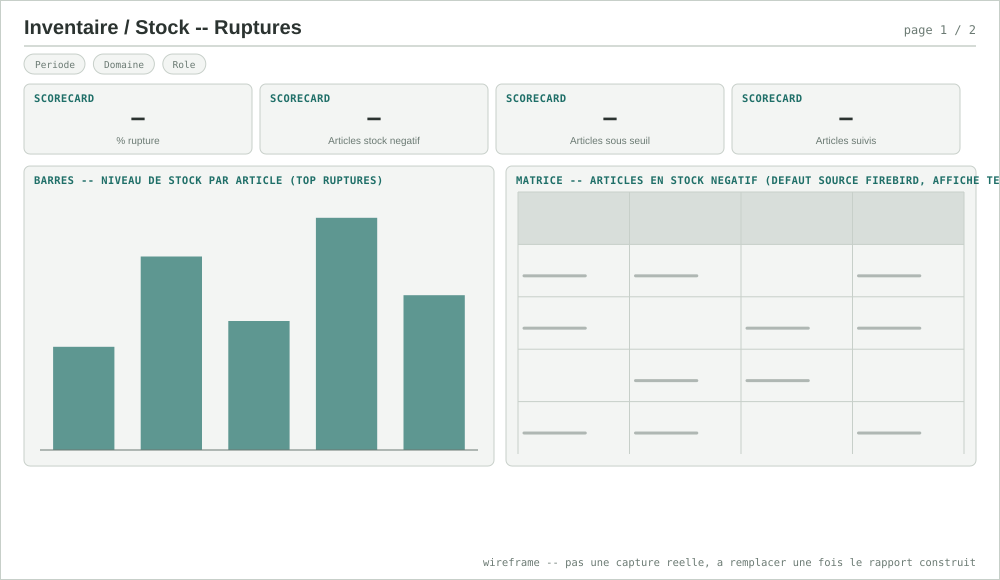
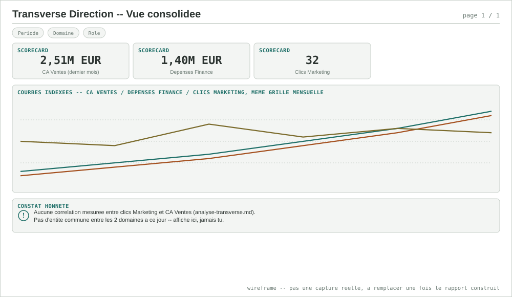
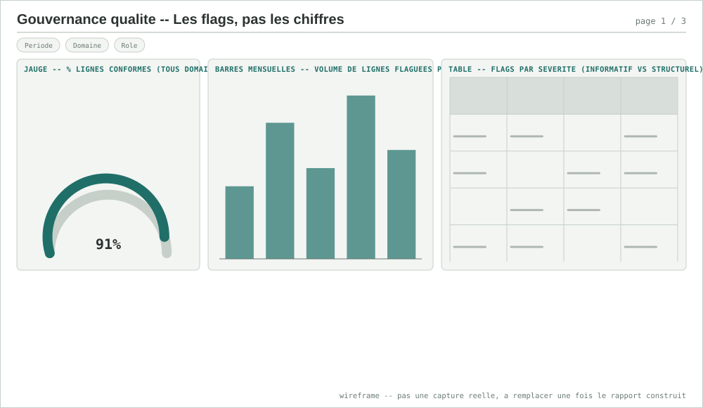
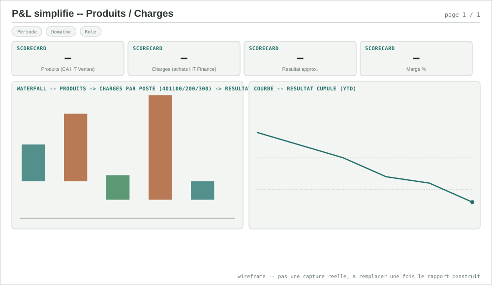

# Pistes Power BI — connecter l'entrepôt, pas encore fait

État réel (voir [`outils.md`](outils.md) et
[`anatomie-pipeline.md`](anatomie-pipeline.md#9-ce-qui-nest-délibérément-pas-montré-ici)) :
Power BI est **prêt côté entrepôt** (schéma `marts`, RLS déjà posée en
`post_hook` dbt) mais **pas encore connecté** à ce projet. Ce document liste
les **8 rapports** à construire, contre quels marts précis, le point
technique à trancher avant le premier (le mapping RLS Postgres → Power BI),
et un **wireframe par page** (schéma de mise en page, pas une capture réelle
— à remplacer par de vraies captures une fois chaque rapport construit dans
Power BI Desktop).

## Point technique à trancher avant tout rapport

La RLS de ce projet est posée **côté Postgres**, par rôle (`role_finance`,
`role_direction`, `role_rh`, `role_commercial`, `role_marketing` —
`GRANT`/`CREATE POLICY` en post_hook, cf. `anatomie-pipeline.md#5`). Deux
façons de la faire respecter depuis Power BI, pas équivalentes :

| Option | Principe | Coût | Recommandé pour |
|---|---|---|---|
| **Import + RLS Power BI dupliquée** | Un connecteur unique (`dbt_transform` en lecture, comme pgHero), RLS *re-déclarée* dans Power BI (rôles + filtres DAX qui reproduisent les policies Postgres) | Double maintenance : toute évolution d'une policy Postgres doit être répercutée à la main côté Power BI | Rapports figés, faible fréquence de refresh, premier rapport à construire |
| **DirectQuery + rôle Postgres par viewer** | Chaque utilisateur Power BI se connecte avec ses propres identifiants Postgres (ou via RLS Power BI qui pousse un `SET ROLE` dynamique) | Nécessite soit des comptes Postgres nominatifs, soit `EffectiveUserName`/paramètre de connexion dynamique — plus proche de la doctrine "vérifié par `SET ROLE`" déjà appliquée ailleurs dans le projet | Rapport Finance (IBAN) et Direction, où la RLS n'est pas cosmétique |
| **Vue restreinte par rôle** | Une vue Postgres par rôle consommateur (`marts.dim_fournisseur_direction` sans `iban`), Power BI se connecte à la vue, pas à la table | Un objet Postgres de plus à maintenir en synchro avec le modèle dbt | Alternative si le mapping dynamique s'avère trop lourd à opérer |

Aucune de ces options n'est construite à ce jour — c'est le premier
chantier avant le rapport Finance/Direction ci-dessous, pas seulement un
détail de configuration.

## Standards de densité — ce qui distingue un rapport senior d'un rapport débutant

Recherche web (sources en bas de page) sur des rapports Power BI jugés
professionnels en finance, vente, marketing, stock et gouvernance de
données. Le motif qui revient partout, indépendamment du domaine :

- **La règle des 3 secondes.** La personne qui ouvre le rapport doit
  comprendre la santé du sujet en 3 secondes — 3 à 5 KPI maximum en haut
  de page, pas 15 cartes. Tout le reste est une page de détail ou un
  drill-through, jamais entassé sur la page de synthèse.
- **Lecture en F ou en Z, jamais en grille homogène.** Le KPI le plus
  important en haut à gauche, avec mise en forme conditionnelle pour une
  lecture instantanée ; les graphiques de contexte en dessous ; les
  slicers en bandeau étroit (haut ou droite), jamais éparpillés.
- **Un visuel par type de décision, pas par type de donnée** :
  - **carte/scorecard** — un seul chiffre + sa tendance (jamais un
    tableau pour un KPI unique)
  - **courbe** — une évolution dans le temps
  - **waterfall** — un écart budgétaire ou une variance qui se décompose
    (Prix/Volume, budget vs réalisé) — c'est le visuel qui manque le
    plus souvent dans un rapport débutant, remplacé à tort par deux
    barres côte à côte
  - **matrice** — le détail transactionnel, avec drill-through vers une
    page dédiée plutôt que noyé sur la page de synthèse
- **Densité ≠ surcharge.** Un rapport dense professionnel utilise le
  blanc comme outil de hiérarchie, pas comme espace à combler — la
  densité vient du nombre de pages et de niveaux de drill-through, pas
  du nombre de visuels empilés sur une seule page.

## Rapports proposés

### 1. Ventes/Commerce — pilotage commercial

- **Sources** : `marts.fait_ventes`, `marts.dim_client`, `marts.dim_date`, `marts.ecart_budget_ventes`
- **Contenu** : CA HT par mois/région, top clients, statuts commande (les 3 canoniques + `INCONNU`, cf. `avant.md`/`apres.md` du domaine), écart budgétaire Prix/Volume déjà calculé dans le mart (pas à recalculer en DAX — la décomposition vit dans dbt)
- **RLS** : `role_commercial` (accès complet clients), `role_direction` (agrégats seulement)
- **Point d'attention réel** : les 13 remises Excel non rattachées à un client AS/400 (rapprochement flou `pg_trgm` à 19 % de confiance) doivent apparaître comme non affectées, pas comme un flag caché — cohérent avec la doctrine "flaguer, jamais masquer" du projet.
- **Gabarit page (densité pro)** : bandeau scorecards (CA HT, nb commandes, panier moyen, % commandes `INCONNU`) → **waterfall** écart Prix/Volume (le mart le calcule déjà, un waterfall le rend lisible en un coup d'œil, contrairement à 2 barres côte à côte) → matrice top clients avec drill-through vers le détail commandes.

<table><tr>
<td> Page 1 — vue d'ensemble</td>
<td> Page 2 — détail commandes (drill-through)</td>
</tr></table>

### 2. Finance/Compta — rapprochement factures & trésorerie

- **Sources** : `marts.fait_ecritures`, `marts.dim_fournisseur`, `marts.fait_rapprochement_factures`
- **Contenu** : montant TTC par compte comptable/statut de paiement, **taux de rapprochement par canal** (91 % Factur-X vs 44 % non structuré — l'indicateur le plus actionnable du domaine, cf. `apres.md`), fournisseurs à SIREN invalide à assainir
- **RLS** : `role_finance` (IBAN visible), `role_direction` (IBAN masqué — 4 colonnes explicites seulement, jamais `SELECT *`), `role_rh` (aucun accès)
- **Point d'attention réel** : c'est le rapport où le choix RLS ci-dessus n'est pas cosmétique — l'IBAN est une donnée bancaire sensible, le mauvais choix (Import + connecteur unique sans re-filtrage correct) l'exposerait à tous les viewers du rapport.
- **Gabarit page (densité pro)** : les dashboards AP professionnels (benchmark web) pivotent tous autour d'un **DPO (Days Payable Outstanding)** et d'un **aging des factures non rapprochées** (0-30/30-60/60-90/90+ jours) — deux indicateurs absents du mart aujourd'hui, à ajouter si ce rapport devient prioritaire. Scorecards (montant TTC total, taux de rapprochement Factur-X, taux non structuré) → aging en barres empilées → matrice fournisseurs à SIREN invalide, drill-through vers `fait_rapprochement_factures`.

<table><tr>
<td> Page 1 — vue d'ensemble AP</td>
<td> Page 2 — détail rapprochement (drill-through)</td>
</tr></table>

### 3. Marketing/Activité — performance campagnes

- **Sources** : `marts.fait_envois`, `marts.fait_performance_campagnes`, `marts.dim_contact`
- **Contenu** : taux d'ouverture/clic par campagne, cohérence stats SaaS vs MySQL (déjà vérifiée 8/8 côté dbt — le rapport l'affiche, ne la recalcule pas), volumétrie par statut d'envoi normalisé
- **RLS** : `role_marketing` (accès complet), `role_direction` — **aucun accès aux tables contact**, seulement à l'agrégat `fait_performance_campagnes` (minimisation RGPD déjà appliquée côté entrepôt, à ne pas contourner en exposant `dim_contact` dans ce rapport)
- **Gabarit page (densité pro)** : les dashboards email marketing sérieux affichent l'entonnoir complet **Envoyés → Ouverts → Clics → Conversions**, pas seulement un taux de clic isolé, et ajoutent le **CTOR** (Click-To-Open Rate — clics rapportés aux ouvertures, pas aux envois) qui distingue un problème de contenu d'un problème d'objet/délivrabilité. Funnel chart en tête → courbe CTOR par campagne dans le temps → carte "cohérence SaaS vs MySQL 8/8" en évidence, pas en petite note.

 Page 1 — performance campagnes

### 4. Support Client — SAV

- **Sources** : `marts.fait_tickets`
- **Contenu** : volumétrie par statut/priorité, délai de résolution, origine MongoDB (JSON imbriqué — vérifier que l'aplatissement staging n'a pas perdu de champ avant de publier des totaux)
- **Gabarit page (densité pro)** : scorecards (tickets ouverts, délai moyen de résolution, % dans le SLA) → barres volumétrie par statut/priorité → courbe tickets créés vs résolus dans le temps, l'écart entre les deux courbes est le signal d'alerte le plus lisible pour ce domaine, pas un chiffre isolé.

 Page 1 — SAV

### 5. Inventaire/Stock — ruptures et mouvements

- **Sources** : `marts.fait_mouvements_stock`, `marts.dim_stock_articles`
- **Contenu** : niveau de stock par article, mouvements entrée/sortie, **articles en stock négatif** — défaut réel du système source (Firebird, pas de validation temps réel côté ERP embarqué, cf. `outils.md`) à afficher tel quel, pas à corriger silencieusement dans le rapport.
- **Gabarit page (densité pro)** : les dashboards inventaire sérieux exposent un **% de rupture** et une liste priorisée d'articles à réapprovisionner, pas seulement un niveau de stock brut — ajouter un ratio ventes/stock disponible si le domaine se connecte un jour à `fait_ventes` (pas fait à ce jour, aucune clé commune vérifiée entre Inventaire/Stock et Ventes/Commerce).

 Page 1 — ruptures et mouvements

### 6. Transverse Direction — vue consolidée

- **Sources** : `marts.synthese_mensuelle_transverse`, `marts.ecart_budget_ventes`
- **Contenu** : CA Ventes / dépenses Finance / clics Marketing sur la même grille mensuelle
- **Point d'attention réel, à afficher explicitement dans le rapport** : `analyse-transverse.md` a déjà mesuré **l'absence de corrélation** entre clics marketing et CA Ventes (pas d'entité commune entre les deux domaines à ce jour). Un rapport qui juxtapose les 3 courbes sans ce rappel laisserait croire à un lien qui n'a pas été trouvé — la bonne pratique ici est d'afficher le constat, pas de le taire pour un visuel plus vendeur.
- **Gabarit page (densité pro)** : 3 scorecards (dernier mois : CA Ventes, dépenses Finance, clics Marketing) → courbe combinée 3 séries indexées sur la même grille mensuelle → **callout explicite** rappelant l'absence de corrélation mesurée, positionné dans le corps du rapport, jamais relégué en annotation discrète.

 Page 1 — vue consolidée

### 7. Gouvernance qualité — les flags, pas les chiffres

- **Sources** : colonnes de flag déjà posées en staging sur les 5 domaines (`siren_valide`, `fournisseur_connu`, `contact_doublon_probable`, `date_format_derive`, `client_doublon_probable`...)
- **Contenu** : un rapport à part, pas noyé dans les autres — volumétrie de données flaguées par domaine et par type de défaut, pensé pour la personne qui doit *décider* une correction, pas pour la piloter au quotidien
- **Pourquoi celui-ci en particulier** : c'est le rapport qui rend visible la doctrine "flaguer, jamais corriger en silence" documentée dans `outils.md` — sans lui, les flags existent dans l'entrepôt mais personne ne les regarde.
- **Gabarit page (densité pro)** : le motif qui revient dans les dashboards de gouvernance sérieux — une **jauge** % de lignes conformes en tête, un **bar chart mensuel** du volume de lignes flaguées par domaine (tendance, pas juste un instantané), et des statuts codés par sévérité plutôt qu'une seule couleur — ici : `flag informatif` (doublon probable, visible mais pas bloquant) vs `flag structurel` (SIREN invalide, `fournisseur_connu = false`).

 Page 1 — gouvernance qualité

### 8. P&L simplifié — Produits / Charges (Ventes × Finance)

- **Sources** : `marts.fait_ventes` (Produits = CA HT), `marts.fait_ecritures` (Charges = `montant_ht_eur`, ventilées par `compte_comptable`), `marts.dim_date` pour la grille mensuelle commune. Réutilise le principe déjà posé par `marts.synthese_mensuelle_transverse`, corrigé sur un point (ci-dessous).
- **RLS** : `role_finance`, `role_direction` — c'est un rapport de synthèse financière, pas un rapport opérationnel Ventes ; `role_commercial`/`role_marketing` n'y ont pas leur place.
- **Contenu** : Produits (CA HT Ventes) − Charges (achats HT Finance, ventilés par poste fournisseur `401100`/`401200`/`401300`) = Résultat approximatif, en **waterfall**, plus une courbe de résultat cumulé (YTD).

- **Point d'attention réel n°1 — ce n'est pas un compte de résultat PCG complet.** Le grand livre Finance de ce projet ne modélise que des écritures **fournisseurs** (comptes `401xxx`, cf. `simulateur_sqlserver.py`) : il n'existe **aucun compte de classe 7 (produits)** ni de charges hors achats (personnel, amortissements, charges financières/exceptionnelles — classes 6 restantes) dans les données simulées. Le "Résultat" de ce rapport est donc une **approximation Produits/Achats**, pas un compte de résultat au sens strict — à nommer ainsi explicitement dans le rapport plutôt que de laisser croire à un P&L complet. Un enrichissement futur du plan comptable simulé (ajouter des comptes de classe 6 hors 401 et de classe 7) est le vrai chantier si un P&L complet devient un objectif.
- **Point d'attention réel n°2 — HT, pas TTC.** `synthese_mensuelle_transverse.depenses_ttc` (déjà en prod) additionne les montants **TTC** : la TVA collectée/récupérable n'est pas une charge réelle pour l'entreprise. Ce rapport doit recalculer les charges en **HT** (`montant_ht_eur`, déjà disponible dans `fait_ecritures`, pas de nouveau modèle dbt nécessaire) plutôt que de réutiliser tel quel le mart existant — sans quoi le "résultat" est mécaniquement sous-estimé du montant de TVA.
- **Point d'attention réel n°3 — même limite que `synthese_mensuelle_transverse`.** Ventes et Finance n'ont pas d'entité commune vérifiée (`analyse-transverse.md`) : ce P&L met en regard deux domaines réels sur une même grille temporelle, ce n'est pas un compte de résultat consolidé par entité juridique — même rappel honnête que le rapport 6.

 Page 1 — P&amp;L simplifié

## Ordre de construction suggéré

1. Trancher le point RLS ci-dessus (probablement Import + RLS dupliquée pour le premier rapport, le temps de vérifier le modèle — DirectQuery ensuite pour Finance).
2. **Ventes/Commerce** (rapport 1) — domaine le plus simple, pas de donnée sensible, sert de gabarit réutilisable pour les suivants.
3. **Finance/Compta** (rapport 2) — premier rapport où la RLS colonne compte réellement.
4. **Gouvernance qualité** (rapport 7) — transversal, réutilise les visuels déjà rodés sur les rapports 1-2.
5. **P&L simplifié** (rapport 8) — seulement une fois les rapports 1 et 2 validés, puisqu'il recombine leurs deux marts ; corriger le calcul HT (point d'attention n°2) avant de le construire, pas après.
6. Marketing, Support Client, Inventaire/Stock, Transverse Direction — dans l'ordre qui correspond au prochain domaine mis en avant, pas figé à l'avance (même doctrine que le reste du projet : le besoin réel avant le plan).

Une fois le premier rapport connecté, `docs/outils.md` et
`docs/bilan-projet.md` seront mis à jour pour refléter l'état réel — pas
avant, même discipline que le reste du projet.

## Sources — benchmarks utilisés pour la section densité

- [Power BI Dashboard Design: 12 Best Practices for 2026](https://www.aufaitux.com/blog/power-bi-dashboard-design-best-practices/)
- [Power BI Dashboard Design Best Practices: Enterprise Guide 2026 — EPC Group](https://www.epcgroup.net/power-bi-dashboard-design-best-practices-enterprise-2026)
- [Top 21 Power BI Dashboard Examples for Finance and Accounting — GrowExx](https://www.growexx.com/blog/top-power-bi-dashboard-examples-for-finance-and-accounting/)
- [Power BI Financial Dashboard: Examples, KPIs & Free Templates — Zebra BI](https://zebrabi.com/power-bi-financial-dashboards/)
- [Accounts Payable Dashboard Power BI Template — Bizinfograph](https://www.bizinfograph.com/blog/accounts-payable-dashboard-power-bi/)
- [Top 15 Power BI Sales Dashboard Examples for 2026 — ZoomCharts (LinkedIn)](https://www.linkedin.com/pulse/top-15-power-bi-sales-dashboard-examples-2026-industry-zoomcharts-vaftf)
- [Email Campaign Performance Dashboard — Bold BI](https://www.boldbi.com/dashboard-examples/marketing/email-campaign-performance-dashboard/)
- [5.2 Email Marketing Analysis (Open/Click/CTOR) — GCom Solutions](https://gcomsolutions.co.uk/guides/power-bi-guides-for-professionals/power-bi-for-marketing-professionals/5-2-email-marketing-analysis/)
- [Power BI Inventory Management Dashboard Example — ZoomCharts](https://zoomcharts.com/en/microsoft-power-bi-custom-visuals/dashboard-and-report-examples/view/inventory-management-dashboard-april-2025)
- [Types of Data Quality Dashboards — DQOps](https://dqops.com/docs/dqo-concepts/types-of-data-quality-dashboards/)
- [Power BI Community Data Stories Gallery — Microsoft Fabric Community](https://community.fabric.microsoft.com/category/pbi_comm_galleries)
- [SQLBI — Marco Russo & Alberto Ferrari](https://www.sqlbi.com/author/marco-russo/)
