# Pistes Power BI — connecter l'entrepôt, pas encore fait

État réel (voir [`outils.md`](outils.md) et
[`anatomie-pipeline.md`](anatomie-pipeline.md#9-ce-qui-nest-délibérément-pas-montré-ici)) :
Power BI est **prêt côté entrepôt** (schéma `marts`, RLS déjà posée en
`post_hook` dbt) mais **pas encore connecté** à ce projet. Ce document liste
les **8 rapports** à construire, contre quels marts précis, le mapping
RLS Postgres → Power BI (tranché le 2026-09-16, cf. plus bas), et un
**wireframe par page** (schéma de mise en page, pas une capture réelle
— à remplacer par de vraies captures une fois chaque rapport construit dans
Power BI Desktop).

## Point technique — tranché le 2026-09-16

La RLS de ce projet est posée **côté Postgres**, par rôle (`role_finance`,
`role_direction`, `role_rh`, `role_commercial`, `role_marketing` —
`GRANT`/`CREATE POLICY` en post_hook, cf. `anatomie-pipeline.md#5`). Trois
façons de la faire respecter depuis Power BI ont été comparées :

| Option | Principe | Coût | Recommandé pour |
|---|---|---|---|
| **Import + RLS Power BI dupliquée** ✅ **retenu pour le rapport 1 (Ventes)** | Un connecteur unique (`dbt_transform` en lecture, comme pgHero), RLS *re-déclarée* dans Power BI (rôles + filtres DAX qui reproduisent les policies Postgres) | Double maintenance : toute évolution d'une policy Postgres doit être répercutée à la main côté Power BI | Rapports figés, faible fréquence de refresh — le premier rapport, pour établir le gabarit sans complexité de connexion |
| **DirectQuery + rôle Postgres par viewer** ✅ **retenu pour le rapport 2 (Finance)** | Chaque utilisateur Power BI se connecte avec ses propres identifiants Postgres (ou via RLS Power BI qui pousse un `SET ROLE` dynamique) | Nécessite soit des comptes Postgres nominatifs, soit `EffectiveUserName`/paramètre de connexion dynamique — plus proche de la doctrine "vérifié par `SET ROLE`" déjà appliquée ailleurs dans le projet | Rapport Finance (IBAN) et Direction, où la RLS n'est pas cosmétique — ne pas dupliquer la logique colonne en DAX, la faire vraiment respecter par Postgres |
| **Vue restreinte par rôle** | Une vue Postgres par rôle consommateur (`marts.dim_fournisseur_direction` sans `iban`), Power BI se connecte à la vue, pas à la table | Un objet Postgres de plus à maintenir en synchro avec le modèle dbt | Filet de secours si le `SET ROLE` dynamique s'avère trop lourd à opérer en pratique sur le rapport 2 |

**Décision** : Import pour le rapport 1 (pas de donnée sensible, vitesse
de mise en place prioritaire), DirectQuery + rôle par viewer pour le
rapport 2 dès que l'IBAN est en jeu — jamais de RLS dupliquée en DAX sur
une colonne réellement sensible, la doctrine du projet ("vérifié par
`SET ROLE`, jamais juste déclaré") s'applique aussi côté Power BI. Les
deux mécanismes restent à construire concrètement dans Power BI Desktop
(hors de portée d'une session sans accès GUI/entrepôt live) — cette
section documente la décision, pas encore son exécution.

## Standards de densité — ce qui distingue un rapport senior d'un rapport débutant

Recherche web (sources en bas de page) sur des rapports Power BI jugés
professionnels en finance, vente, marketing, stock et gouvernance de
données. Le motif qui revient partout, indépendamment du domaine :

- **La règle des 3 secondes.** La personne qui ouvre le rapport doit
  comprendre la santé du sujet en 3 secondes — 3 à 5 KPI maximum en haut
  de page, pas 15 cartes. Tout le reste est une page de détail ou un
  drill-through, jamais entassé sur la page de synthèse.
- **Lecture en F ou en Z, jamais en grille homogène.** Le KPI le plus
  important en haut à gauche, avec mise en forme conditionnelle pour une
  lecture instantanée ; les graphiques de contexte en dessous ; les
  slicers en bandeau étroit (haut ou droite), jamais éparpillés.
- **Un visuel par type de décision, pas par type de donnée** :
  - **carte/scorecard** — un seul chiffre + sa tendance (jamais un
    tableau pour un KPI unique)
  - **courbe** — une évolution dans le temps
  - **waterfall** — un écart budgétaire ou une variance qui se décompose
    (Prix/Volume, budget vs réalisé) — c'est le visuel qui manque le
    plus souvent dans un rapport débutant, remplacé à tort par deux
    barres côte à côte
  - **matrice** — le détail transactionnel, avec drill-through vers une
    page dédiée plutôt que noyé sur la page de synthèse
- **Densité ≠ surcharge.** Un rapport dense professionnel utilise le
  blanc comme outil de hiérarchie, pas comme espace à combler — la
  densité vient du nombre de pages et de niveaux de drill-through, pas
  du nombre de visuels empilés sur une seule page.

**Principe DAX transverse — un seul, valable sur les 8 rapports** : ne
jamais moyenner un ratio déjà calculé colonne par colonne. `AVERAGE()`
sur une colonne de taux pondère chaque ligne également, indépendamment
de son volume réel — faux dès que les lignes n'ont pas le même poids
(deux campagnes n'ont pas le même nombre d'envois, deux mois n'ont pas
le même nombre d'écritures). La bonne pratique, partout ci-dessous : une
mesure `DIVIDE(somme brute numérateur, somme brute dénominateur)`, jamais
une moyenne d'un taux pré-calculé — cf. `fait_performance_campagnes.taux_ouverture`
(colonne déjà présente côté SaaS) qui doit être **recalculée** depuis
`SUM(ouverts)/SUM(envoyes)` en DAX, pas moyennée telle quelle.

Chaque rapport ci-dessous précise, dans l'ordre : les marts sources, les
**questions analytiques** auxquelles il répond, la RLS réelle (vérifiée
ligne par ligne dans le code dbt, pas résumée de mémoire), le **découpage
en pages** (dimensionné à la vraie richesse du domaine — pas uniformisé
à un nombre de pages arbitraire), les **mesures DAX clés** avec les noms
de colonnes réels des marts, et les **limites** à afficher dans le
rapport plutôt qu'à taire. Les DAX ci-dessous sont des mesures à créer
une fois chaque table important dans Power BI (nom de table = nom du
mart Postgres, sans le préfixe de schéma) — pas encore testées dans un
vrai fichier `.pbix`, donc à vérifier à la construction comme tout DAX
neuf.

## Rapports proposés

### 1. Ventes/Commerce — pilotage commercial

- **Sources** : `marts.fait_ventes`, `marts.dim_client`, `marts.ecart_budget_ventes`
- **Questions analytiques** :
  1. Le CA HT réel suit-il le budget (+8 %/mois, prix cible 255 €) mois par mois, et l'écart vient-il du volume ou du prix ?
  2. Combien de commandes ont un statut encore `INCONNU` après nettoyage, et est-ce que ça baisse dans le temps ?
  3. Quels clients concentrent le CA, et combien sont des doublons probables non résolus ?
  4. Quelle part des remises négociées (Excel) est effectivement rattachée à un client AS/400 avec un niveau de confiance jugé fiable ?
- **RLS réelle** (vérifiée dans `fait_ventes.sql`/`dim_client.sql`, pas résumée) :
  - `role_rh` : aucun accès (les deux tables).
  - `role_finance`, `role_direction` : accès **complet** aux deux tables, y compris les commandes `ANNULEE` (réconciliation budgétaire) — **pas seulement des agrégats**, contrairement à ce qu'une version antérieure de ce document disait.
  - `role_commercial` : `dim_client` en entier, mais sur `fait_ventes` une **policy ligne** exclut les commandes `ANNULEE` (`USING (statut <> 'ANNULEE')`) — vue opérationnelle, pas un filtre de colonnes.
- **Pages** (4 — le domaine a assez de matière réelle pour ne pas tout compresser sur une seule vue) :
  1. **Vue d'ensemble** — scorecards (CA HT, commandes actives, panier moyen, % `INCONNU`) → waterfall Prix/Volume (vue synthèse) → matrice top clients, drill-through vers page 2.
  2. **Détail commandes** (drill-through) — historique complet d'un client sélectionné, avec le flag `date_format_derive` visible.
  3. **Clients & remises** — matrice clients avec `est_doublon_probable`, et le détail du rapprochement flou remise↔client (méthode + seuil, pas seulement le résultat).
  4. **Écart budgétaire** — le waterfall détaillé mois par mois, matrice `ecart_volume`/`ecart_prix`/`ecart_total`.
- **Mesures DAX clés** :

  ```dax
  CA HT = SUM(fait_ventes[montant_ht_eur])
  CA Net (apres remise) = SUM(fait_ventes[montant_net_eur])

  Commandes Actives =
      CALCULATE(COUNTROWS(fait_ventes), fait_ventes[statut] <> "ANNULEE")

  Panier Moyen =
      DIVIDE([CA Net (apres remise)], [Commandes Actives])
      -- jamais AVERAGE(montant_net_eur) : ca pondere chaque commande
      -- egalement au lieu de refleter le vrai CA / nb commandes

  % Statut Inconnu =
      DIVIDE(
          CALCULATE(COUNTROWS(fait_ventes), fait_ventes[statut] = "INCONNU"),
          COUNTROWS(fait_ventes)
      )

  % Clients Doublon Probable =
      DIVIDE(
          CALCULATE(COUNTROWS(dim_client), dim_client[est_doublon_probable] = TRUE),
          COUNTROWS(dim_client)
      )

  % Remises Rapprochees =
      DIVIDE(
          CALCULATE(COUNTROWS(dim_client), NOT ISBLANK(dim_client[remise_pct])),
          COUNTROWS(dim_client)
      )
  -- Ecart Volume / Ecart Prix / Ecart Total : deja calcules dans
  -- marts.ecart_budget_ventes (decomposition Projet 15), une mesure DAX
  -- fait juste SUM() sur les colonnes du mart -- ne pas les recoder en DAX
  ```

- **Limites à afficher dans le rapport, pas à taire** :
  - Le rapprochement flou remise↔client n'aboutit qu'à 3 correspondances sur 16 avec un score jugé fiable (seuil 0,5) — les 13 restantes n'affectent pas `fait_ventes` mais restent non exploitées, pas une erreur du rapport.
  - Le budget comparé n'est pas une vraie négociation — une hypothèse assumée (+8 %/mois, prix cible fixe), documentée comme telle dans `ecart_budget_ventes.sql`.

<table><tr>
<td><br><sub>Page 1 — vue d'ensemble</sub></td>
<td><br><sub>Page 2 — détail commandes (drill-through)</sub></td>
</tr><tr>
<td>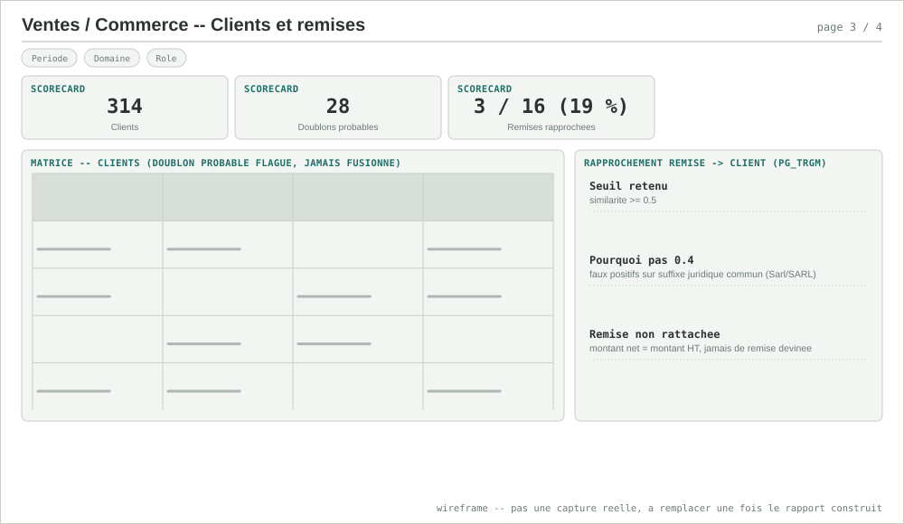<br><sub>Page 3 — clients et remises</sub></td>
<td>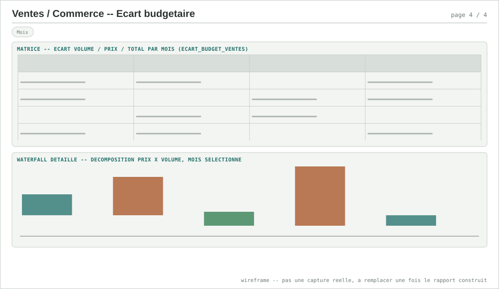<br><sub>Page 4 — écart budgétaire</sub></td>
</tr></table>

### 2. Finance/Compta — rapprochement factures & trésorerie

- **Sources** : `marts.fait_ecritures`, `marts.dim_fournisseur`, `marts.fait_rapprochement_factures`
- **Questions analytiques** :
  1. Quel est le taux de rapprochement facture↔écriture par canal, et quel écart en euros ça représente (argument pour prioriser la migration Factur-X) ?
  2. Combien de fournisseurs ont un SIREN invalide, et quel volume d'écritures ça concerne ?
  3. Quelle part des écritures référence un fournisseur inconnu du référentiel (`fournisseur_connu = false`) ?
  4. Quel est le délai (en jours) entre la date de facture et la date de l'écriture rapprochée — un proxy de délai de traitement, faute de vrai DPO dans les données actuelles (cf. limites).
- **RLS réelle** (vérifiée dans `fait_ecritures.sql`/`dim_fournisseur.sql`/`fait_rapprochement_factures.sql`) :
  - `role_rh` : aucun accès sur les 3 tables.
  - `role_finance` : accès complet, **IBAN inclus** (seule table du projet où l'IBAN est lisible).
  - `role_direction` : `fait_ecritures` et `fait_rapprochement_factures` en entier, mais sur `dim_fournisseur` **seulement 4 colonnes nommées** (`fournisseur_id`, `raison_sociale`, `siren_normalise`, `siren_valide`) — jamais de `SELECT *`, l'IBAN est explicitement exclu de la liste des colonnes accordées, pas juste filtré côté rapport.
- **Pages** (3) :
  1. **Vue d'ensemble AP** — scorecards (montant TTC, taux Factur-X, taux non structuré, % écritures fournisseur inconnu) → aging en barres empilées → matrice écritures par statut de paiement.
  2. **Détail rapprochement** (drill-through par fournisseur) — factures ↔ écritures, appariées par SIREN + montant (jamais par numéro).
  3. **Fournisseurs & SIREN** — matrice fournisseurs avec `siren_valide`, IBAN visible uniquement si le viewer est `role_finance` (à vérifier réellement une fois le rapport construit, cf. point RLS en tête de doc).
- **Mesures DAX clés** :

  ```dax
  Montant TTC Total = SUM(fait_ecritures[montant_ttc_eur])
  Montant HT Total = SUM(fait_ecritures[montant_ht_eur])

  Taux Rapprochement Facturx =
      DIVIDE(
          CALCULATE(COUNTROWS(fait_rapprochement_factures),
              fait_rapprochement_factures[canal] = "facturx",
              fait_rapprochement_factures[rapprochee] = TRUE),
          CALCULATE(COUNTROWS(fait_rapprochement_factures),
              fait_rapprochement_factures[canal] = "facturx")
      )

  Taux Rapprochement Non Structure =
      DIVIDE(
          CALCULATE(COUNTROWS(fait_rapprochement_factures),
              fait_rapprochement_factures[canal] = "non_structure",
              fait_rapprochement_factures[rapprochee] = TRUE),
          CALCULATE(COUNTROWS(fait_rapprochement_factures),
              fait_rapprochement_factures[canal] = "non_structure")
      )

  Ecart Jours Moyen (rapprochees) =
      DIVIDE(
          CALCULATE(SUM(fait_rapprochement_factures[ecart_jours]),
              fait_rapprochement_factures[rapprochee] = TRUE),
          CALCULATE(COUNTROWS(fait_rapprochement_factures),
              fait_rapprochement_factures[rapprochee] = TRUE)
      )
      -- ratio de sommes, jamais AVERAGE(ecart_jours) : le blank-handling
      -- d'AVERAGE sur les factures non rapprochees (ecart_jours vide)
      -- n'est pas garanti equivalent a l'exclusion explicite ci-dessus

  % SIREN Invalides =
      DIVIDE(
          CALCULATE(COUNTROWS(dim_fournisseur), dim_fournisseur[siren_valide] = FALSE),
          COUNTROWS(dim_fournisseur)
      )

  % Ecritures Fournisseur Inconnu =
      DIVIDE(
          CALCULATE(COUNTROWS(fait_ecritures), fait_ecritures[fournisseur_connu] = FALSE),
          COUNTROWS(fait_ecritures)
      )
  ```

- **Limites à afficher dans le rapport, pas à taire** :
  - Pas de vrai **DPO (Days Payable Outstanding)** ni d'aging normalisé (0-30/30-60/...) dans les marts actuels — la mesure `Ecart Jours Moyen` ci-dessus est un proxy, pas un DPO comptable au sens strict (qui suppose une date d'échéance, absente des données).
  - L'écart 91 % vs 44 % est une mesure directe du coût du papier/PDF non structuré (SIREN absent dans 60 % des cas de ce canal, montant illisible dans 15 %) — pas un artefact du pipeline, à dire explicitement dans le rapport plutôt que laisser le chiffre seul.

<table><tr>
<td><br><sub>Page 1 — vue d'ensemble AP</sub></td>
<td><br><sub>Page 2 — détail rapprochement (drill-through)</sub></td>
</tr><tr>
<td>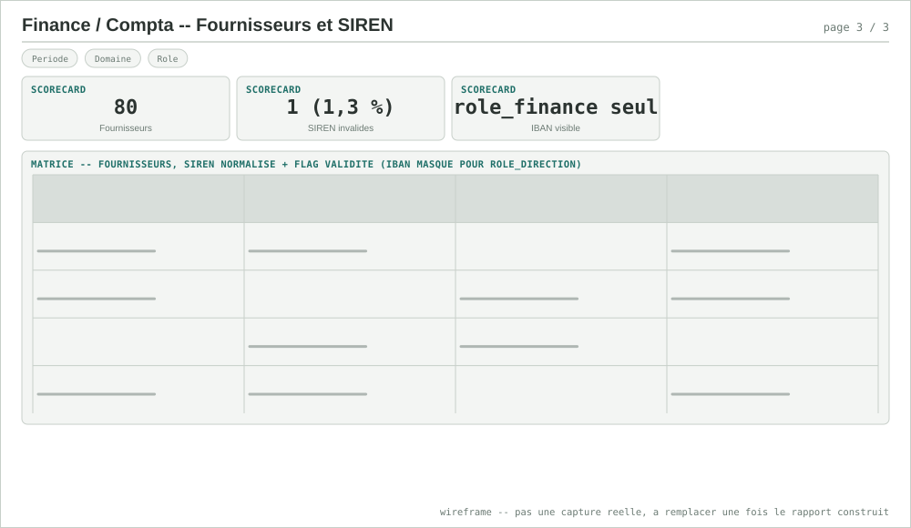<br><sub>Page 3 — fournisseurs et SIREN</sub></td>
<td></td>
</tr></table>

### 3. Marketing/Activité — performance campagnes

- **Sources** : `marts.fait_envois`, `marts.fait_performance_campagnes`, `marts.dim_contact`
- **Questions analytiques** :
  1. Le taux d'ouverture et le CTOR (clic/ouverture, pas clic/envoi) varient-ils significativement d'une campagne à l'autre ?
  2. Les statistiques SaaS sont-elles cohérentes avec le calcul interne MySQL, campagne par campagne — pas seulement en global ?
  3. Quelle part des envois reste sur un statut non normalisé (`INCONNU`) après nettoyage ?
  4. Quelle part des contacts est un doublon probable (email identique, plusieurs ID) ?
- **RLS réelle** (vérifiée dans `fait_envois.sql`/`fait_performance_campagnes.sql`/`dim_contact.sql`) :
  - `role_rh` : aucun accès sur les 3 tables.
  - `role_marketing` : accès complet aux 3 tables.
  - `role_direction` : accès **uniquement** à `fait_performance_campagnes` (l'agrégat) — **aucun `GRANT` du tout** sur `fait_envois` ni `dim_contact`, pas une RLS ligne qui filtrerait, une absence totale de droit. Donnée à caractère personnel (email, nom) : la page 3 (Contacts) de ce rapport n'a donc de sens que pour un viewer `role_marketing`.
- **Pages** (3) :
  1. **Vue d'ensemble** — scorecards (envois, taux ouverture, taux clic, cohérence SaaS/MySQL) → funnel Envoyés→Ouverts→Clics→Conversions → matrice envois par statut normalisé.
  2. **Funnel & CTOR** — courbe CTOR par campagne dans le temps, matrice SaaS vs calcul interne campagne par campagne (pas seulement le total 8/8).
  3. **Contacts** (`role_marketing` uniquement) — matrice contacts avec `contact_doublon_probable`, jamais exposée à `role_direction`.
- **Mesures DAX clés** :

  ```dax
  Envois Total = SUM(fait_performance_campagnes[envoyes])
  Taux Ouverture = DIVIDE(SUM(fait_performance_campagnes[ouverts]), SUM(fait_performance_campagnes[envoyes]))
  Taux Clic = DIVIDE(SUM(fait_performance_campagnes[clics]), SUM(fait_performance_campagnes[envoyes]))
  CTOR (Click-to-Open) = DIVIDE(SUM(fait_performance_campagnes[clics]), SUM(fait_performance_campagnes[ouverts]))
  -- les 3 mesures ci-dessus recalculent depuis les compteurs bruts --
  -- ne jamais moyenner fait_performance_campagnes[taux_ouverture]/[taux_clic],
  -- ce sont des colonnes deja calculees cote SaaS, une par campagne

  % Coherent avec MySQL =
      DIVIDE(
          CALCULATE(COUNTROWS(fait_performance_campagnes), fait_performance_campagnes[coherent_avec_mysql] = TRUE),
          COUNTROWS(fait_performance_campagnes)
      )

  % Contacts Doublon Probable =
      DIVIDE(
          CALCULATE(COUNTROWS(dim_contact), dim_contact[contact_doublon_probable] = TRUE),
          COUNTROWS(dim_contact)
      )

  % Envois Statut Inconnu =
      DIVIDE(
          CALCULATE(COUNTROWS(fait_envois), fait_envois[statut] = "INCONNU"),
          COUNTROWS(fait_envois)
      )
  ```

- **Limites à afficher dans le rapport, pas à taire** :
  - La cohérence SaaS/MySQL est vérifiée au niveau `envoyes` (`coherent_avec_mysql`) — pas au niveau `ouverts`/`clics`, qui ne sont recalculés qu'en interne sans comparaison croisée équivalente. Le dire évite de laisser croire à une vérification plus large qu'elle ne l'est.
  - `dim_contact.nom_encodage_suspect` (mojibake MySQL) reste un flag, jamais réparé automatiquement — un nom affiché "é" dans ce rapport est le signal, pas un bug du rapport lui-même.

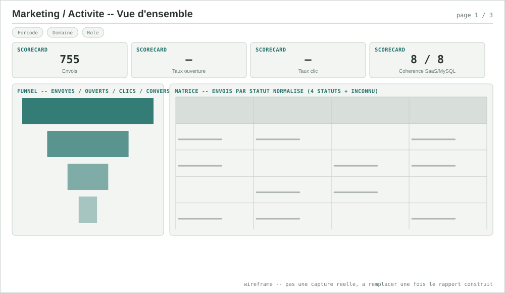<br><sub>Page 1 — vue d'ensemble</sub>
<br><br>
<table><tr>
<td>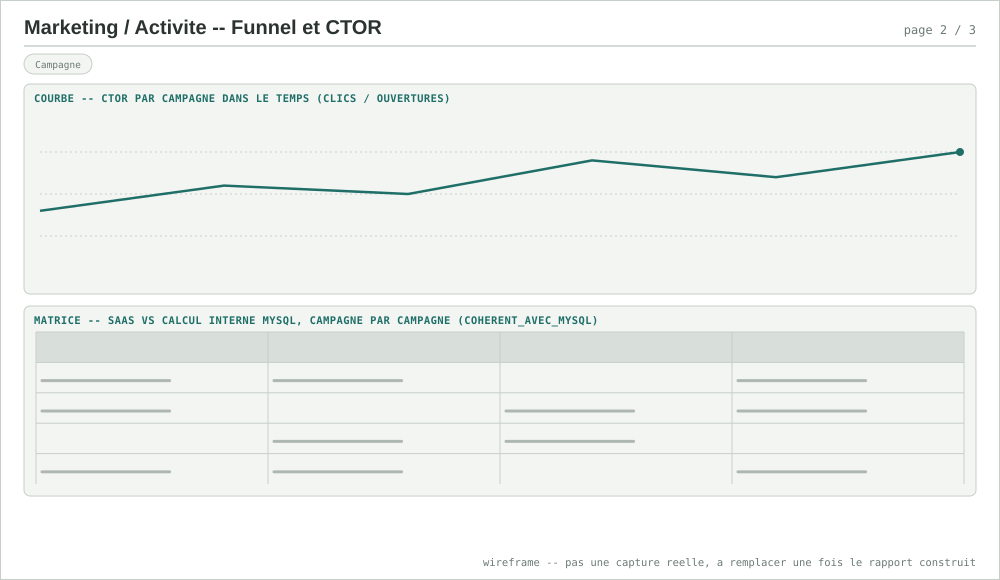<br><sub>Page 2 — funnel et CTOR</sub></td>
<td>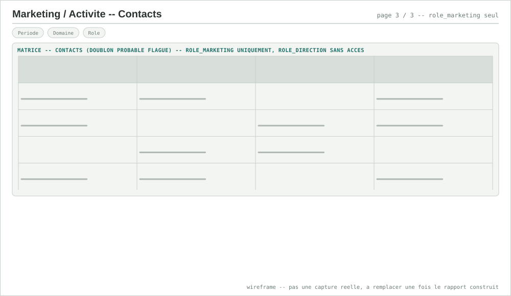<br><sub>Page 3 — contacts (role_marketing seul)</sub></td>
</tr></table>

### 4. Support Client — SAV

- **Sources** : `marts.fait_tickets`
- **Questions analytiques** :
  1. Le volume de tickets créés dépasse-t-il le volume résolu sur une période donnée (backlog qui grossit) ?
  2. Le délai de résolution varie-t-il par catégorie ou priorité ?
  3. Quelle part des tickets vient encore du schéma ancien (`schema_ancien = true`, `customer_ref` au lieu de `client_id`) ?
- **RLS réelle** (vérifiée dans `fait_tickets.sql`) : `role_support` et `role_direction` — accès complet, aucune policy ligne (pas de filtrage RH/Finance, ces rôles n'ont simplement aucun `GRANT` sur cette table).
- **Statuts réels** (vérifiés dans le simulateur, `STATUTS = ["ouvert", "en_cours", "resolu", "ferme"]`) — pas de statut `INCONNU` sur ce domaine, contrairement à Ventes/Marketing.
- **Pages** (2) :
  1. **SAV** — scorecards (tickets ouverts, délai moyen de résolution, satisfaction moyenne) → barres volumétrie par statut/priorité → courbes tickets créés vs résolus dans le temps.
  2. **Détail tickets** (drill-through) — un ticket : catégorie, priorité, nombre de messages, délai.
- **Mesures DAX clés** :

  ```dax
  Tickets Ouverts =
      CALCULATE(COUNTROWS(fait_tickets), fait_tickets[statut] IN {"ouvert", "en_cours"})

  Delai Moyen Resolution (jours) =
      DIVIDE(
          SUM(fait_tickets[delai_resolution_jours]),
          CALCULATE(COUNTROWS(fait_tickets), NOT ISBLANK(fait_tickets[delai_resolution_jours]))
      )
      -- ratio de sommes plutot qu'AVERAGE : les tickets non resolus ont
      -- delai_resolution_jours vide (date_derniere_maj absente), a exclure
      -- explicitement du denominateur, pas suppose par AVERAGE

  Satisfaction Moyenne =
      DIVIDE(
          SUM(fait_tickets[satisfaction]),
          CALCULATE(COUNTROWS(fait_tickets), NOT ISBLANK(fait_tickets[satisfaction]))
      )

  % Schema Ancien =
      DIVIDE(
          CALCULATE(COUNTROWS(fait_tickets), fait_tickets[schema_ancien] = TRUE),
          COUNTROWS(fait_tickets)
      )
  ```

- **Limites à afficher dans le rapport, pas à taire** :
  - Aucun seuil de SLA n'existe dans les données du projet à ce jour — un "% dans le SLA" ne peut pas être calculé sans qu'un seuil métier soit d'abord défini avec le support (pas un manque du rapport, un manque de référentiel en amont).
  - `numero_commande` permettrait de croiser un ticket avec `fait_ventes`, mais aucune clé fiable vérifiée entre les deux domaines à ce jour — même prudence que la vue transverse (rapport 6).

<br><sub>Page 1 — SAV</sub>
<br>
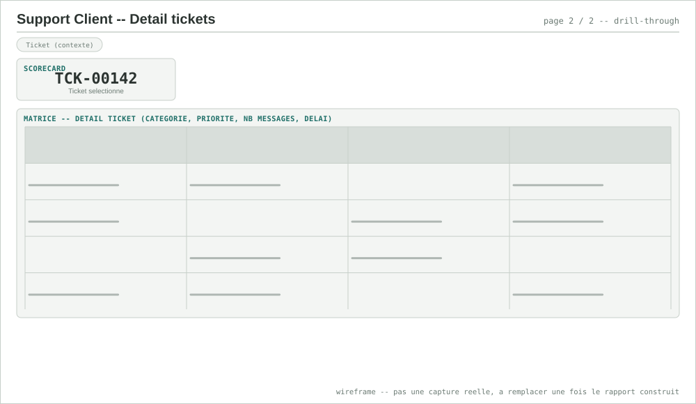<br><sub>Page 2 — détail tickets (drill-through)</sub>

### 5. Inventaire/Stock — ruptures et mouvements

- **Sources** : `marts.fait_mouvements_stock`, `marts.dim_stock_articles`
- **Questions analytiques** :
  1. Combien d'articles sont en stock négatif — défaut réel du système source (Firebird ne valide pas en temps réel, une `SORTIE` peut dépasser le stock connu) — à afficher tel quel, jamais corrigé en silence ?
  2. Combien d'articles sont sous leur seuil de réapprovisionnement, en priorité de traitement ?
  3. Le volume de mouvements `ENTREE`/`SORTIE`/`INVENTAIRE` varie-t-il par article ou par mois ?
- **RLS réelle** (vérifiée dans `fait_mouvements_stock.sql`/`dim_stock_articles.sql`) : `role_stock` et `role_direction` — accès complet aux deux tables, aucune policy ligne (RH/Finance/Commercial/Marketing n'ont simplement aucun `GRANT`, pas d'usage métier sur du stock physique).
- **Types de mouvement réels** (vérifiés dans le simulateur) : `ENTREE` (46 %), `SORTIE` (46 %), `INVENTAIRE` (8 %, ajustement de comptage).
- **Pages** (2) :
  1. **Ruptures** — scorecards (% rupture, articles en stock négatif, articles sous seuil, articles suivis) → barres niveau de stock par article → matrice articles en stock négatif.
  2. **Mouvements** — barres empilées entrée/sortie/inventaire par mois, par article.
- **Mesures DAX clés** :

  ```dax
  Articles en Rupture = CALCULATE(COUNTROWS(dim_stock_articles), dim_stock_articles[stock_negatif] = TRUE)
  % Rupture = DIVIDE([Articles en Rupture], COUNTROWS(dim_stock_articles))
  Articles Sous Seuil = CALCULATE(COUNTROWS(dim_stock_articles), dim_stock_articles[sous_seuil_reappro] = TRUE)

  Quantite Entrees = CALCULATE(SUM(fait_mouvements_stock[quantite]), fait_mouvements_stock[type_mouvement] = "ENTREE")
  Quantite Sorties = CALCULATE(SUM(fait_mouvements_stock[quantite]), fait_mouvements_stock[type_mouvement] = "SORTIE")
  Quantite Inventaire = CALCULATE(SUM(fait_mouvements_stock[quantite]), fait_mouvements_stock[type_mouvement] = "INVENTAIRE")
  ```

- **Limites à afficher dans le rapport, pas à taire** :
  - Aucune clé commune vérifiée entre Inventaire/Stock et Ventes/Commerce à ce jour — un ratio ventes/stock disponible n'est pas construit, pas parce qu'il serait inintéressant mais parce que rien ne garantit qu'`article_id` (Firebird) corresponde à `artcod` (AS/400) sans un chantier de rapprochement dédié.
  - `DATE_MVT` est un `TIMESTAMP` sans fuseau (horodatage scanner local restitué tel quel, cf. `stg_stock_mouvements.sql`) — une agrégation par jour suppose implicitement un seul fuseau, à documenter si le stock est un jour multi-sites.

<br><sub>Page 1 — ruptures</sub>
<br>
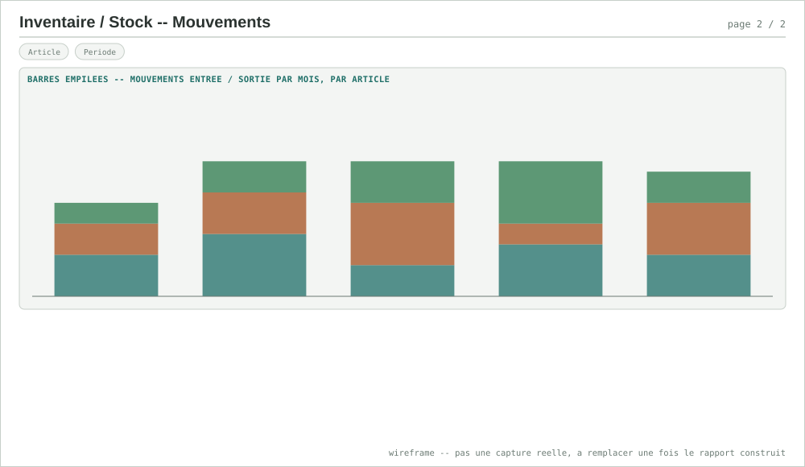<br><sub>Page 2 — mouvements</sub>

### 6. Transverse Direction — vue consolidée

- **Sources** : `marts.synthese_mensuelle_transverse`, `marts.ecart_budget_ventes`
- **Questions analytiques** :
  1. Comment évoluent CA Ventes, dépenses Finance et clics Marketing sur la même grille mensuelle ?
  2. Y a-t-il un signal de corrélation temporelle entre l'activité marketing et le CA — et si non, pourquoi (question déjà instruite dans `analyse-transverse.md`, ce rapport l'affiche, ne la re-découvre pas) ?
  3. La marge brute approximative (CA − dépenses) progresse-t-elle, et à quel point cette lecture est-elle fragile (cf. limites) ?
- **RLS réelle** (vérifiée dans `synthese_mensuelle_transverse.sql`) : `GRANT SELECT` accordé à `role_finance`, `role_direction`, `role_commercial`, `role_marketing` — pas de policy ligne (mart déjà agrégé, rien à filtrer par ligne). `role_rh` n'a aucun accès.
- **Pages** (2) :
  1. **Vue consolidée** — scorecards (dernier mois : CA Ventes, dépenses Finance, clics Marketing) → courbes indexées 3 séries → callout explicite rappelant l'absence de corrélation mesurée, dans le corps de la page, pas en annotation discrète.
  2. **Méthodologie et limites** — page dédiée : comment la grille mensuelle est construite, ce qui a été testé, ce qui n'a pas été trouvé, et pourquoi structurellement.
- **Mesures DAX clés** :

  ```dax
  CA Ventes = SUM(synthese_mensuelle_transverse[ca_ht])
  Clics Marketing = SUM(synthese_mensuelle_transverse[clics])
  Taux Clic Marketing = DIVIDE(SUM(synthese_mensuelle_transverse[clics]), SUM(synthese_mensuelle_transverse[envois]))

  Depenses Finance HT =
      SUM(fait_ecritures[montant_ht_eur])
      -- a calculer depuis fait_ecritures directement, PAS depuis
      -- synthese_mensuelle_transverse[depenses_ttc] (colonne TTC) --
      -- meme correctif HT que le rapport 8, la TVA n'est pas une charge

  Marge Brute Approx = [CA Ventes] - [Depenses Finance HT]
  ```

- **Limites à afficher dans le rapport, pas à taire** (reprend et détaille `analyse-transverse.md`) :
  - **Aucune corrélation mesurée** entre clics Marketing et CA Ventes : les clics oscillent 25-37/mois sans tendance pendant que le CA croît de +169 % sur la période — un fait mesuré, pas une limite de méthode.
  - **Cause structurelle** : Ventes (comptes B2B AS/400) et Marketing (contacts MySQL) n'ont aucune entité commune dans ce modèle — comparer les deux revient à juxtaposer deux processus indépendants.
  - `synthese_mensuelle_transverse.depenses_ttc` est en **TTC** dans le mart existant — ce rapport doit recalculer en HT (mesure ci-dessus) pour que "Marge Brute" veuille dire quelque chose.
  - Ce n'est pas une consolidation comptable par entité juridique, seulement une mise en regard temporelle de deux domaines réels.

<br><sub>Page 1 — vue consolidée</sub>
<br>
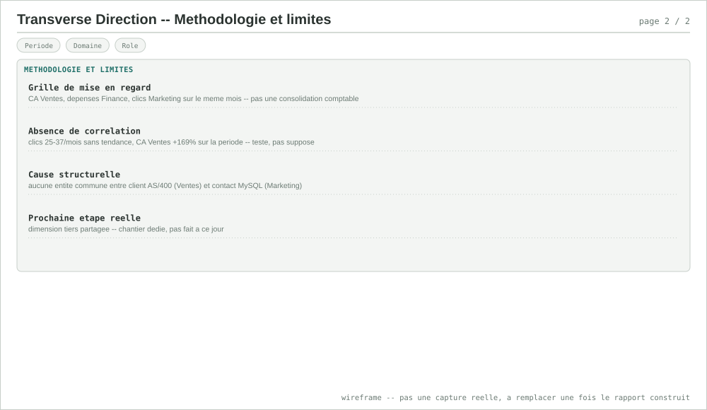<br><sub>Page 2 — méthodologie et limites</sub>

### 7. Gouvernance qualité — les flags, pas les chiffres

- **Sources** : colonnes de flag déjà posées en staging/marts sur les domaines réellement vérifiées ici : `dim_client.est_doublon_probable` (Ventes), `dim_fournisseur.siren_valide` + `fait_ecritures.fournisseur_connu` (Finance), `dim_contact.contact_doublon_probable` + `dim_contact.nom_encodage_suspect` (Marketing).
- **Prérequis technique réel, différent des 7 autres rapports** : ces flags vivent dans **4 marts séparés**, aucun ne les consolide aujourd'hui. Ce rapport suppose soit un petit modèle dbt de consolidation (`marts.synthese_qualite_donnees`, une ligne par flag/domaine/mois), soit une table DAX construite en Power Query par `UNION` des 4 sources — la première option est plus propre (logique dans dbt, testable), la seconde plus rapide à construire. **Ce n'est pas un simple export de marts existants**, contrairement aux 7 autres rapports — à trancher avant de commencer.
- **Questions analytiques** :
  1. Quel volume de lignes est flagué, par domaine et par type de défaut, et cette proportion baisse-t-elle dans le temps ?
  2. Quels flags sont **structurels** (bloquent une jointure ou un calcul, ex. `siren_valide = false`) vs **informatifs** (visibles mais sans impact aval, ex. `est_doublon_probable`) ?
  3. Est-ce que le nombre de lignes flaguées corrèle avec le volume ingéré (proportionnel, donc stable) ou grandit-il plus vite (dérive qualité réelle) ?
- **RLS** : pas de RLS dédiée à ce jour (rapport transversal, lecture agrégée) — accès proposé à `role_direction` + les rôles métier de chaque domaine source, à réévaluer une fois le modèle de consolidation choisi.
- **Pages** (3) :
  1. **Vue d'ensemble qualité** — jauge % lignes conformes (tous domaines) → barres mensuelles volume flagué par domaine → table flags par sévérité.
  2. **Détail par domaine** — matrice flaguée avec drill-through vers la table source (`dim_client`, `dim_fournisseur`...).
  3. **Définitions des flags** (méthodologie) — chaque flag nommé, sa règle exacte, informatif ou structurel — la page qui rend le rapport lisible par quelqu'un qui n'a pas lu `outils.md`.
- **Mesures DAX clés** (une fois le modèle de consolidation choisi ci-dessus) :

  ```dax
  % Lignes Conformes =
      1 - DIVIDE([Lignes Flaguees], [Lignes Totales])
      -- necessite les 2 mesures de base definies contre le modele de
      -- consolidation retenu (dbt ou Power Query) -- pas calculable
      -- directement sur les marts actuels sans ce prealable

  % SIREN Invalides = DIVIDE(CALCULATE(COUNTROWS(dim_fournisseur), dim_fournisseur[siren_valide] = FALSE), COUNTROWS(dim_fournisseur))
  % Clients Doublon Probable = DIVIDE(CALCULATE(COUNTROWS(dim_client), dim_client[est_doublon_probable] = TRUE), COUNTROWS(dim_client))
  % Contacts Doublon Probable = DIVIDE(CALCULATE(COUNTROWS(dim_contact), dim_contact[contact_doublon_probable] = TRUE), COUNTROWS(dim_contact))
  % Ecritures Fournisseur Inconnu = DIVIDE(CALCULATE(COUNTROWS(fait_ecritures), fait_ecritures[fournisseur_connu] = FALSE), COUNTROWS(fait_ecritures))
  ```

- **Limites à afficher dans le rapport, pas à taire** :
  - Ce rapport rend visible la doctrine "flaguer, jamais corriger en silence" (`outils.md`) — le taux de conformité n'est **jamais** censé atteindre 100 % par construction, ce n'est pas un objectif à atteindre mais un indicateur à surveiller.
  - Sans le modèle de consolidation, ce rapport 7 ne peut pas être construit avant les rapports 1, 2 et 3 (dont il réutilise les tables sources) — dépendance à respecter dans l'ordre de construction.

<br><sub>Page 1 — vue d'ensemble qualité</sub>
<br>
<table><tr>
<td>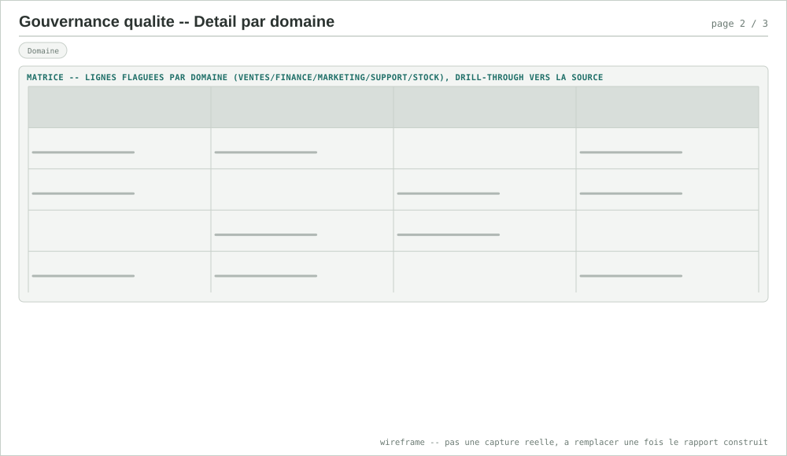<br><sub>Page 2 — détail par domaine</sub></td>
<td>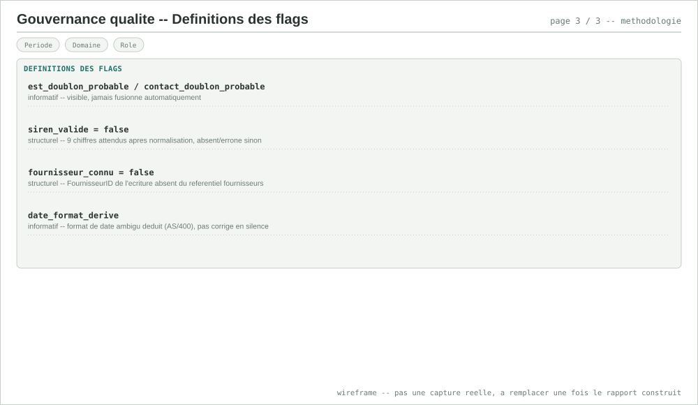<br><sub>Page 3 — définitions des flags</sub></td>
</tr></table>

### 8. P&L simplifié — Produits / Charges (Ventes × Finance)

- **Sources** : `marts.fait_ventes` (Produits = CA HT), `marts.fait_ecritures` (Charges = `montant_ht_eur`, ventilées par `compte_comptable`). Réutilise le principe déjà posé par `marts.synthese_mensuelle_transverse`, corrigé sur un point (ci-dessous).
- **Questions analytiques** :
  1. Quel est le résultat approximatif (Produits − Charges) mois par mois, et comment se décompose-t-il par poste fournisseur (`401100`/`401200`/`401300`) ?
  2. Le résultat cumulé (YTD) progresse-t-il régulièrement ou par à-coups ?
  3. Quelle est la part de chaque poste fournisseur dans les charges totales ?
- **RLS** : `role_finance`, `role_direction` (recombine `fait_ventes` et `fait_ecritures`, tous deux déjà lisibles par ces 2 rôles) — `role_commercial`/`role_marketing` n'ont pas leur place sur un rapport de synthèse financière.
- **Pages** (2) :
  1. **Vue d'ensemble P&L** — scorecards (Produits, Charges, Résultat approx., Marge %) → waterfall Produits→Charges par poste→Résultat → courbe résultat cumulé (YTD).
  2. **Définitions et limites** — page dédiée, à lire avant le chiffre (mêmes 3 points ci-dessous, formalisés comme une vraie page du rapport plutôt qu'une note en bas de doc).
- **Mesures DAX clés** :

  ```dax
  Produits (CA HT Ventes) =
      CALCULATE(SUM(fait_ventes[montant_ht_eur]), fait_ventes[statut] <> "ANNULEE")

  Charges (Achats HT Finance) = SUM(fait_ecritures[montant_ht_eur])
  -- HT, jamais montant_ttc_eur -- cf. limite n2

  Resultat Approx = [Produits (CA HT Ventes)] - [Charges (Achats HT Finance)]
  Marge % = DIVIDE([Resultat Approx], [Produits (CA HT Ventes)])

  Charges Poste 401100 = CALCULATE([Charges (Achats HT Finance)], fait_ecritures[compte_comptable] = "401100")
  Charges Poste 401200 = CALCULATE([Charges (Achats HT Finance)], fait_ecritures[compte_comptable] = "401200")
  Charges Poste 401300 = CALCULATE([Charges (Achats HT Finance)], fait_ecritures[compte_comptable] = "401300")
  ```

- **Limites à afficher sur la page 2 dédiée, jamais en petit à côté du chiffre** :
  1. **Ce n'est pas un compte de résultat PCG complet.** Le grand livre Finance ne modélise que des écritures **fournisseurs** (comptes `401xxx`, cf. `simulateur_sqlserver.py`) : aucun compte de classe 7 (produits), aucune charge hors achats (personnel, amortissements, charges financières/exceptionnelles). Le "Résultat" est une **approximation Produits/Achats**, pas un P&L au sens strict — un enrichissement futur du plan comptable simulé serait le vrai chantier pour un P&L complet.
  2. **HT, pas TTC.** `synthese_mensuelle_transverse.depenses_ttc` (mart existant) additionne du TTC — la TVA n'est pas une charge réelle. Ce rapport recalcule en HT (mesure ci-dessus), sans quoi le résultat est mécaniquement sous-estimé.
  3. **Pas d'entité commune Ventes/Finance vérifiée** (`analyse-transverse.md`) — mise en regard de deux domaines réels sur la même grille temporelle, pas une consolidation comptable par entité juridique. Même rappel que le rapport 6.

<br><sub>Page 1 — vue d'ensemble</sub>
<br>
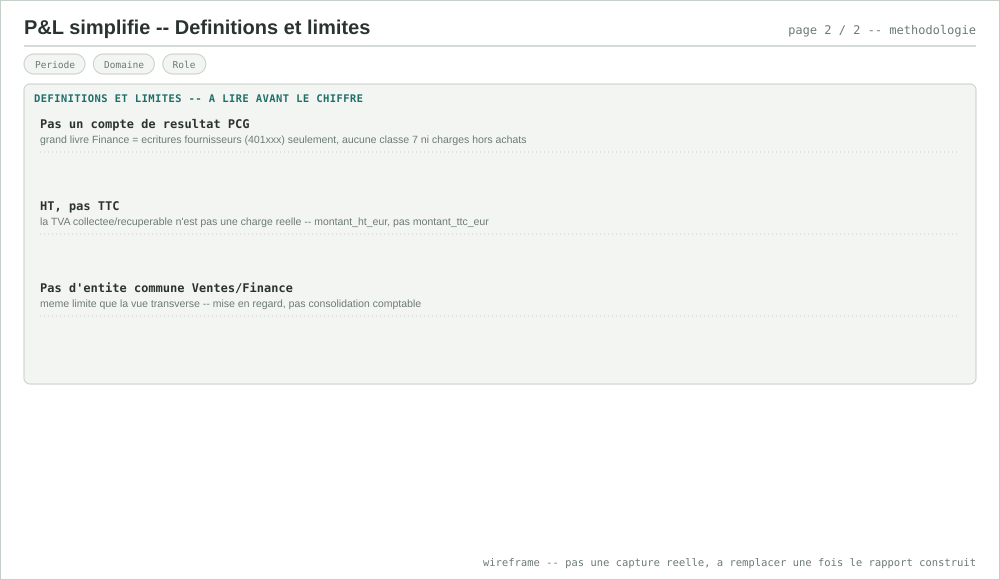<br><sub>Page 2 — définitions et limites</sub>

## Ordre de construction suggéré

1. ✅ Point RLS tranché (Import pour le rapport 1, DirectQuery + rôle par viewer pour le rapport 2 — cf. ci-dessus).
2. **Ventes/Commerce** (rapport 1) — domaine le plus simple, pas de donnée sensible, sert de gabarit réutilisable pour les suivants (structure de pages, mesures DAX en `DIVIDE`).
3. **Finance/Compta** (rapport 2) — premier rapport où la RLS colonne (IBAN) compte réellement.
4. **Marketing/Activité** (rapport 3) — dernier domaine "simple" dont `dim_contact`/`fait_ecritures`/`dim_client`/`dim_fournisseur` sont nécessaires avant la Gouvernance qualité.
5. **Gouvernance qualité** (rapport 7) — dépend réellement des rapports 1-3 (réutilise `dim_client`, `dim_fournisseur`, `fait_ecritures`, `dim_contact`) **et** du choix du modèle de consolidation des flags (dbt ou Power Query) — pas juste un remix visuel des précédents.
6. **P&L simplifié** (rapport 8) — une fois les rapports 1 et 2 validés, puisqu'il recombine leurs deux marts ; corriger le calcul HT (limite n°2) avant de le construire, pas après.
7. Support Client, Inventaire/Stock, Transverse Direction — dans l'ordre qui correspond au prochain domaine mis en avant, pas figé à l'avance (même doctrine que le reste du projet : le besoin réel avant le plan).

Une fois le premier rapport connecté, `docs/outils.md` et
`docs/bilan-projet.md` seront mis à jour pour refléter l'état réel — pas
avant, même discipline que le reste du projet.

## Sources — benchmarks utilisés

Le format "questions analytiques → RLS vérifiée dans le code → DAX en
`DIVIDE` → limites explicites, sur des pages dédiées" reprend la
structure observée sur le [portfolio Power BI de Fabrice Bomisso](https://fbomisso.github.io/fabrice.bomisso/)
(notamment [`analyse-retail-star-schema`](https://fbomisso.github.io/fabrice.bomisso/projets/power-bi/analyse-retail-star-schema/)
et [`analyse-performance-football-europe`](https://fbomisso.github.io/fabrice.bomisso/projets/power-bi/analyse-performance-football-europe/)) —
5 pages par rapport, un journal de bugs DAX réels, des hypothèses
testées plutôt qu'illustrées, un principe DAX explicite ("ne jamais
moyenner un ratio déjà calculé"). Différence assumée : ces écritures
documentent des rapports **déjà construits** (bugs réels trouvés,
hypothèses réellement testées) ; ce document reste un **cahier des
charges pré-construction** — les DAX ci-dessus n'ont pas encore tourné
dans un `.pbix` réel, le journal de bugs viendra une fois chaque rapport
effectivement bâti dans Power BI Desktop, pas avant (même discipline que
`guide-realisation.md`/`pieges-*.md` pour le reste du projet).

- [Power BI Dashboard Design: 12 Best Practices for 2026](https://www.aufaitux.com/blog/power-bi-dashboard-design-best-practices/)
- [Power BI Dashboard Design Best Practices: Enterprise Guide 2026 — EPC Group](https://www.epcgroup.net/power-bi-dashboard-design-best-practices-enterprise-2026)
- [Top 21 Power BI Dashboard Examples for Finance and Accounting — GrowExx](https://www.growexx.com/blog/top-power-bi-dashboard-examples-for-finance-and-accounting/)
- [Power BI Financial Dashboard: Examples, KPIs & Free Templates — Zebra BI](https://zebrabi.com/power-bi-financial-dashboards/)
- [Accounts Payable Dashboard Power BI Template — Bizinfograph](https://www.bizinfograph.com/blog/accounts-payable-dashboard-power-bi/)
- [Top 15 Power BI Sales Dashboard Examples for 2026 — ZoomCharts (LinkedIn)](https://www.linkedin.com/pulse/top-15-power-bi-sales-dashboard-examples-2026-industry-zoomcharts-vaftf)
- [Email Campaign Performance Dashboard — Bold BI](https://www.boldbi.com/dashboard-examples/marketing/email-campaign-performance-dashboard/)
- [5.2 Email Marketing Analysis (Open/Click/CTOR) — GCom Solutions](https://gcomsolutions.co.uk/guides/power-bi-guides-for-professionals/power-bi-for-marketing-professionals/5-2-email-marketing-analysis/)
- [Power BI Inventory Management Dashboard Example — ZoomCharts](https://zoomcharts.com/en/microsoft-power-bi-custom-visuals/dashboard-and-report-examples/view/inventory-management-dashboard-april-2025)
- [Types of Data Quality Dashboards — DQOps](https://dqops.com/docs/dqo-concepts/types-of-data-quality-dashboards/)
- [Power BI Community Data Stories Gallery — Microsoft Fabric Community](https://community.fabric.microsoft.com/category/pbi_comm_galleries)
- [SQLBI — Marco Russo & Alberto Ferrari](https://www.sqlbi.com/author/marco-russo/)
