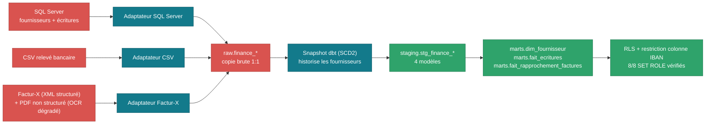
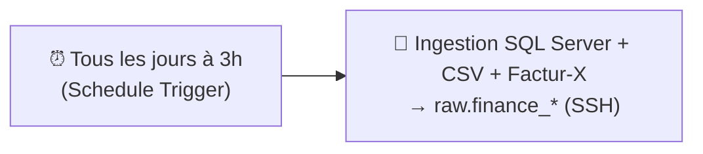

# Domaine Finance/Compta

**✅ Phase 3 terminée et vérifiée** (2026-09-05) — deuxième domaine
construit bout en bout.

Sources : SQL Server (édition Developer, 0€, l'ERP lui-même — pas un
export) + CSV relevé bancaire + Factur-X (norme française de facturation
électronique, coexistence transitoire avec le PDF non structuré). Détail
du raisonnement dans l'[issue #2](https://github.com/valentinratigniet-byte/valentinratigniet-byte/issues/2).

## Ce qui est construit et vérifié

- **`source/`** — `generer_evenements.py` (liste canonique partagée entre
  simulateurs, pour un rapprochement facture/écriture réel), simulateurs
  SQL Server / CSV / Factur-X.
- **Ingestion** → `raw` — conteneurisée, idempotente (fournisseurs/écritures
  en `remplacer_table`, relevé/factures en `ajouter_lignes`).
- **dbt** — snapshot SCD2 fournisseurs, 4 modèles staging, 3 marts
  (`dim_fournisseur`, `fait_ecritures`, `fait_rapprochement_factures`) —
  **26/26 tests passent**.
- **RLS multi-rôles + sécurité colonne** — `role_rh`/`role_finance`/
  `role_direction` sur les lignes, **restriction colonne sur l'IBAN**
  (nouveauté vs Ventes) — **8/8 cas vérifiés** par `SET ROLE` +
  tentative de lecture réelle.
- **Workflow n8n** — importé, publié, credentialé et **exécuté avec
  succès** dans l'instance n8n réelle (`n8n/finance-compta-ingestion-workflow.json`).

## Pipeline (schéma réel, étape par étape)

**Nettoyage réel, ligne par ligne** (extraction directe de l'entrepôt,
jointure `FournisseurID` = `fournisseur_id`) :

| `raw.finance_fournisseurs` (brut) | → | `staging.stg_finance_fournisseurs` (net) |
|---|---|---|
| `FournisseurID 15` · `SIREN = "200 524 117"` (espaces) | | `siren_normalise = 200524117`, `siren_valide = true` |
| `FournisseurID 16` · `SIREN = "845 533 873"` | | `siren_normalise = 845533873`, `siren_valide = true` |
| `FournisseurID 35` · `SIREN = "577 485 562"` | | `siren_normalise = 577485562`, `siren_valide = true` |

Le SIREN brut mélange formats avec/sans espaces (saisie ERP réaliste) —
normalisé (`regexp_replace`) puis validé par motif (9 chiffres) plutôt
que rejeté : une facture reste rattachable à son fournisseur même si le
SIREN est mal renseigné.

**Orchestration ingestion (n8n)** — schéma reconstruit à partir de l'export
réel [`n8n/finance-compta-ingestion-workflow.json`](../../n8n/finance-compta-ingestion-workflow.json) :

**Importé, credentialé et publié** dans l'instance n8n réelle, **exécution
manuelle vérifiée avec succès**. Tourne automatiquement tous les jours à
3h.

## Trouvaille phare

**91 % des factures Factur-X (structurées) se rapprochent automatiquement**
d'une écriture comptable, contre **44 % pour le canal non structuré**
(PDF/OCR) — un argument chiffré concret pour accélérer la migration vers
la facturation électronique.

## Documentation

[`avant.md`](avant.md) · [`decisions.md`](decisions.md)
(7 étapes, dont 2 bugs réels rencontrés et corrigés) ·
[`regles-transformation.md`](regles-transformation.md) ·
[`apres.md`](apres.md) (résultats + 5 recommandations pour l'équipe
Finance/Compta).

Détail complet de la construction dans
[`docs/guide-realisation.md`](../../docs/guide-realisation.md).
