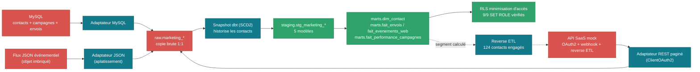
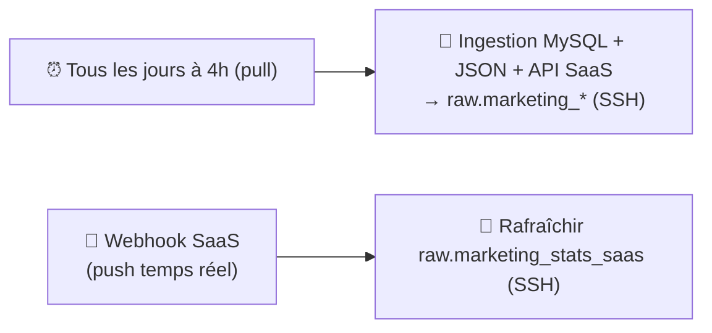

# Domaine Marketing/Activité

**✅ Phase 4 terminée et vérifiée** (2026-09-05) — troisième et dernier
domaine construit bout en bout, le plus riche fonctionnellement des trois.

Sources : MySQL (CRM/campagnes) + flux JSON événementiel (tracking web) +
API SaaS (webhook push + polling OAuth2 + reverse ETL). Détail du
raisonnement dans l'[issue #2](https://github.com/valentinratigniet-byte/valentinratigniet-byte/issues/2).

## Ce qui est construit et vérifié

- **`source/`** — `generer_evenements.py` (socle partagé contacts/
  campagnes/envois/événements pour un vrai funnel), simulateurs MySQL et
  JSON. **`saas-mock/`** — mock API SaaS (Flask) avec OAuth2, polling
  paginé, webhook, reverse ETL.
- **Ingestion** → `raw` — MySQL/JSON/stats SaaS, conteneurisée, idempotente.
- **dbt** — snapshot SCD2 contacts, 5 modèles staging, 4 marts
  (`dim_contact`, `fait_envois`, `fait_evenements_web`,
  `fait_performance_campagnes`) — **45/45 tests dbt du projet passent**,
  dont un test de cohérence SaaS ↔ MySQL.
- **RLS avec minimisation d'accès** — `role_direction` n'a **aucun accès**
  aux tables contenant des données personnelles (pas juste des lignes
  filtrées), seulement à l'agrégat `fait_performance_campagnes` —
  **9/9 cas vérifiés** par `SET ROLE` + tentative de lecture réelle.
- **4 mécanismes SaaS vérifiés réellement** : OAuth2 (refresh attendu en
  conditions réelles, 32s), polling paginé, webhook push (réception
  confirmée côté destinataire), **reverse ETL** (segment de 124 contacts
  engagés calculé dans l'entrepôt et confirmé reçu côté SaaS).
- **Workflow n8n** — export prêt (pull quotidien + webhook push).

## Pipeline (schéma réel, étape par étape)

**Nettoyage réel, ligne par ligne** (extraction directe de l'entrepôt,
jointure `id` = `contact_id`) :

| `raw.marketing_contacts` (brut) | → | `staging.stg_marketing_contacts` (net) |
|---|---|---|
| `id 21` · `email = adrien.moulin@hotmail.fr` | | `contact_doublon_probable = true` |
| `id 9001` · `email = adrien.moulin@hotmail.fr` (ré-inscription) | | même `email_normalise`, `contact_doublon_probable = true` |
| `id 73` / `id 9002` · `claudine.marty@tele2.fr` | | doublon flagué (paire) |
| `id 11` / `id 9000` · `dominique.delaunay@tele2.fr` | | doublon flagué (paire) |

12/206 contacts (5,8 %) sont des doublons probables (même email
normalisé sous deux `id` différents — ré-inscriptions) — **flagués, pas
fusionnés** (pas de règle de survivorship métier validée). Le mécanisme
`nom_encodage_suspect` (bug de charset MySQL simulé) existe aussi dans
`stg_marketing_contacts` mais ne se déclenche sur **aucun** contact de ce
jeu de données précis (0/206, mesuré) — voir le constat détaillé dans
[`apres.md`](apres.md).

**Orchestration ingestion (n8n)** — schéma reconstruit à partir de l'export
réel [`n8n/marketing-activite-ingestion-workflow.json`](../../n8n/marketing-activite-ingestion-workflow.json),
seul des 3 domaines avec **2 déclencheurs** (pull ET push) :

Export prêt, import manuel dans n8n restant (même contrainte que les 2
autres domaines).

## Trouvaille phare

**Vérification croisée SaaS ↔ MySQL : 8/8 campagnes cohérentes** — les
statistiques d'engagement rapportées par l'outil marketing et le
comptage indépendant depuis le CRM interne concordent exactement, un vrai
contrôle plutôt qu'une confiance aveugle en une seule source.

## Documentation

[`avant.md`](avant.md) · [`decisions.md`](decisions.md) (7 étapes) ·
[`regles-transformation.md`](regles-transformation.md) ·
[`apres.md`](apres.md) (résultats + 5 recommandations).

Détail complet de la construction dans
[`docs/guide-realisation.md`](../../docs/guide-realisation.md).

---

**Les 3 domaines, la consolidation, le housekeeping et Filiation sont
maintenant terminés** (phasage principal 1 à 7). Seule la Phase 8
(optionnelle, Hermès Agent) reste en standby.
