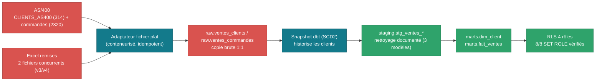

# Domaine Ventes/Commerce

**✅ Phase 2 terminée et vérifiée** (2026-09-05) — le premier domaine
construit bout en bout, selon la doctrine "tentaculaire mais
chirurgical" du [phasage](../../README.md#-phasage-par-domaine-pas-par-couche-technique).

Sources : AS/400 (DB2 for i, export batch fichier plat, simulé — cf.
[issue #2](https://github.com/valentinratigniet-byte/valentinratigniet-byte/issues/2)
pour le raisonnement) + Excel manuel (grille de remises négociées, 2
versions concurrentes).

## Ce qui est construit et vérifié

- **`source/`** — simulateurs d'usage (`simulateur_as400.py`,
  `simulateur_excel_remises.py`), défauts réels générés (dérive de date,
  doublons, FK partielle, formule cassée).
- **Ingestion** → `raw` (schéma brut, copie 1:1) — conteneurisée,
  idempotente (manifeste de fichiers ingérés).
- **dbt** — snapshot SCD2 sur les clients, staging (3 modèles, règles de
  nettoyage réelles), marts (`dim_client`, `fait_ventes`) — **14/14 tests
  passent**.
- **RLS multi-rôles** (`role_rh`/`role_finance`/`role_direction`/
  `role_commercial`) — **8/8 cas vérifiés par `SET ROLE`**, survit aux
  reruns dbt (post_hook).
- **Workflow n8n** — importé et **publié** dans l'instance n8n réelle
  (partagée avec le Projet 18), credential SSH réelle attachée, **exécution
  manuelle réussie** (ingestion AS/400+Excel confirmée).

## Pipeline (schéma réel, étape par étape)

**Nettoyage réel, ligne par ligne** (extraction directe de l'entrepôt, pas
un exemple fabriqué) :

| `raw.ventes_clients` (brut) | → | `staging.stg_ventes_clients` (net) |
|---|---|---|
| `CL900003` · `ARNAUD` | | `ARNAUD` → normalisé `ARNAUD`, **doublon probable = true** |
| `CL000072` · `Arnaud` | | `Arnaud` → normalisé `ARNAUD`, **doublon probable = true** |
| `CL900000` · `BECKER GUÉRIN S.A.S.` | | normalisé `BECKERGURINSAS`, **doublon probable = true** |
| `CL000044` · `Becker Guérin S.A.S.` | | normalisé `BECKERGURINSAS`, **doublon probable = true** |

Même casse/ponctuation différente pour la même personne → repérées par
normalisation du nom (accents/casse/ponctuation supprimés), **flaguées
pas fusionnées** (décision documentée dans `decisions.md`, pas de règle
de survivorship métier validée).

| `raw.ventes_commandes` (brut) | → | `staging.stg_ventes_commandes` (net) |
|---|---|---|
| `CMDNUM 2026030000` · `CMDDAT = 25032026` (format DDMMYYYY dérivé) · `STCMD = Val` · `PRIXUN = 0000046781` | | `date_commande = 2026-03-25`, `date_format_derive = true`, `statut = VALIDEE`, `prix_unitaire_eur = 467.81` |
| `CMDNUM 2026030001` · `CMDDAT = 01032026` · `STCMD = LIV` · `PRIXUN = 0000018763` | | `date_commande = 2026-03-01`, `date_format_derive = true`, `statut = LIVREE`, `prix_unitaire_eur = 187.63` |

Deux mois (2026-03, 2026-04) ont une dérive de format de date
(DDMMYYYY au lieu de YYYYMMDD) — `date_format_derive` la rend visible
plutôt que de silencieusement mal interpréter le jour et le mois.
Montants en centimes-texte convertis en euros (`/100`), statuts en 7
variantes orthographiques regroupés par préfixe.

**Orchestration ingestion (n8n)** — schéma reconstruit à partir de l'export
réel [`n8n/ventes-commerce-ingestion-workflow.json`](../../n8n/ventes-commerce-ingestion-workflow.json) :

**Importé, credentialé et publié dans l'instance n8n réelle** (partagée
avec le Projet 18) — import via copier-coller du JSON directement sur le
canvas (pas d'API n8n disponible sans clé, import UI natif à la place),
credential SSH réelle créée et attachée, **exécution manuelle vérifiée
avec succès**. Tourne maintenant automatiquement tous les jours à 2h.

## Documentation

[`avant.md`](avant.md) (état brut chiffré) · [`decisions.md`](decisions.md)
(raisonnement, 7 étapes) · [`regles-transformation.md`](regles-transformation.md)
(brut → net, colonne par colonne) · [`apres.md`](apres.md) (résultats +
recommandations pour l'équipe Commerce).

Détail complet de la construction, y compris les bugs rencontrés et
corrigés, dans [`docs/guide-realisation.md`](../../docs/guide-realisation.md).
